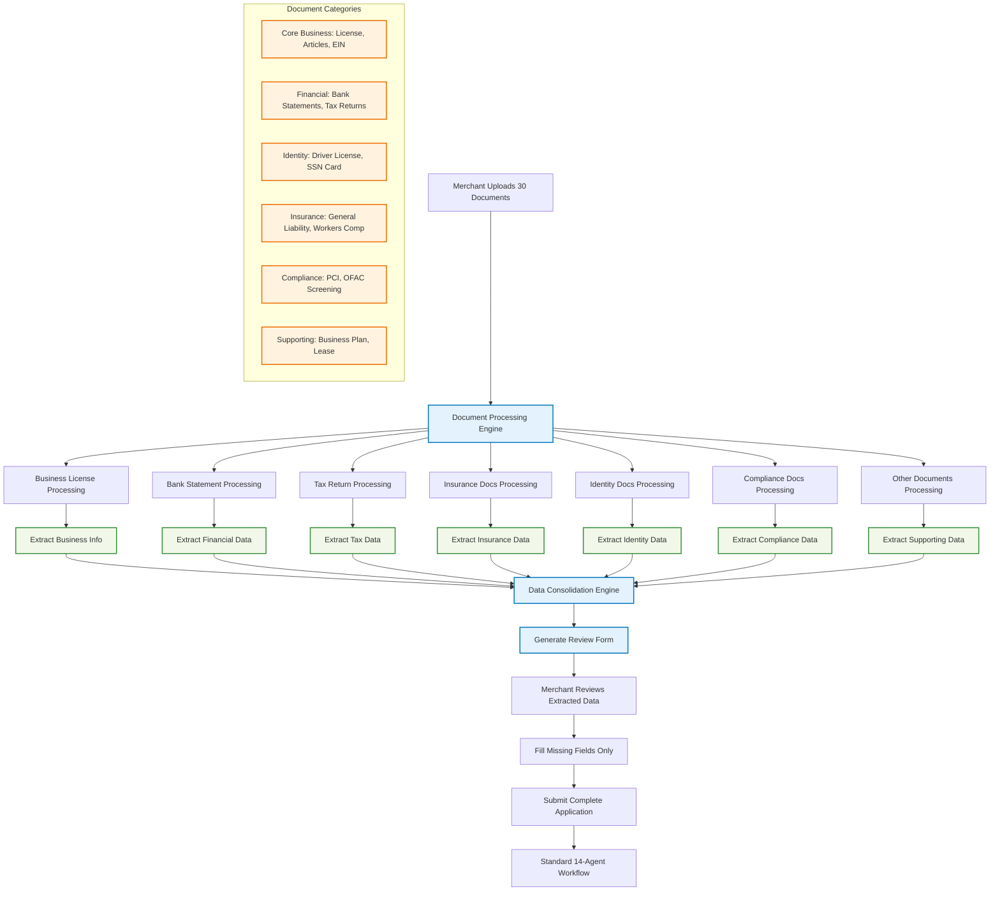

# Document-First Onboarding Diagram

```mermaid

graph TD
    A[Merchant Uploads 30 Documents] --> B[Document Processing Engine]
    
    B --> C1[Business License Processing]
    B --> C2[Bank Statement Processing]
    B --> C3[Tax Return Processing]
    B --> C4[Insurance Docs Processing]
    B --> C5[Identity Docs Processing]
    B --> C6[Compliance Docs Processing]
    B --> C7[Other Documents Processing]
    
    C1 --> D1[Extract Business Info]
    C2 --> D2[Extract Financial Data]
    C3 --> D3[Extract Tax Data]
    C4 --> D4[Extract Insurance Data]
    C5 --> D5[Extract Identity Data]
    C6 --> D6[Extract Compliance Data]
    C7 --> D7[Extract Supporting Data]
    
    D1 --> E[Data Consolidation Engine]
    D2 --> E
    D3 --> E
    D4 --> E
    D5 --> E
    D6 --> E
    D7 --> E
    
    E --> F[Generate Review Form]
    F --> G[Merchant Reviews Extracted Data]
    G --> H[Fill Missing Fields Only]
    H --> I[Submit Complete Application]
    I --> J[Standard 14-Agent Workflow]
    
    %% Document Types
    subgraph "Document Categories"
        DOC1[Core Business: License, Articles, EIN]
        DOC2[Financial: Bank Statements, Tax Returns]
        DOC3[Identity: Driver License, SSN Card]
        DOC4[Insurance: General Liability, Workers Comp]
        DOC5[Compliance: PCI, OFAC Screening]
        DOC6[Supporting: Business Plan, Lease]
    end
    
    %% Styling
    classDef process fill:#e3f2fd,stroke:#0277bd,stroke-width:2px
    classDef document fill:#fff3e0,stroke:#ef6c00,stroke-width:2px
    classDef extraction fill:#f1f8e9,stroke:#388e3c,stroke-width:2px
    
    class B,E,F process
    class DOC1,DOC2,DOC3,DOC4,DOC5,DOC6 document
    class D1,D2,D3,D4,D5,D6,D7 extraction

```
