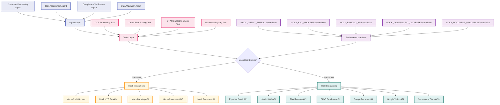

# Integration Architecture Diagram

```mermaid

graph TD
    A[Agent Layer] --> B[Tools Layer]
    B --> C{Mock/Real Decision}
    
    C -->|Mock=true| D[Mock Integrations]
    C -->|Mock=false| E[Real Integrations]
    
    %% Mock Integrations
    D --> D1[Mock Credit Bureau]
    D --> D2[Mock KYC Provider]
    D --> D3[Mock Banking API]
    D --> D4[Mock Government DB]
    D --> D5[Mock Document AI]
    
    %% Real Integrations
    E --> E1[Experian Credit API]
    E --> E2[Jumio KYC API]
    E --> E3[Plaid Banking API]
    E --> E4[OFAC Database API]
    E --> E5[Google Document AI]
    E --> E6[Google Vision API]
    E --> E7[Secretary of State APIs]
    
    %% Environment Configuration
    F[Environment Variables] --> C
    F1[MOCK_CREDIT_BUREAUS=true/false] --> F
    F2[MOCK_KYC_PROVIDERS=true/false] --> F
    F3[MOCK_BANKING_APIS=true/false] --> F
    F4[MOCK_GOVERNMENT_DATABASES=true/false] --> F
    F5[MOCK_DOCUMENT_PROCESSING=true/false] --> F
    
    %% Agent Examples
    A1[Document Processing Agent] --> A
    A2[Risk Assessment Agent] --> A
    A3[Compliance Verification Agent] --> A
    A4[Data Validation Agent] --> A
    
    %% Tool Examples
    B1[OCR Processing Tool] --> B
    B2[Credit Risk Scoring Tool] --> B
    B3[OFAC Sanctions Check Tool] --> B
    B4[Business Registry Tool] --> B
    
    %% Styling
    classDef agent fill:#e8eaf6,stroke:#3f51b5,stroke-width:2px
    classDef tool fill:#fce4ec,stroke:#e91e63,stroke-width:2px
    classDef mock fill:#fff8e1,stroke:#ff8f00,stroke-width:2px
    classDef real fill:#e0f2f1,stroke:#00695c,stroke-width:2px
    classDef config fill:#f3e5f5,stroke:#7b1fa2,stroke-width:2px
    
    class A,A1,A2,A3,A4 agent
    class B,B1,B2,B3,B4 tool
    class D,D1,D2,D3,D4,D5 mock
    class E,E1,E2,E3,E4,E5,E6,E7 real
    class F,F1,F2,F3,F4,F5 config

```
