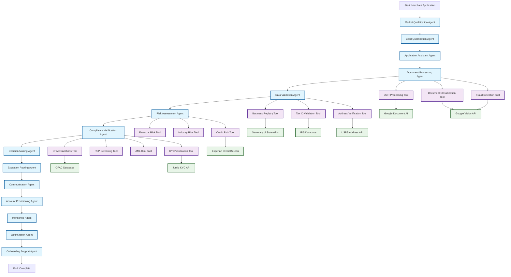

# Merchant Onboarding Workflow Diagram

```mermaid

graph TD
    A[Start: Merchant Application] --> B[Market Qualification Agent]
    B --> C[Lead Qualification Agent]
    C --> D[Application Assistant Agent]
    D --> E[Document Processing Agent]
    E --> F[Data Validation Agent]
    F --> G[Risk Assessment Agent]
    G --> H[Compliance Verification Agent]
    H --> I[Decision Making Agent]
    I --> J[Exception Routing Agent]
    J --> K[Communication Agent]
    K --> L[Account Provisioning Agent]
    L --> M[Monitoring Agent]
    M --> N[Optimization Agent]
    N --> O[Onboarding Support Agent]
    O --> P[End: Complete]
    
    %% Tool Connections
    E --> E1[OCR Processing Tool]
    E --> E2[Document Classification Tool]
    E --> E3[Fraud Detection Tool]
    
    F --> F1[Business Registry Tool]
    F --> F2[Tax ID Validation Tool]
    F --> F3[Address Verification Tool]
    
    G --> G1[Financial Risk Tool]
    G --> G2[Industry Risk Tool]
    G --> G3[Credit Risk Tool]
    
    H --> H1[OFAC Sanctions Tool]
    H --> H2[PEP Screening Tool]
    H --> H3[AML Risk Tool]
    H --> H4[KYC Verification Tool]
    
    %% External Integrations
    E1 --> EXT1[Google Document AI]
    E2 --> EXT2[Google Vision API]
    E3 --> EXT2
    
    F1 --> EXT3[Secretary of State APIs]
    F2 --> EXT4[IRS Database]
    F3 --> EXT5[USPS Address API]
    
    G3 --> EXT6[Experian Credit Bureau]
    
    H1 --> EXT7[OFAC Database]
    H4 --> EXT8[Jumio KYC API]
    
    %% Styling
    classDef agent fill:#e1f5fe,stroke:#01579b,stroke-width:2px
    classDef tool fill:#f3e5f5,stroke:#4a148c,stroke-width:2px
    classDef external fill:#e8f5e8,stroke:#1b5e20,stroke-width:2px
    
    class B,C,D,E,F,G,H,I,J,K,L,M,N,O agent
    class E1,E2,E3,F1,F2,F3,G1,G2,G3,H1,H2,H3,H4 tool
    class EXT1,EXT2,EXT3,EXT4,EXT5,EXT6,EXT7,EXT8 external

```
