# AI Agent Architecture Diagrams
## Actual Implementation Architecture

## Multi-Workflow Agent System Overview

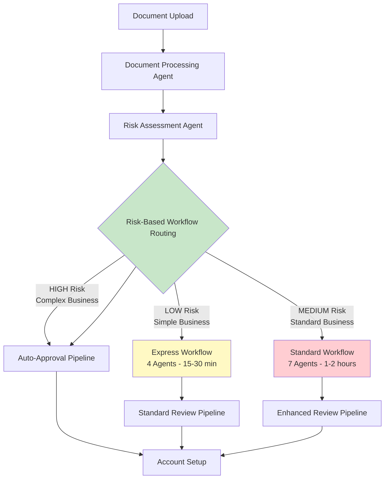

## 14 AI Agents - Complete System Architecture

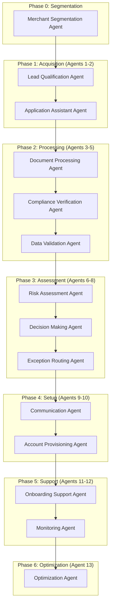

## Workflow Pattern Comparison

```mermaid
graph LR
    subgraph "Routing Workflow (All merchants start here)"
        R1[Document Processing] --> R2[Risk Assessment]
        R2 --> R3{Route Based on Risk Tier}
    end
    
    subgraph "Express Workflow (LOW risk - 50% of merchants)"
        E1[Document Processing] --> E2[Risk Assessment]
        E2 --> E3[Decision Making] --> E4[Account Provisioning]
    end
    
    subgraph "Standard Workflow (MEDIUM risk - 30% of merchants)"
        S1[Document Processing] --> S2[Data Validation]
        S2 --> S3[Risk Assessment] --> S4[Compliance Verification]
        S4 --> S5[Decision Making] --> S6[Account Provisioning]
        S6 --> S7[Communication]
    end
    
    subgraph "Comprehensive Workflow (HIGH risk - 20% of merchants)"
        C1[Document Processing] --> C2[Market Qualification]
        C2 --> C3[Lead Qualification] --> C4[Data Validation]
        C4 --> C5[Risk Assessment] --> C6[Compliance Verification]
        C6 --> C7[Decision Making] --> C8[Exception Routing]
        C8 --> C9[Communication] --> C10[Account Provisioning]
        C10 --> C11[Monitoring] --> C12[Optimization]
        C12 --> C13[Onboarding Support]
    end
    
    R3 -->|LOW Risk| E1
    R3 -->|MEDIUM Risk| S1
    R3 -->|HIGH Risk| C1
    
    style E1 fill:#c8e6c9
    style S1 fill:#fff9c4
    style C1 fill:#ffcdd2
```

## LangGraph State Management Architecture

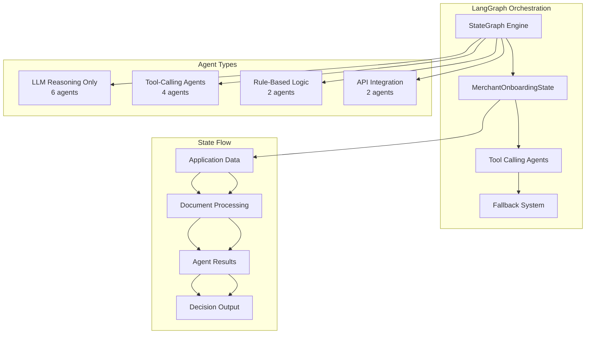

## Tool-Calling Agent Architecture

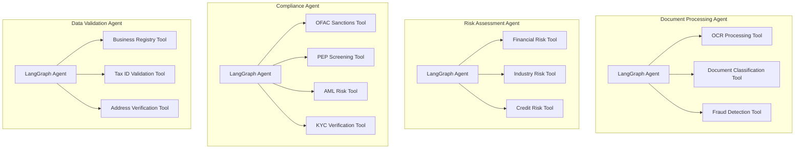

## 3-Layer Fallback System

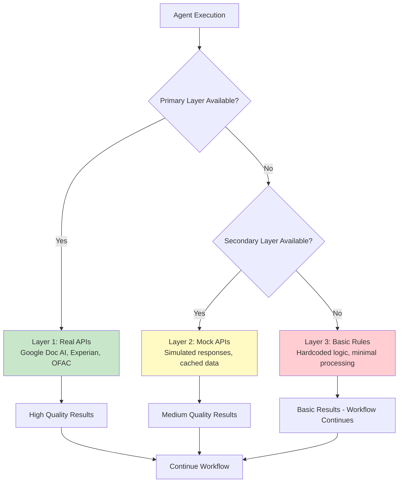

## Real-Time Progress Tracking

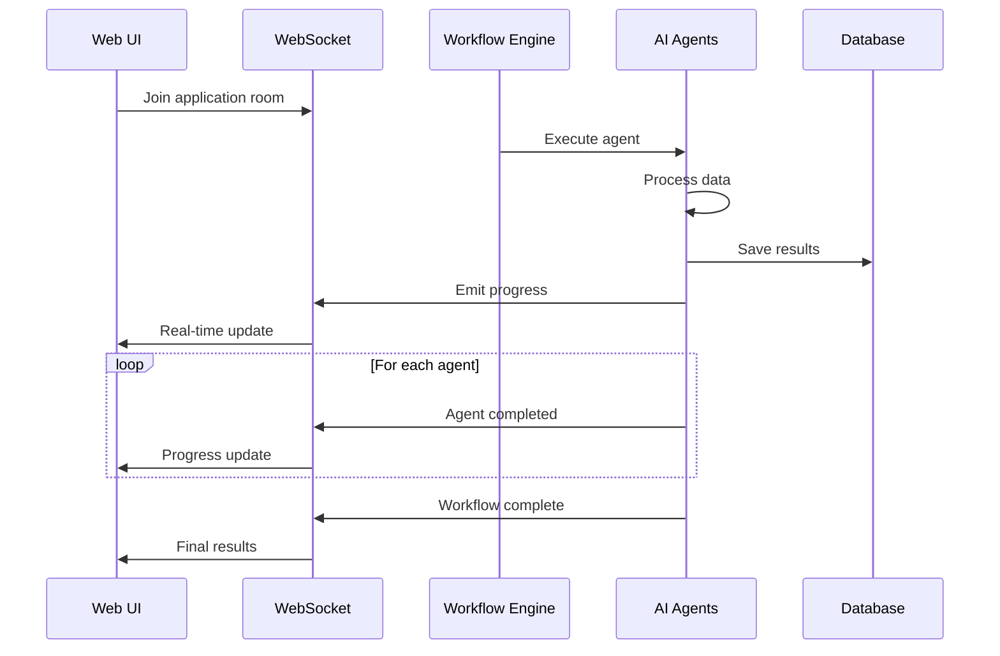

## Integration Architecture with Implementation Status

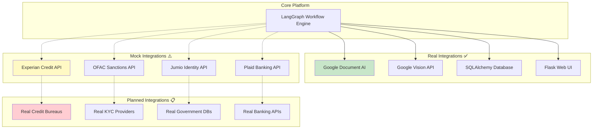

## Performance Metrics by Workflow

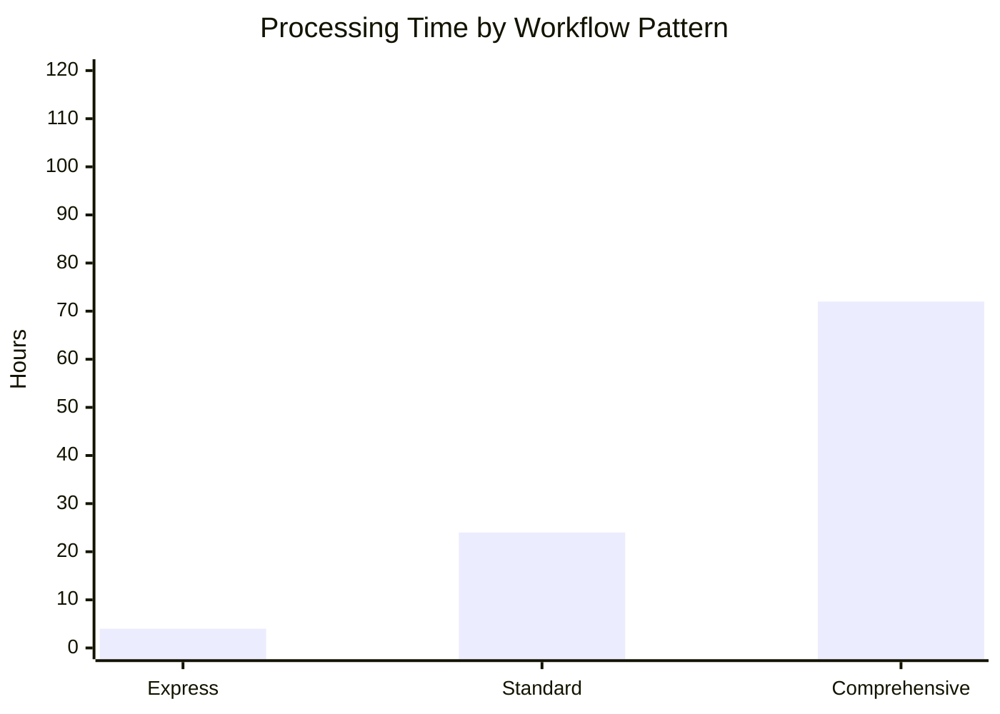

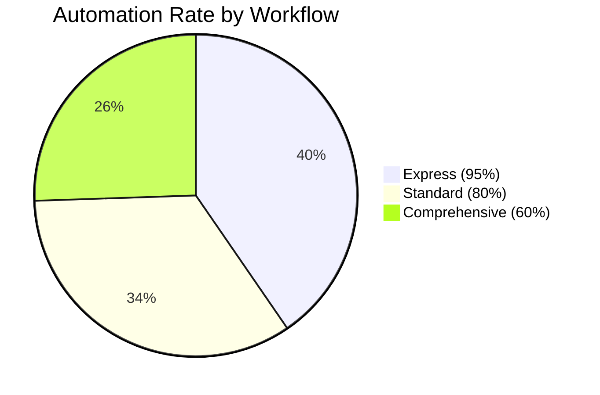

## Database Schema - Actual Implementation

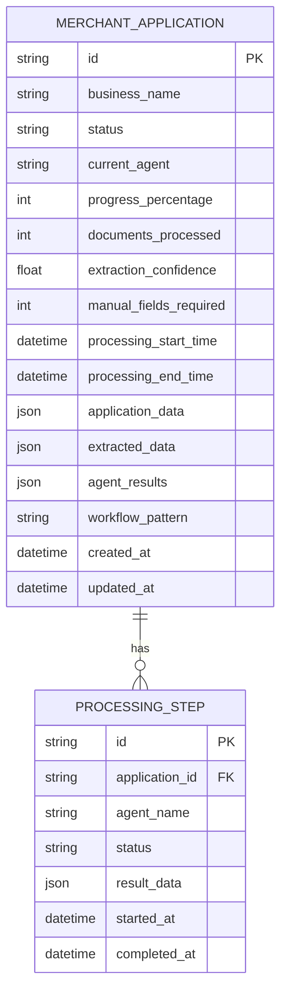

## Deployment Architecture - Current Implementation

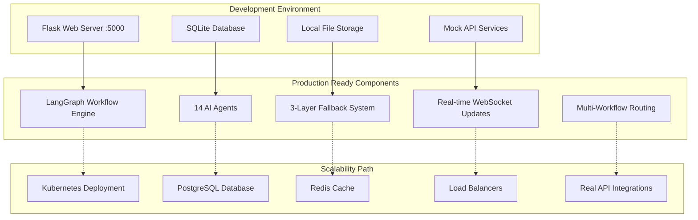