# AI Agent Architecture Diagrams
## Actual Implementation Architecture

## Multi-Workflow Agent System Overview (As Implemented)

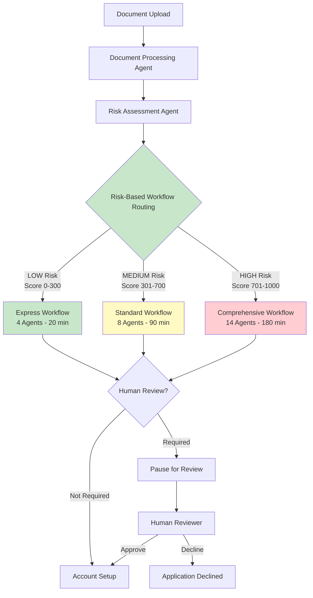

## 14 AI Agents - Actual Implementation

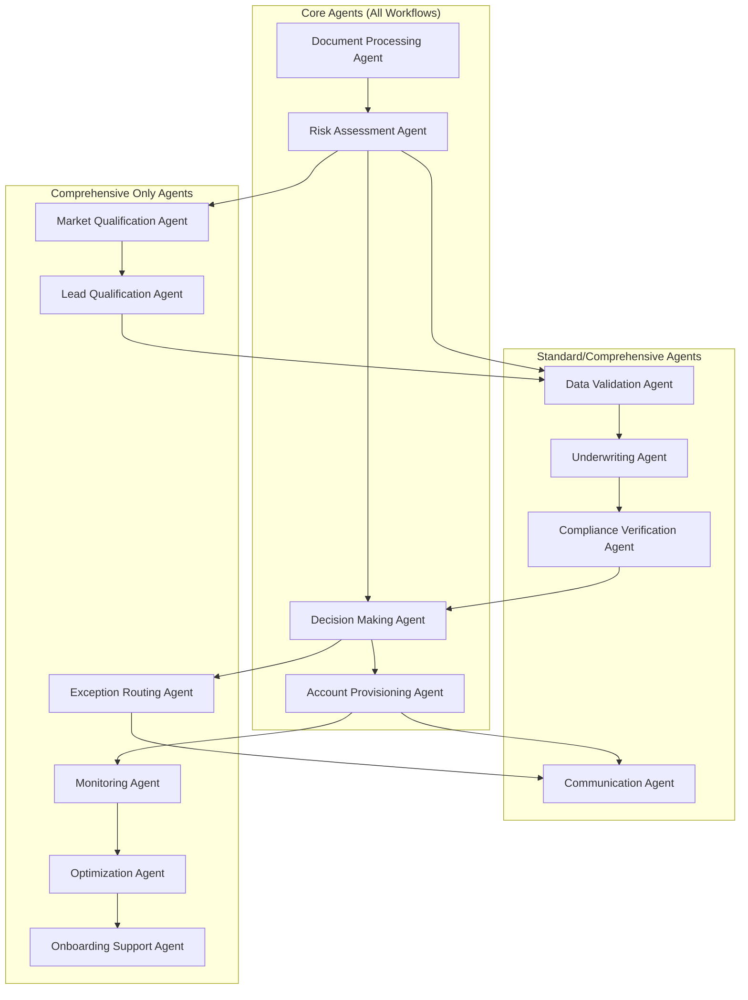

## Actual Workflow Implementation (From Code)

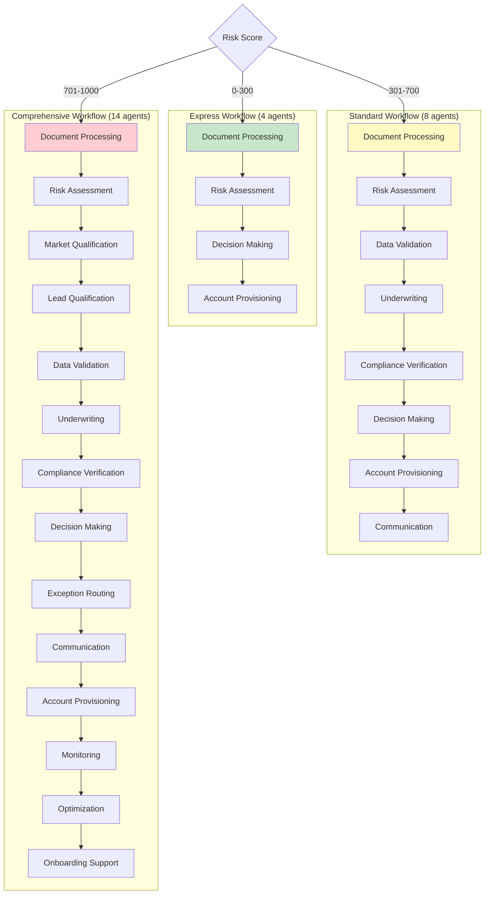

## LangGraph State Management (Actual Implementation)

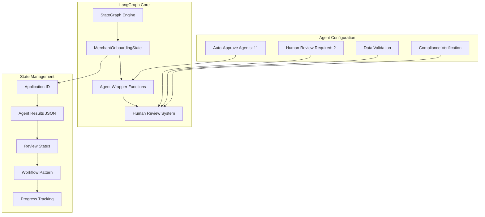

## Tool-Calling Agent Architecture

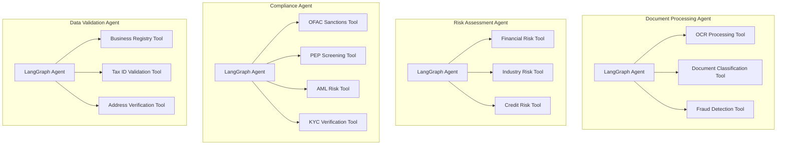


## Real-Time Progress Tracking

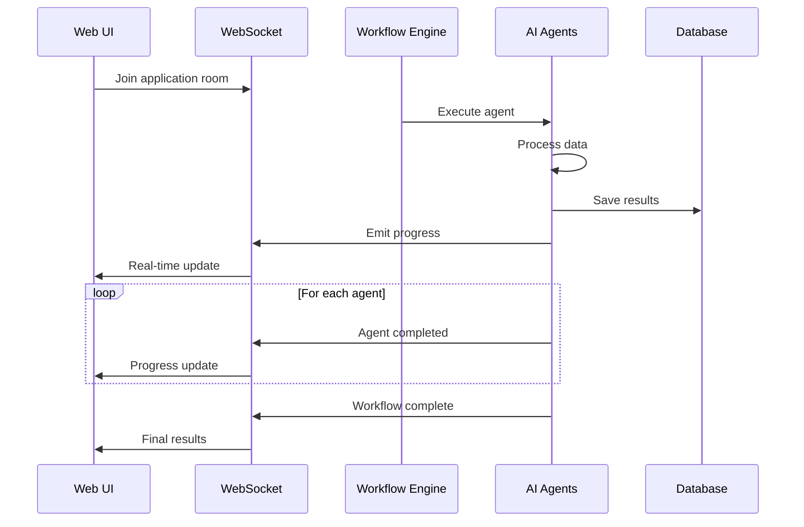

## Integration Architecture with Implementation Status

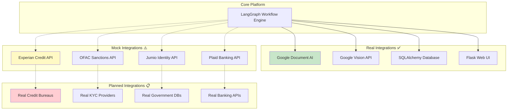


## Human Review Workflow (Implementation)

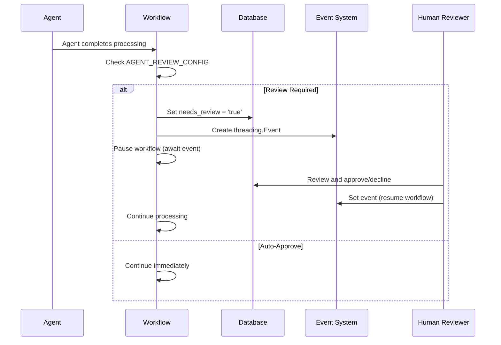

## File Structure (Actual Implementation)

```
merchant-onboarding-ai-project/
├── src/
│   ├── main.py                    # Entry point with test data
│   ├── multi_workflow.py          # Multi-workflow + human review
│   ├── workflow_router.py         # Risk-based routing logic
│   ├── state.py                   # MerchantOnboardingState class
│   └── document_analyzer.py       # Document processing utilities
├── agents/                        # 13 agent directories
│   ├── document-processing/src/agent.py
│   ├── risk-assessment/src/agent.py
│   ├── compliance-verification/src/agent.py
│   ├── data-validation/src/agent.py
│   └── [9 other agents]/
├── ui/
│   ├── app.py                     # Flask web server
│   ├── review_api.py              # Human review endpoints
│   └── [HTML/CSS/JS files]/
├── tools/                         # Tool functions for agents
│   ├── document_tools.py          # Google Doc AI integration
│   ├── risk_tools.py             # Risk assessment tools
│   ├── compliance_tools.py       # KYC/AML/OFAC tools
│   └── validation_tools.py       # Data validation tools
└── database/
    ├── models.py                  # SQLAlchemy models
    └── merchant_onboarding.db     # SQLite database
```

## System Architecture Components

### High-Level System Architecture

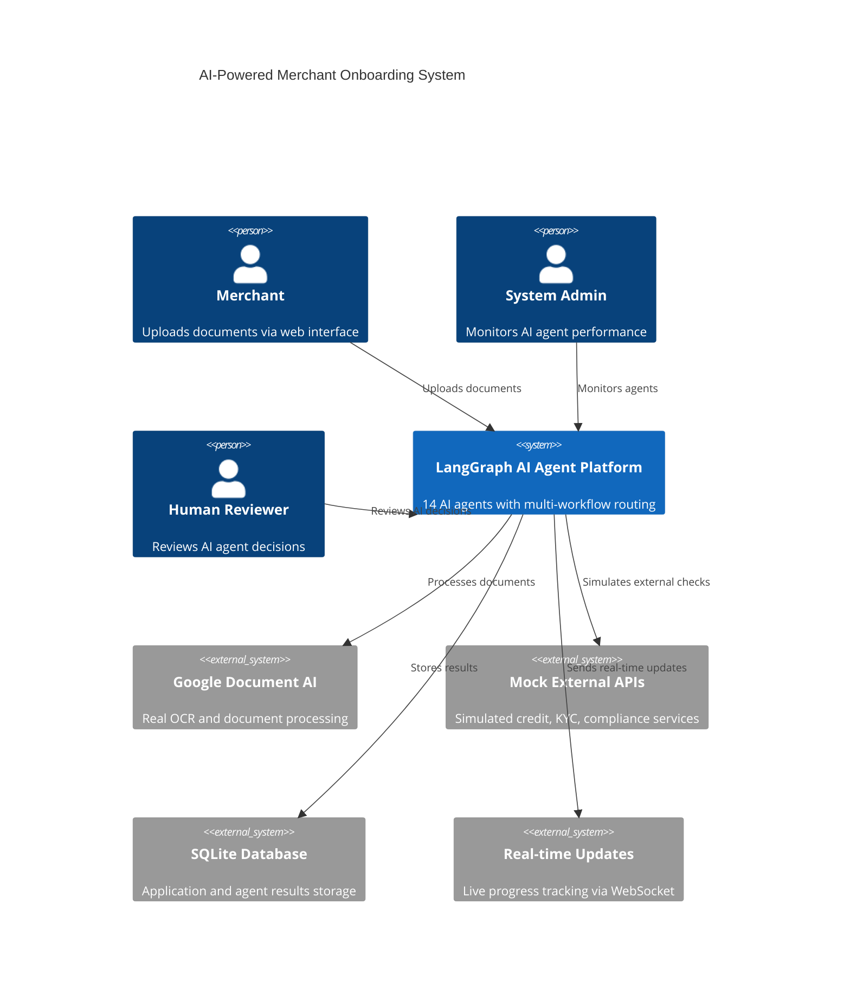

### Current Implementation Architecture

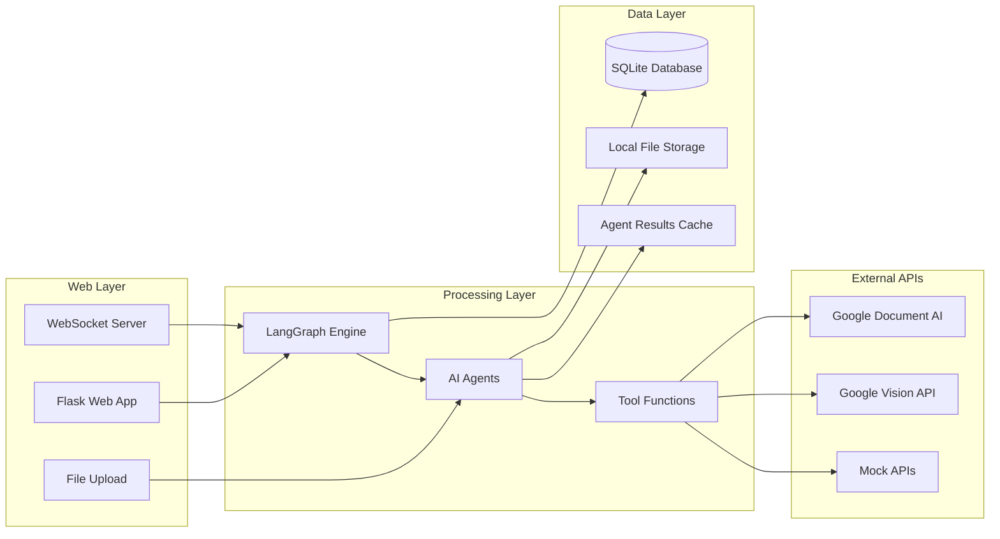


### Current AI Processing (Simplified)

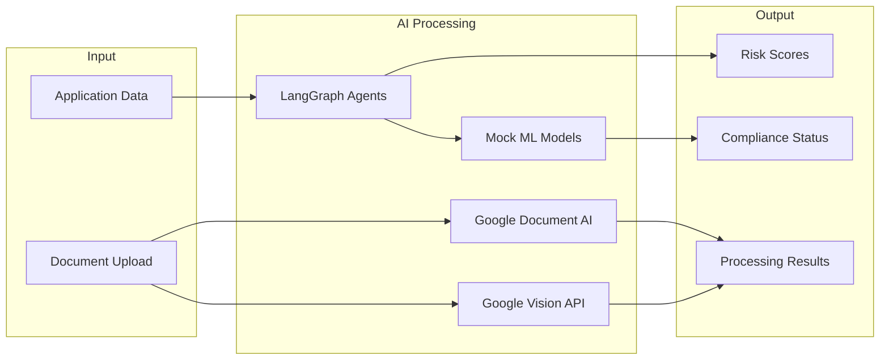


