# AI/ML/GenAI Implementation Map - 12 Phase Merchant Onboarding

## Complete AI Agent & Model Deployment Visualization

```mermaid
flowchart TD
    %% Phase 1: Pre-Application & Lead Management
    subgraph P1 ["🤖 Phase 1: Pre-Application & Lead Management"]
        P1A[Lead Generation & Qualification]
        P1B[ML-based Lead Scoring]
        P1C[CRM Integration]
        P1D[Initial Engagement]
        P1E[GenAI Conversational Interface]
        
        %% AI Components for Phase 1
        A1[🤖 Lead Qualification Agent]
        ML1[📊 Lead Scoring ML Model]
        G1[🧠 Conversational GenAI]
        
        P1A --> A1
        P1B --> ML1
        P1E --> G1
    end
    
    %% Phase 2: Application Initiation & Data Collection
    subgraph P2 ["🤖 Phase 2: Application Initiation & Data Collection"]
        P2A[Portal Registration]
        P2B[Adaptive Questionnaire Engine]
        P2C[Progressive Disclosure]
        P2D[Real-time Validation]
        P2E[Application State Management]
        
        %% AI Components for Phase 2
        A2[🤖 Application Assistant Agent]
        ML2[📊 Form Optimization ML]
        G2[🧠 Dynamic Question GenAI]
        
        P2B --> A2
        P2C --> ML2
        P2D --> G2
    end
    
    %% Phase 3: Document Collection & Processing
    subgraph P3 ["🤖 Phase 3: Document Collection & Processing"]
        P3A[Document Requirements Matrix]
        P3B[Document Upload & Classification]
        P3C[OCR & Computer Vision]
        P3D[Data Extraction & Normalization]
        P3E[Quality Assessment]
        
        %% AI Components for Phase 3
        A3[🤖 Document Processing Agent]
        ML3[📊 Document Classification ML]
        ML3B[📊 OCR Quality ML]
        G3[🧠 Data Extraction GenAI]
        
        P3B --> A3
        P3C --> ML3
        P3D --> ML3B
        P3E --> G3
    end
    
    %% Phase 4: Identity Verification & Compliance
    subgraph P4 ["🤖 Phase 4: Identity Verification & Compliance"]
        P4A[KYC Identity Verification]
        P4B[Facial Recognition & Biometrics]
        P4C[AML Sanctions Screening]
        P4D[PEP Identification]
        P4E[Beneficial Ownership Check]
        
        %% AI Components for Phase 4
        A4[🤖 Compliance Verification Agent]
        ML4[📊 Identity Matching ML]
        ML4B[📊 Sanctions Screening ML]
        G4[🧠 Compliance Report GenAI]
        
        P4A --> A4
        P4B --> ML4
        P4C --> ML4B
        P4E --> G4
    end
    
    %% Phase 5: Data Validation & Enrichment
    subgraph P5 ["🤖 Phase 5: Data Validation & Enrichment"]
        P5A[Document Authentication]
        P5B[Cross-Reference Validation]
        P5C[Data Enrichment & Intelligence]
        P5D[GenAI Analysis & Summarization]
        P5E[Anomaly Detection]
        
        %% AI Components for Phase 5
        A5[🤖 Data Validation Agent]
        ML5[📊 Fraud Detection ML]
        ML5B[📊 Anomaly Detection ML]
        G5[🧠 Data Analysis GenAI]
        
        P5A --> A5
        P5B --> ML5
        P5E --> ML5B
        P5D --> G5
    end
    
    %% Phase 6: Risk Assessment & Scoring
    subgraph P6 ["🤖 Phase 6: Risk Assessment & Scoring"]
        P6A[Credit Risk Modeling]
        P6B[Fraud Risk Assessment]
        P6C[Operational Risk Analysis]
        P6D[Regulatory Risk Evaluation]
        P6E[Composite Risk Scoring]
        
        %% AI Components for Phase 6
        A6[🤖 Risk Assessment Agent]
        ML6[📊 Credit Risk ML Model]
        ML6B[📊 Fraud Risk ML Model]
        ML6C[📊 Ensemble Risk ML]
        G6[🧠 Risk Explanation GenAI]
        
        P6A --> ML6
        P6B --> ML6B
        P6E --> ML6C
        P6E --> A6
        A6 --> G6
    end
    
    %% Phase 7: Underwriting & Decision Making
    subgraph P7 ["🤖 Phase 7: Underwriting & Decision Making"]
        P7A[Intelligent Application Routing]
        P7B[Underwriter Dashboard]
        P7C[Decision Matrix Application]
        P7D[Final Decision & Documentation]
        
        %% AI Components for Phase 7
        A7[🤖 Autonomous Decision Agent]
        ML7[📊 Routing Optimization ML]
        G7[🧠 Decision Reasoning GenAI]
        
        P7A --> ML7
        P7C --> A7
        P7D --> G7
    end
    
    %% Phase 8: Decision Communication & Exception Handling
    subgraph P8 ["🤖 Phase 8: Decision Communication & Exception Handling"]
        P8A[Decision Notification]
        P8B[GenAI Personalized Communication]
        P8C[Exception Management]
        P8D[Clarification Requests]
        P8E[Appeal Process]
        
        %% AI Components for Phase 8
        A8[🤖 Communication Agent]
        ML8[📊 Personalization ML]
        G8[🧠 Message Generation GenAI]
        
        P8A --> A8
        P8B --> ML8
        P8B --> G8
        P8D --> G8
    end
    
    %% Phase 9: Account Setup & Provisioning
    subgraph P9 ["🤖 Phase 9: Account Setup & Provisioning"]
        P9A[API Key Generation]
        P9B[Payment Gateway Configuration]
        P9C[Risk-based Pricing Setup]
        P9D[Settlement Account Linking]
        P9E[Integration Testing]
        
        %% AI Components for Phase 9
        A9[🤖 Account Provisioning Agent]
        ML9[📊 Pricing Optimization ML]
        G9[🧠 Configuration GenAI]
        
        P9A --> A9
        P9C --> ML9
        P9E --> G9
    end
    
    %% Phase 10: Onboarding Completion & Handoff
    subgraph P10 ["🤖 Phase 10: Onboarding Completion & Handoff"]
        P10A[Welcome Kit Delivery]
        P10B[Platform Training]
        P10C[Go-Live Support]
        P10D[Account Manager Assignment]
        P10E[Performance Benchmarking]
        
        %% AI Components for Phase 10
        A10[🤖 Onboarding Support Agent]
        ML10[📊 Success Prediction ML]
        G10[🧠 Training Content GenAI]
        
        P10B --> A10
        P10E --> ML10
        P10A --> G10
    end
    
    %% Phase 11: Post-Onboarding Monitoring
    subgraph P11 ["🤖 Phase 11: Post-Onboarding Monitoring"]
        P11A[Initial Monitoring Period]
        P11B[Transaction Pattern Analysis]
        P11C[Enhanced Controls]
        P11D[Portfolio Management]
        P11E[Performance Analytics]
        
        %% AI Components for Phase 11
        A11[🤖 Monitoring Agent]
        ML11[📊 Pattern Analysis ML]
        ML11B[📊 Anomaly Detection ML]
        G11[🧠 Alert Generation GenAI]
        
        P11A --> A11
        P11B --> ML11
        P11C --> ML11B
        P11D --> G11
    end
    
    %% Phase 12: Continuous Improvement
    subgraph P12 ["🤖 Phase 12: Continuous Improvement & Feedback Loop"]
        P12A[Model Performance Monitoring]
        P12B[Process Optimization]
        P12C[Feedback Integration]
        P12D[Model Retraining]
        P12E[Closed-Loop Learning]
        
        %% AI Components for Phase 12
        A12[🤖 Optimization Agent]
        ML12[📊 Performance Analysis ML]
        G12[🧠 Insight Generation GenAI]
        
        P12A --> A12
        P12B --> ML12
        P12E --> G12
    end
    
    %% Main Flow Connections
    P1E --> P2A
    P2E --> P3A
    P3E --> P4A
    P4E --> P5A
    P5E --> P6A
    P6E --> P7A
    P7D --> P8A
    P8E --> P9A
    P9E --> P10A
    P10E --> P11A
    P11E --> P12A
    P12E --> P1A
    
    %% Styling
    classDef agentBox fill:#e8f5e8,stroke:#2e7d32,stroke-width:2px
    classDef mlBox fill:#fff3e0,stroke:#f57c00,stroke-width:2px
    classDef genaiBox fill:#f3e5f5,stroke:#7b1fa2,stroke-width:2px
    
    class A1,A2,A3,A4,A5,A6,A7,A8,A9,A10,A11,A12 agentBox
    class ML1,ML2,ML3,ML3B,ML4,ML4B,ML5,ML5B,ML6,ML6B,ML6C,ML7,ML8,ML9,ML10,ML11,ML11B,ML12 mlBox
    class G1,G2,G3,G4,G5,G6,G7,G8,G9,G10,G11,G12 genaiBox
```



## Detailed AI Agent Specifications

### 🤖 **AI Agents by Phase**


### 📊 **ML Models by Category**

```mermaid
flowchart TB
    subgraph "Predictive Models"
        PM1[Lead Scoring Model]
        PM2[Credit Risk Model]
        PM3[Fraud Risk Model]
        PM4[Success Prediction Model]
    end
    
    subgraph "Classification Models"
        CM1[Document Classification]
        CM2[Identity Matching]
        CM3[Sanctions Screening]
        CM4[Pattern Analysis]
    end
    
    subgraph "Optimization Models"
        OM1[Form Optimization]
        OM2[Routing Optimization]
        OM3[Pricing Optimization]
        OM4[Performance Analysis]
    end
    
    subgraph "Detection Models"
        DM1[OCR Quality Detection]
        DM2[Fraud Detection]
        DM3[Anomaly Detection]
        DM4[Anomaly Detection (Monitoring)]
    end
```

### 🧠 **GenAI Applications by Use Case**


## Implementation Priority & Complexity Matrix

| **Phase** | **🤖 AI Agent** | **📊 ML Model** | **🧠 GenAI** | **Priority** | **Complexity** |
|-----------|-----------------|-----------------|--------------|--------------|----------------|
| **P1** | Lead Qualification | Lead Scoring | Conversational UI | HIGH | LOW |
| **P2** | Application Assistant | Form Optimization | Dynamic Questions | HIGH | MEDIUM |
| **P3** | Document Processing | Classification + OCR | Data Extraction | CRITICAL | HIGH |
| **P4** | Compliance Verification | Identity + Sanctions | Compliance Reports | CRITICAL | HIGH |
| **P5** | Data Validation | Fraud + Anomaly | Data Analysis | HIGH | MEDIUM |
| **P6** | Risk Assessment | Multi-Risk Models | Risk Explanations | CRITICAL | HIGH |
| **P7** | Decision Agent | Routing Optimization | Decision Reasoning | CRITICAL | VERY HIGH |
| **P8** | Communication | Personalization | Message Generation | MEDIUM | LOW |
| **P9** | Provisioning | Pricing Optimization | Configuration Guide | MEDIUM | MEDIUM |
| **P10** | Support Agent | Success Prediction | Training Content | LOW | LOW |
| **P11** | Monitoring | Pattern Analysis | Alert Generation | HIGH | MEDIUM |
| **P12** | Optimization | Performance Analysis | Insight Generation | MEDIUM | MEDIUM |

## ROI Impact by AI Implementation


## Technology Stack Requirements

### **AI Agents Framework**
- **LangChain/LlamaIndex** for agent orchestration
- **AutoGen** for multi-agent collaboration
- **CrewAI** for specialized agent teams

### **ML Models Platform**
- **MLflow** for model lifecycle management
- **Kubeflow** for ML pipelines
- **Feature Store** for real-time feature serving

### **GenAI Infrastructure**
- **OpenAI GPT-4/Claude** for text generation
- **Azure OpenAI** for enterprise deployment
- **Vector Databases** (Pinecone/Weaviate) for RAG

## Implementation Roadmap

### **Phase 1 (Months 1-3): Foundation**
1. Document Processing Agent + ML Models (P3)
2. Risk Assessment ML Models (P6)
3. Basic Decision Agent (P7)

### **Phase 2 (Months 4-6): Enhancement**
1. Compliance Verification Agent (P4)
2. Lead Qualification Agent (P1)
3. Communication GenAI (P8)

### **Phase 3 (Months 7-9): Optimization**
1. Advanced Decision Agent (P7)
2. Monitoring Agent (P11)
3. Full GenAI Integration

### **Phase 4 (Months 10-12): Innovation**
1. Optimization Agent (P12)
2. Advanced Analytics
3. Continuous Learning Systems

This comprehensive map shows exactly where each AI technology provides maximum value across all 12 phases of merchant onboarding.