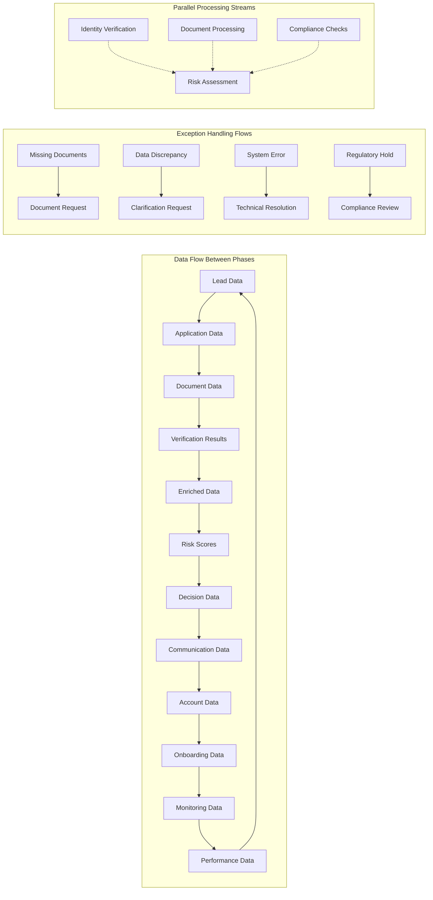
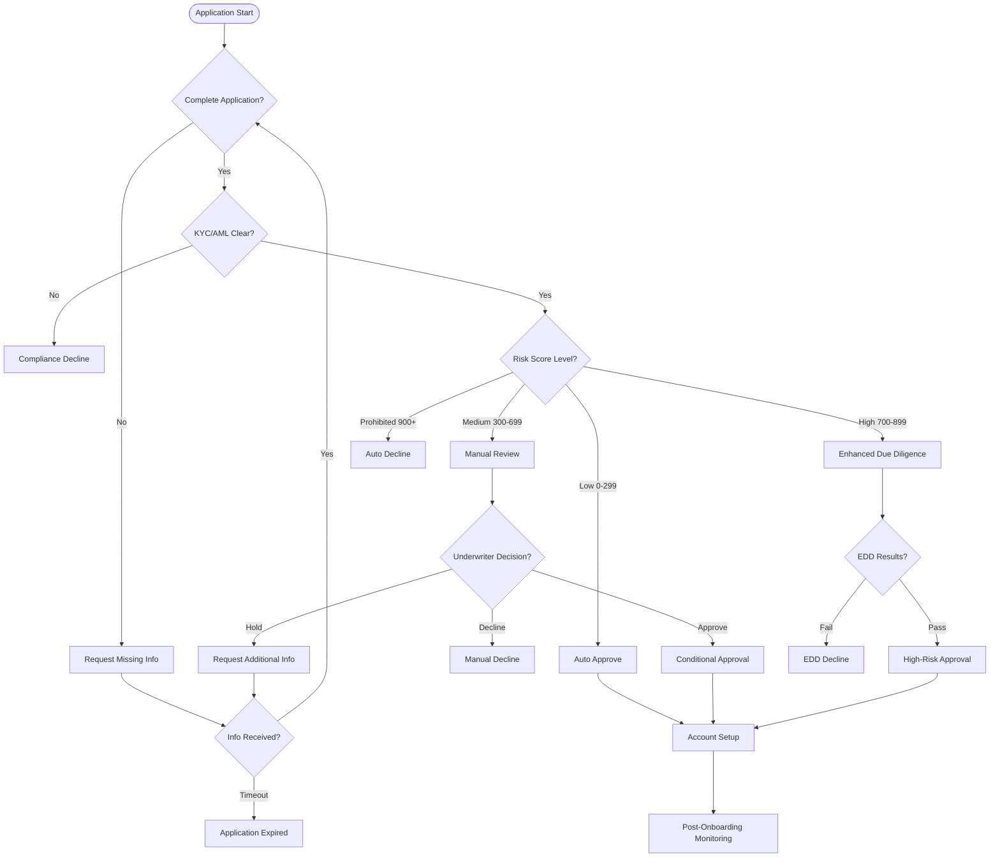

# Complete 12-Phase Merchant Onboarding Flow Diagram

## Comprehensive End-to-End Process Flow

```mermaid
flowchart TD
    %% Phase 1: Pre-Application & Lead Management
    subgraph P1 ["Phase 1: Pre-Application & Lead Management"]
        P1A[Lead Generation & Qualification]
        P1B[ML-based Lead Scoring]
        P1C[CRM Integration]
        P1D[Initial Engagement]
        P1E[GenAI Conversational Interface]
        
        P1A --> P1B
        P1B --> P1C
        P1C --> P1D
        P1D --> P1E
    end
    
    %% Phase 2: Application Initiation & Data Collection
    subgraph P2 ["Phase 2: Application Initiation & Data Collection"]
        P2A[Portal Registration]
        P2B[Adaptive Questionnaire Engine]
        P2C[Progressive Disclosure]
        P2D[Real-time Validation]
        P2E[Application State Management]
        
        P2A --> P2B
        P2B --> P2C
        P2C --> P2D
        P2D --> P2E
    end
    
    %% Phase 3: Document Collection & Processing
    subgraph P3 ["Phase 3: Document Collection & Processing"]
        P3A[Document Requirements Matrix]
        P3B[Document Upload & Classification]
        P3C[OCR & Computer Vision]
        P3D[Data Extraction & Normalization]
        P3E[Quality Assessment]
        
        P3A --> P3B
        P3B --> P3C
        P3C --> P3D
        P3D --> P3E
    end
    
    %% Phase 4: Identity Verification & Compliance
    subgraph P4 ["Phase 4: Identity Verification & Compliance"]
        P4A[KYC Identity Verification]
        P4B[Facial Recognition & Biometrics]
        P4C[AML Sanctions Screening]
        P4D[PEP Identification]
        P4E[Beneficial Ownership Check]
        
        P4A --> P4B
        P4B --> P4C
        P4C --> P4D
        P4D --> P4E
    end
    
    %% Phase 5: Data Validation & Enrichment
    subgraph P5 ["Phase 5: Data Validation & Enrichment"]
        P5A[Document Authentication]
        P5B[Cross-Reference Validation]
        P5C[Data Enrichment & Intelligence]
        P5D[GenAI Analysis & Summarization]
        P5E[Anomaly Detection]
        
        P5A --> P5B
        P5B --> P5C
        P5C --> P5D
        P5D --> P5E
    end
    
    %% Phase 6: Risk Assessment & Scoring
    subgraph P6 ["Phase 6: Risk Assessment & Scoring"]
        P6A[Credit Risk Modeling]
        P6B[Fraud Risk Assessment]
        P6C[Operational Risk Analysis]
        P6D[Regulatory Risk Evaluation]
        P6E[Composite Risk Scoring]
        
        P6A --> P6E
        P6B --> P6E
        P6C --> P6E
        P6D --> P6E
    end
    
    %% Phase 7: Underwriting & Decision Making
    subgraph P7 ["Phase 7: Underwriting & Decision Making"]
        P7A[Intelligent Application Routing]
        P7B[Underwriter Dashboard]
        P7C[Decision Matrix Application]
        P7D[Final Decision & Documentation]
        
        P7A --> P7B
        P7B --> P7C
        P7C --> P7D
    end
    
    %% Decision Point
    P7D --> DECISION{Decision Type}
    
    %% Phase 8: Decision Communication & Exception Handling
    subgraph P8 ["Phase 8: Decision Communication & Exception Handling"]
        P8A[Decision Notification]
        P8B[GenAI Personalized Communication]
        P8C[Exception Management]
        P8D[Clarification Requests]
        P8E[Appeal Process]
        
        P8A --> P8B
        P8C --> P8D
        P8D --> P8E
    end
    
    %% Phase 9: Account Setup & Provisioning
    subgraph P9 ["Phase 9: Account Setup & Provisioning"]
        P9A[API Key Generation]
        P9B[Payment Gateway Configuration]
        P9C[Risk-based Pricing Setup]
        P9D[Settlement Account Linking]
        P9E[Integration Testing]
        
        P9A --> P9B
        P9B --> P9C
        P9C --> P9D
        P9D --> P9E
    end
    
    %% Phase 10: Onboarding Completion & Handoff
    subgraph P10 ["Phase 10: Onboarding Completion & Handoff"]
        P10A[Welcome Kit Delivery]
        P10B[Platform Training]
        P10C[Go-Live Support]
        P10D[Account Manager Assignment]
        P10E[Performance Benchmarking]
        
        P10A --> P10B
        P10B --> P10C
        P10C --> P10D
        P10D --> P10E
    end
    
    %% Phase 11: Post-Onboarding Monitoring
    subgraph P11 ["Phase 11: Post-Onboarding Monitoring"]
        P11A[Initial Monitoring Period]
        P11B[Transaction Pattern Analysis]
        P11C[Enhanced Controls]
        P11D[Portfolio Management]
        P11E[Performance Analytics]
        
        P11A --> P11B
        P11B --> P11C
        P11C --> P11D
        P11D --> P11E
    end
    
    %% Phase 12: Continuous Improvement
    subgraph P12 ["Phase 12: Continuous Improvement & Feedback Loop"]
        P12A[Model Performance Monitoring]
        P12B[Process Optimization]
        P12C[Feedback Integration]
        P12D[Model Retraining]
        P12E[Closed-Loop Learning]
        
        P12A --> P12B
        P12B --> P12C
        P12C --> P12D
        P12D --> P12E
    end
    
    %% Main Flow Connections
    P1E --> P2A
    P2E --> P3A
    P3E --> P4A
    P4E --> P5A
    P5E --> P6A
    P6E --> P7A
    
    %% Decision Branches
    DECISION -->|Approve| P9A
    DECISION -->|Decline| P8A
    DECISION -->|Hold/Exception| P8C
    
    %% Exception Handling Flow
    P8E --> P2A
    
    %% Approval Flow
    P9E --> P10A
    P10E --> P11A
    P11E --> P12A
    
    %% Feedback Loop
    P12E --> P1A
    
    %% Styling
    classDef phaseBox fill:#e1f5fe,stroke:#01579b,stroke-width:2px
    classDef decisionBox fill:#fff3e0,stroke:#e65100,stroke-width:3px
    classDef processBox fill:#f3e5f5,stroke:#4a148c,stroke-width:1px
    
    class P1,P2,P3,P4,P5,P6,P7,P8,P9,P10,P11,P12 phaseBox
    class DECISION decisionBox
```

## Detailed Phase Interconnections

## Phase Timing and SLA Matrix

```mermaid
gantt
    title Merchant Onboarding Phase Timeline
    dateFormat X
    axisFormat %d
    
    section Phase 1-3: Data Collection
    Lead Qualification    :p1, 0, 1d
    Application Submission :p2, after p1, 2d
    Document Processing   :p3, after p2, 2d
    
    section Phase 4-6: Verification & Risk
    Identity Verification :p4, after p2, 3d
    Data Validation      :p5, after p3, 2d
    Risk Assessment      :p6, after p4, 1d
    
    section Phase 7-8: Decision
    Underwriting         :p7, after p6, 2d
    Decision Communication :p8, after p7, 1d
    
    section Phase 9-10: Setup
    Account Provisioning :p9, after p8, 2d
    Onboarding Complete  :p10, after p9, 1d
    
    section Phase 11-12: Monitoring
    Initial Monitoring   :p11, after p10, 30d
    Continuous Improvement :p12, after p11, 365d
```

## Critical Decision Points Flow

