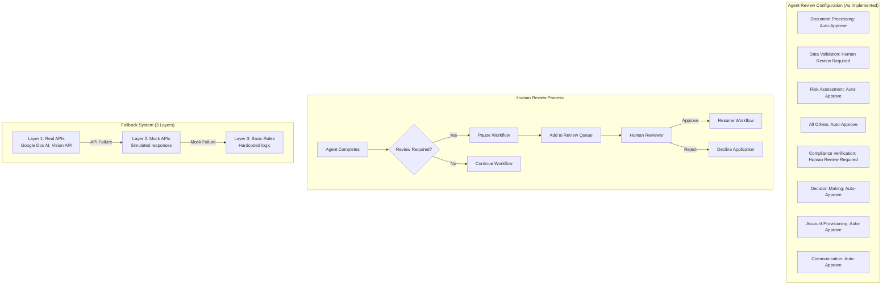
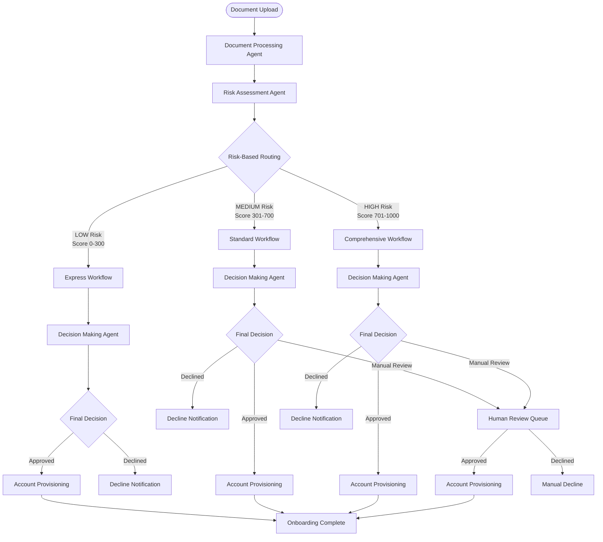
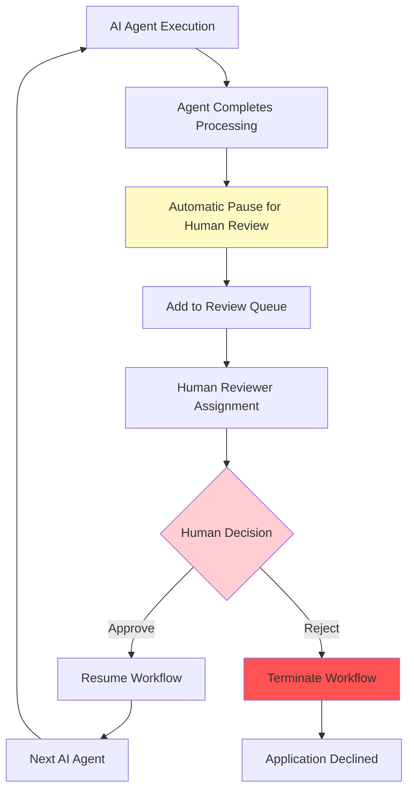

# Merchant Onboarding AI System - Actual Implementation Flow

## Multi-Workflow Architecture (As Implemented)

```mermaid
flowchart TD
    %% Entry Point: Document Processing
    START[Application Submission] --> DOC[Document Processing Agent]
    DOC --> RISK[Risk Assessment Agent]
    RISK --> ROUTE{Workflow Routing}
    
    %% Express Workflow (4 agents)
    ROUTE -->|LOW Risk| EXP[Express Workflow]
    subgraph EXPRESS ["Express Workflow - 4 Agents"]
        E1[Document Processing]
        E2[Risk Assessment]
        E3[Decision Making]
        E4[Account Provisioning]
        
        E1 --> E2 --> E3 --> E4
    end
    
    %% Standard Workflow (8 agents)
    ROUTE -->|MEDIUM Risk| STD[Standard Workflow]
    subgraph STANDARD ["Standard Workflow - 8 Agents"]
        S1[Document Processing]
        S2[Data Validation]
        S3[Risk Assessment]
        S8[Underwriting]
        S4[Compliance Verification]
        S5[Decision Making]
        S6[Account Provisioning]
        S7[Communication]
        
        S1 --> S3
        S3 --> S2 --> S8
        S8 --> S4
        S4 --> S5 --> S6 --> S7
    end
    
    %% Comprehensive Workflow (14 agents)
    ROUTE -->|HIGH Risk| COMP[Comprehensive Workflow]
    subgraph COMPREHENSIVE ["Comprehensive Workflow - 14 Agents"]
        C1[Document Processing]
        C2[Risk Assessment]
        C3[Market Qualification]
        C4[Lead Qualification]
        C5[Data Validation]
        C14[Underwriting]
        C6[Compliance Verification]
        C7[Decision Making]
        C8[Exception Routing]
        C9[Communication]
        C10[Account Provisioning]
        C11[Monitoring]
        C12[Optimization]
        C13[Onboarding Support]
        
        C1 --> C2 --> C3 --> C4 --> C5 --> C14 --> C6 --> C7 --> C8 --> C9 --> C10 --> C11 --> C12 --> C13
    end
    
    %% Human Review Integration
    EXPRESS --> REVIEW{Human Review Required?}
    STANDARD --> REVIEW
    COMPREHENSIVE --> REVIEW
    
    REVIEW -->|Yes| PAUSE[Workflow Paused]
    REVIEW -->|No| COMPLETE[Processing Complete]
    
    PAUSE --> HUMAN[Human Review]
    HUMAN -->|Approved| RESUME[Resume Workflow]
    HUMAN -->|Rejected| DECLINE[Application Declined]
    
    RESUME --> COMPLETE
    
    %% Styling
    classDef expressBox fill:#c8e6c9,stroke:#2e7d32,stroke-width:2px
    classDef standardBox fill:#fff9c4,stroke:#f57f17,stroke-width:2px
    classDef comprehensiveBox fill:#ffcdd2,stroke:#c62828,stroke-width:2px
    classDef reviewBox fill:#e1f5fe,stroke:#01579b,stroke-width:3px
    
    class EXPRESS,E1,E2,E3,E4 expressBox
    class STANDARD,S1,S2,S3,S4,S5,S6,S7 standardBox
    class COMPREHENSIVE,C1,C2,C3,C4,C5,C6,C7,C8,C9,C10,C11,C12,C13 comprehensiveBox
    class REVIEW,PAUSE,HUMAN reviewBox
```

## Agent Configuration and Review Settings

```mermaid
flowchart TD
    subgraph "Agent Review Configuration (As Implemented)"
        AR1[Document Processing: Auto-Approve]
        AR2[Data Validation: Human Review Required]
        AR3[Risk Assessment: Auto-Approve]
        AR8[Underwriting: Auto-Approve]
        AR4[Compliance Verification: Human Review Required]
        AR5[Decision Making: Auto-Approve]
        AR6[Account Provisioning: Auto-Approve]
        AR7[Communication: Auto-Approve]
        AR8[All Others: Auto-Approve]
    end
    
    subgraph "Human Review Process"
        HR1[Agent Completes] --> HR2{Review Required?}
        HR2 -->|Yes| HR3[Pause Workflow]
        HR2 -->|No| HR4[Continue Workflow]
        HR3 --> HR5[Add to Review Queue]
        HR5 --> HR6[Human Reviewer]
        HR6 -->|Approve| HR7[Resume Workflow]
        HR6 -->|Reject| HR8[Decline Application]
    end
    
    subgraph "Fallback System (3 Layers)"
        F1[Layer 1: Real APIs<br/>Google Doc AI, Vision API]
        F2[Layer 2: Mock APIs<br/>Simulated responses]
        F3[Layer 3: Basic Rules<br/>Hardcoded logic]
        
        F1 -->|API Failure| F2
        F2 -->|Mock Failure| F3
    end
```

## Actual Decision Flow (As Implemented)

```mermaid
flowchart TD
    START([Document Upload]) --> DOC[Document Processing Agent]
    DOC --> RISK[Risk Assessment Agent]
    RISK --> ROUTE{Risk-Based Routing}
    
    ROUTE -->|LOW Risk<br/>Score 0-300| EXPRESS[Express Workflow]
    ROUTE -->|MEDIUM Risk<br/>Score 301-700| STANDARD[Standard Workflow]
    ROUTE -->|HIGH Risk<br/>Score 701-1000| COMPREHENSIVE[Comprehensive Workflow]
    
    EXPRESS --> DECISION1[Decision Making Agent]
    STANDARD --> DECISION2[Decision Making Agent]
    COMPREHENSIVE --> DECISION3[Decision Making Agent]
    
    DECISION1 --> RESULT1{Final Decision}
    DECISION2 --> RESULT2{Final Decision}
    DECISION3 --> RESULT3{Final Decision}
    
    RESULT1 -->|Approved| PROVISION1[Account Provisioning]
    RESULT1 -->|Declined| NOTIFY1[Decline Notification]
    
    RESULT2 -->|Approved| PROVISION2[Account Provisioning]
    RESULT2 -->|Declined| NOTIFY2[Decline Notification]
    RESULT2 -->|Manual Review| REVIEW[Human Review Queue]
    
    RESULT3 -->|Approved| PROVISION3[Account Provisioning]
    RESULT3 -->|Declined| NOTIFY3[Decline Notification]
    RESULT3 -->|Manual Review| REVIEW
    
    REVIEW -->|Approved| PROVISION_MANUAL[Account Provisioning]
    REVIEW -->|Declined| NOTIFY_MANUAL[Manual Decline]
    
    PROVISION1 --> COMPLETE
    PROVISION2 --> COMPLETE
    PROVISION3 --> COMPLETE
    PROVISION_MANUAL --> COMPLETE
    
    COMPLETE[Onboarding Complete]
```

## External API Integrations

### ✅ Live Integrations (4 APIs)
- **Google Document AI**: OCR and document processing
- **Google Vision API**: Image analysis and fraud detection
- **SQLAlchemy**: Database operations
- **Flask/WebSocket**: Web interface and real-time updates

### ⚠️ Mock Integrations (12+ APIs)
- **Experian Business API** (Mock): Credit scoring responses
- **OFAC Sanctions API** (Mock): Compliance screening data
- **Jumio Identity API** (Mock): KYC verification simulation
- **Plaid Banking API** (Mock): Account verification
- **Equifax Business API** (Mock): Credit bureau data
- **TransUnion Business API** (Mock): Credit reports
- **LexisNexis Risk API** (Mock): AML screening
- **Onfido Identity API** (Mock): Document verification
- **Trulioo Global API** (Mock): Identity verification
- **Secretary of State APIs** (Mock): Business registry checks
- **IRS Tax ID API** (Mock): Tax verification
- **USPS Address API** (Mock): Address validation

### 📋 Integration Summary
- **Total APIs**: 16+
- **Live**: 4 (25%)
- **Mocked**: 12+ (75%)
- **Fallback Layers**: 3 (Real → Mock → Rules)

## Human-in-the-Loop Implementation Details

### 🎯 Implementation Status: DEVELOPMENT PROTOTYPE ⚠️

The system is a **development prototype** with basic human review framework. Full compliance implementation requires production deployment with real security and review systems.

### Mandatory Review Checkpoints

```mermaid
flowchart TD
    A[AI Agent Execution] --> B[Agent Completes Processing]
    B --> C[Automatic Pause for Human Review]
    C --> D[Add to Review Queue]
    D --> E[Human Reviewer Assignment]
    E --> F{Human Decision}
    F -->|Approve| G[Resume Workflow]
    F -->|Reject| H[Terminate Workflow]
    G --> I[Next AI Agent]
    H --> J[Application Declined]
    I --> A
    
    style C fill:#fff9c4
    style F fill:#ffcdd2
    style H fill:#ff5252
```

### Compliance Achievement

**Regulatory Requirements - DEVELOPMENT ONLY ⚠️**
- BSA/AML Compliance: Mock screening only (not production-ready)
- OFAC Sanctions Screening: Simulated responses (not real OFAC data)
- Risk Assessment Validation: Basic framework (needs production security)
- KYC Identity Verification: Mock verification (not real KYC providers)
- Decision Making Oversight: Development interface only

**Audit Trail Requirements - BASIC IMPLEMENTATION ⚠️**
- Basic review history in SQLite (not enterprise-grade)
- Simple decision tracking (no authentication/authorization)
- Basic review notes (no encryption or security)
- Agent result storage (local development only)
- Workflow state persistence (SQLite, not production database)

