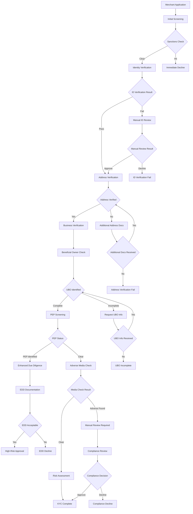
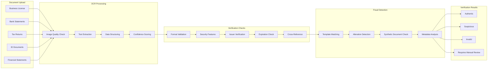
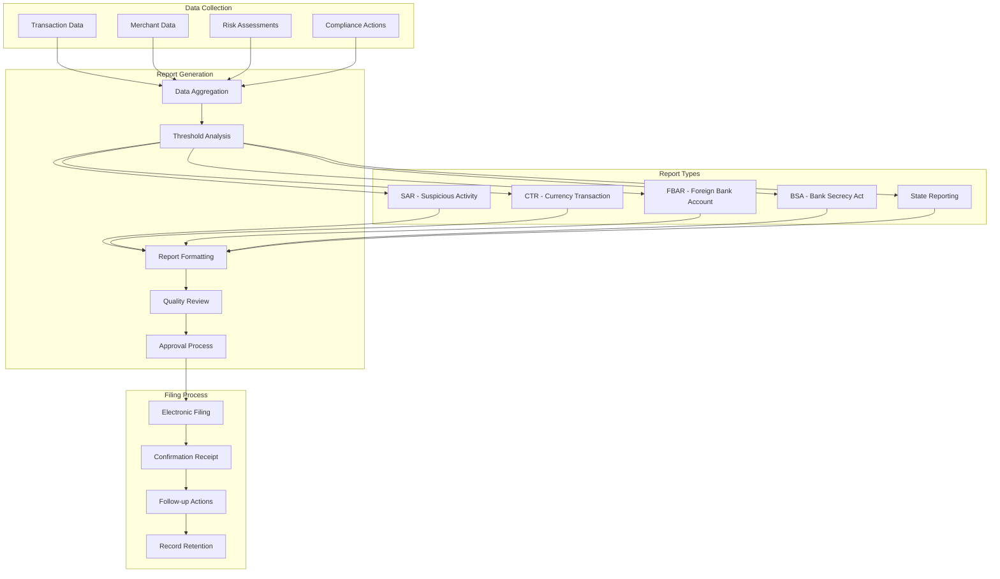
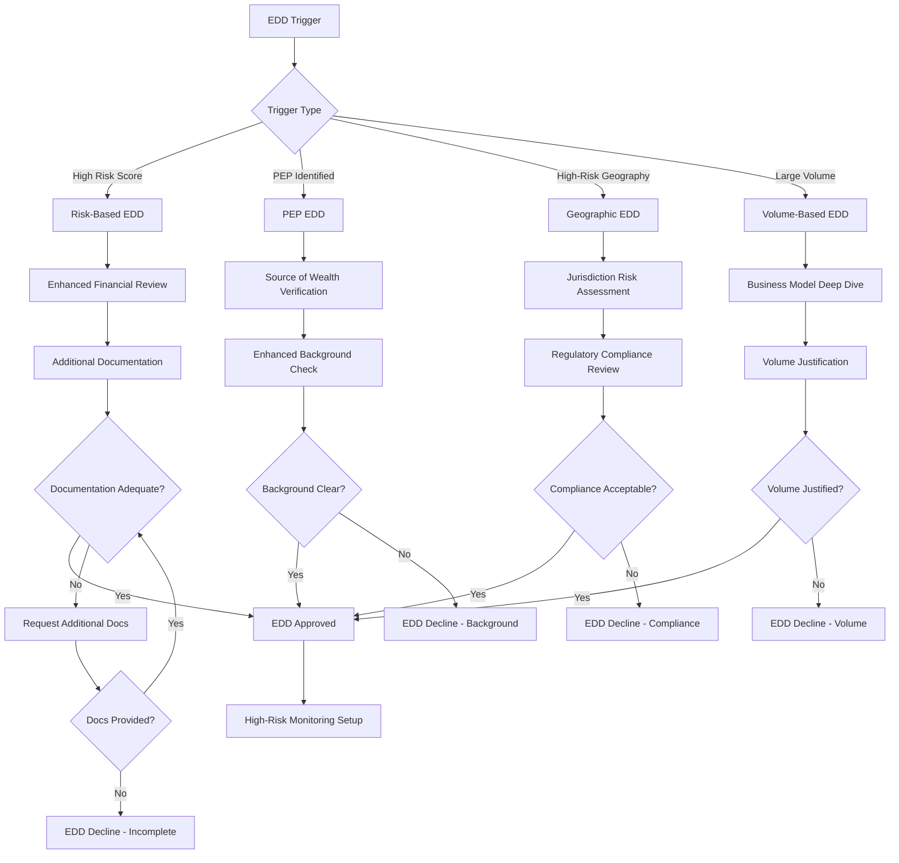
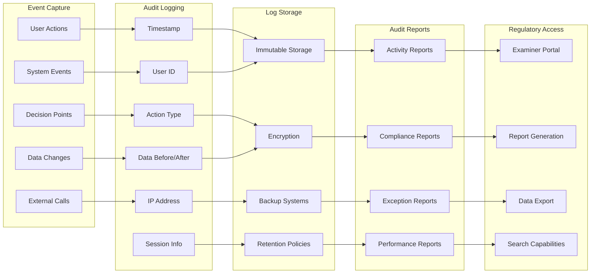
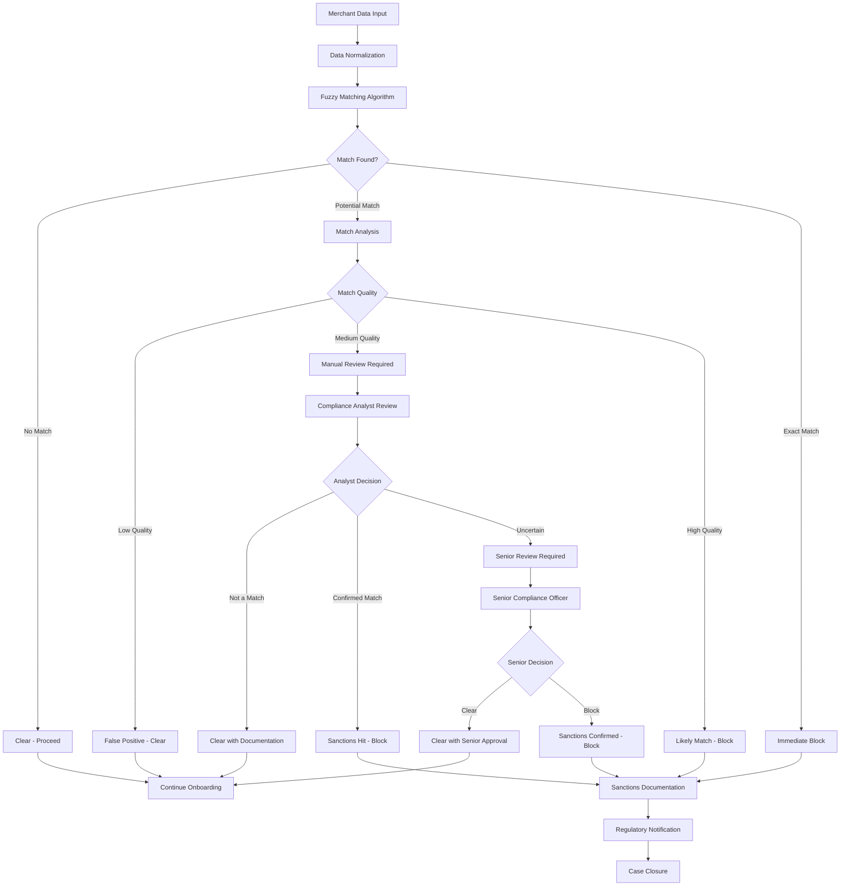
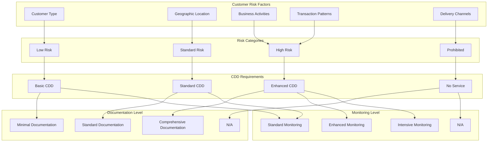
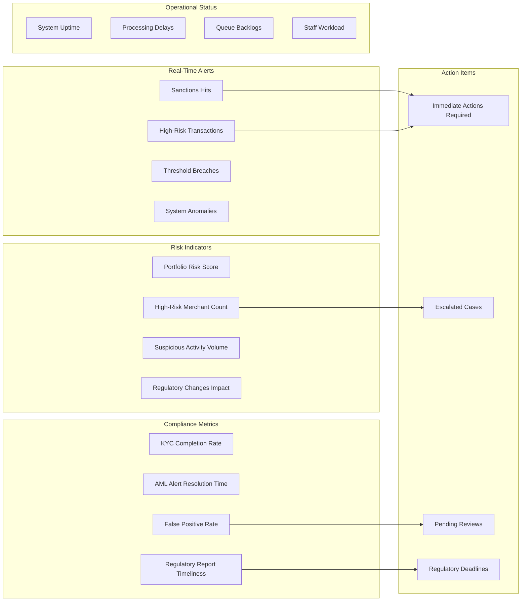

# Compliance and Regulatory Workflow Diagrams

## KYC/AML Compliance Workflow

## Document Verification Process

## Regulatory Reporting Workflow

## Enhanced Due Diligence (EDD) Process

## Audit Trail and Documentation

## Sanctions Screening Process

## Customer Due Diligence (CDD) Matrix

## Compliance Monitoring Dashboard

