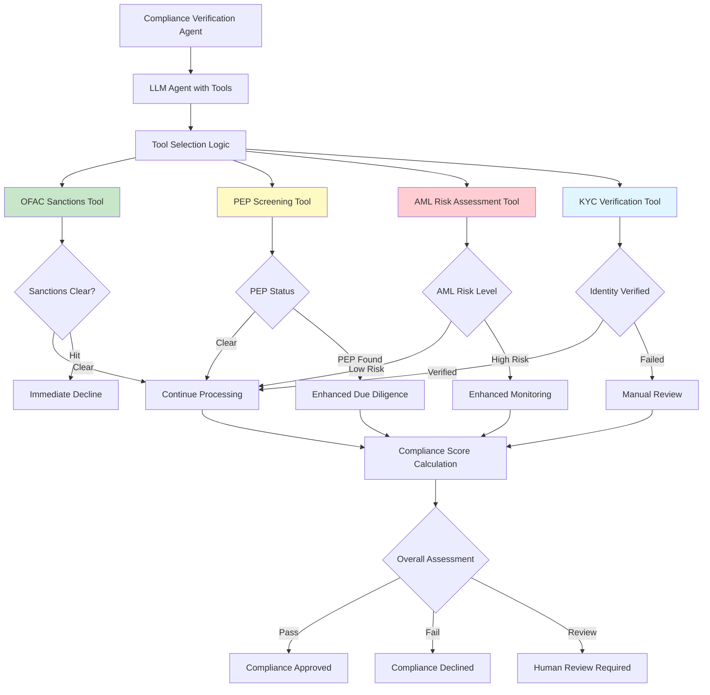
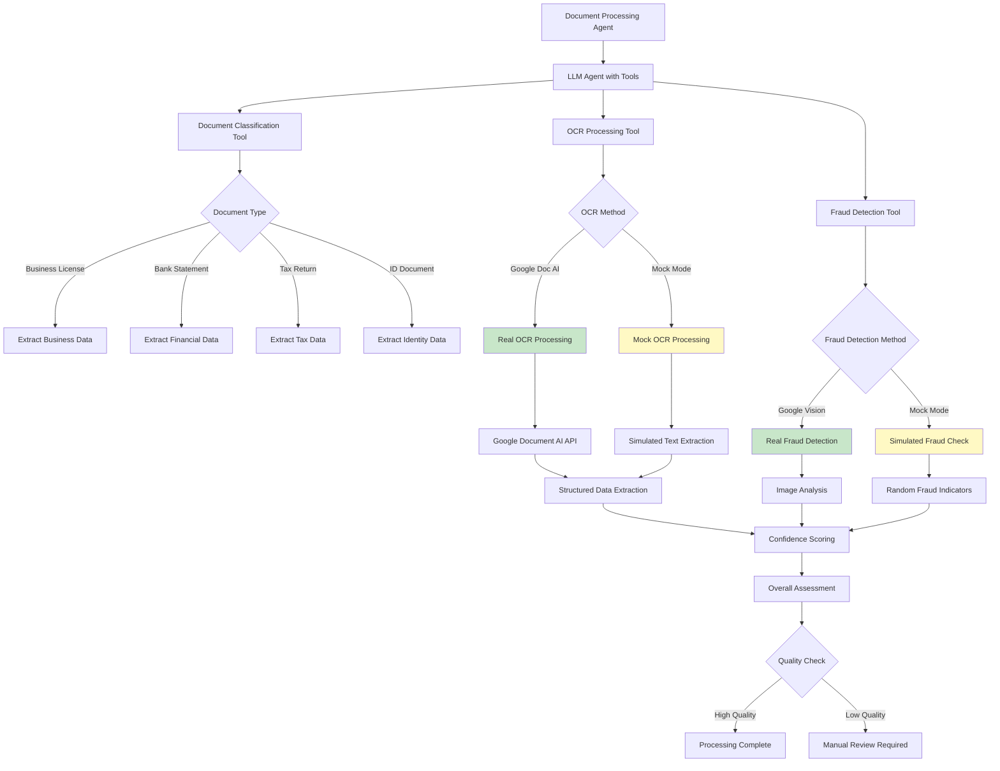
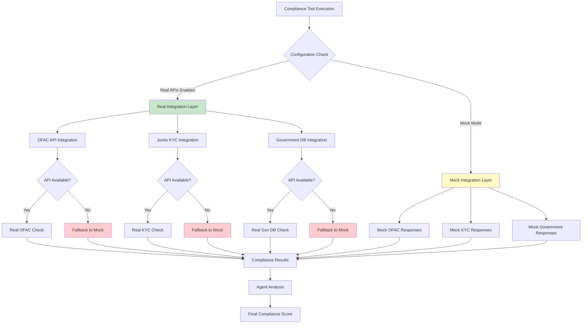
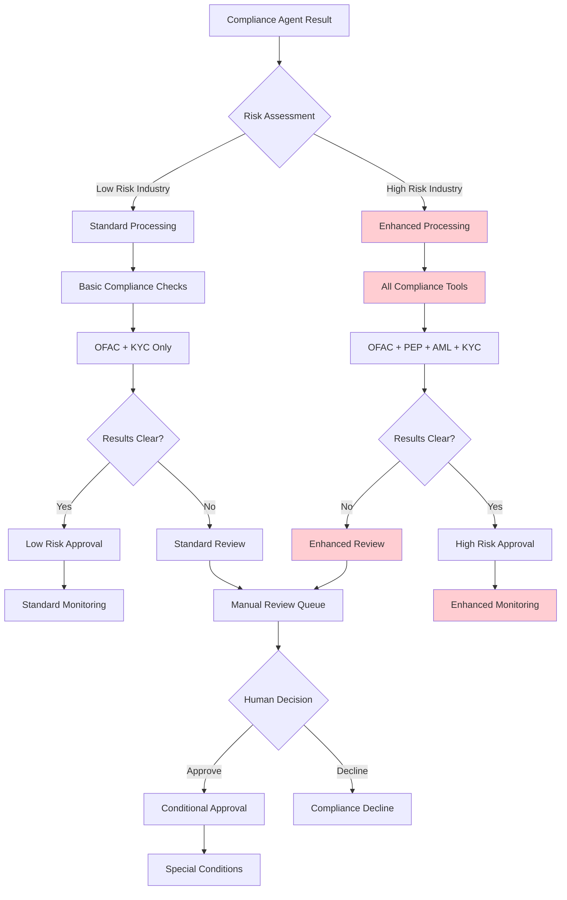
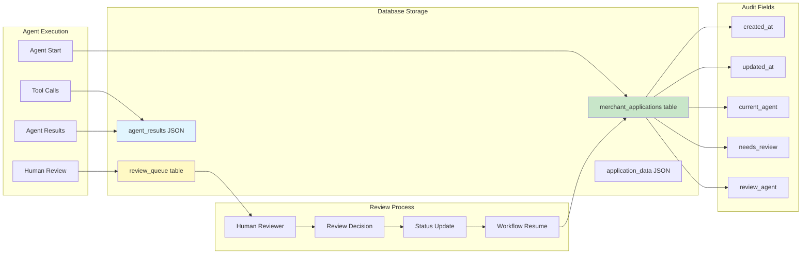
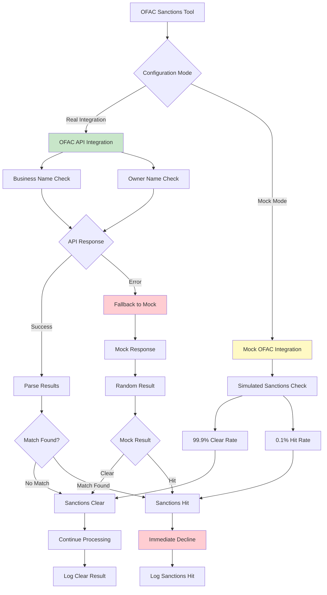
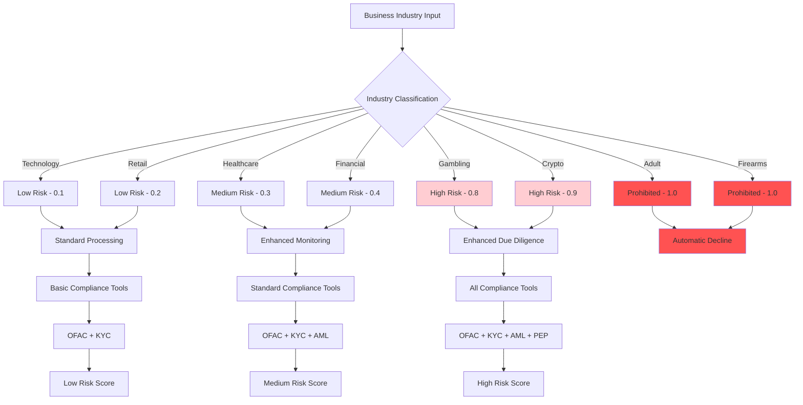
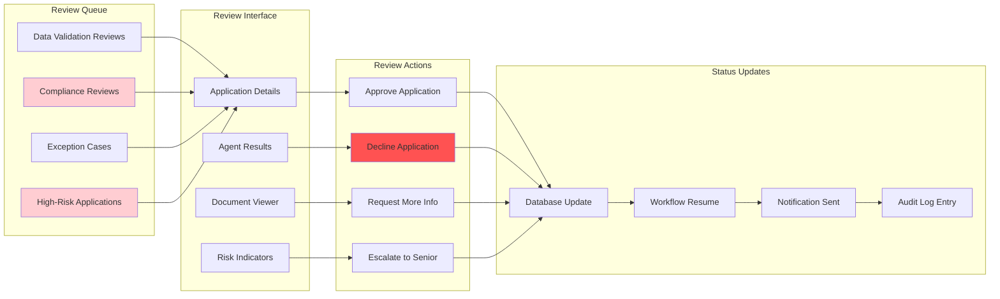
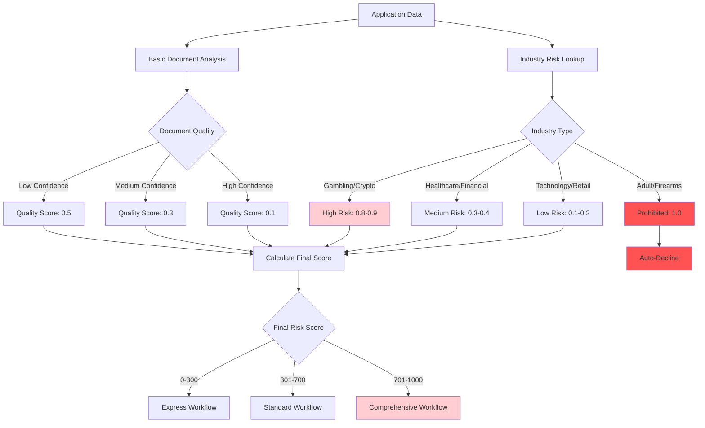
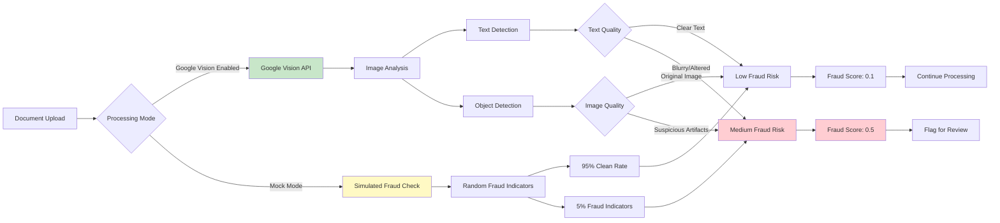

# Compliance and Regulatory Workflow Diagrams
## Development Implementation with Mock APIs

**⚠️ IMPORTANT**: This documentation shows the development prototype implementation. Most compliance tools use **mock APIs** and simulated responses. This is **NOT production-ready** for regulated financial services.

## Compliance Verification Agent Workflow (As Implemented)

```mermaid
flowchart TD
    A[Compliance Verification Agent] --> B[LLM Agent with Tools]
    B --> C[Tool Selection Logic]
    
    C --> D[OFAC Sanctions Tool]
    C --> E[PEP Screening Tool]
    C --> F[AML Risk Assessment Tool]
    C --> G[KYC Verification Tool]
    
    D --> H{Sanctions Clear?}
    H -->|Clear| I[Continue Processing]
    H -->|Hit| J[Immediate Decline]
    
    E --> K{PEP Status}
    K -->|Clear| I
    K -->|PEP Found| L[Enhanced Due Diligence]
    
    F --> M{AML Risk Level}
    M -->|Low Risk| I
    M -->|High Risk| N[Enhanced Monitoring]
    
    G --> O{Identity Verified}
    O -->|Verified| I
    O -->|Failed| P[Manual Review]
    
    I --> Q[Compliance Score Calculation]
    L --> Q
    N --> Q
    P --> Q
    
    Q --> R{Overall Assessment}
    R -->|Pass| S[Compliance Approved]
    R -->|Fail| T[Compliance Declined]
    R -->|Review| U[Human Review Required]
    
    style D fill:#c8e6c9
    style E fill:#fff9c4
    style F fill:#ffcdd2
    style G fill:#e1f5fe
```

## Document Processing Agent Workflow (As Implemented)

```mermaid
flowchart TD
    A[Document Processing Agent] --> B[LLM Agent with Tools]
    B --> C[Document Classification Tool]
    B --> D[OCR Processing Tool]
    B --> E[Fraud Detection Tool]
    
    C --> F{Document Type}
    F -->|Business License| G[Extract Business Data]
    F -->|Bank Statement| H[Extract Financial Data]
    F -->|Tax Return| I[Extract Tax Data]
    F -->|ID Document| J[Extract Identity Data]
    
    D --> K{OCR Method}
    K -->|Google Doc AI| L[Real OCR Processing]
    K -->|Mock Mode| M[Mock OCR Processing]
    
    L --> N[Google Document AI API]
    M --> O[Simulated Text Extraction]
    
    N --> P[Structured Data Extraction]
    O --> P
    
    E --> Q{Fraud Detection Method}
    Q -->|Google Vision| R[Real Fraud Detection]
    Q -->|Mock Mode| S[Simulated Fraud Check]
    
    R --> T[Image Analysis]
    S --> U[Random Fraud Indicators]
    
    P --> V[Confidence Scoring]
    T --> V
    U --> V
    
    V --> W[Overall Assessment]
    W --> X{Quality Check}
    X -->|High Quality| Y[Processing Complete]
    X -->|Low Quality| Z[Manual Review Required]
    
    style L fill:#c8e6c9
    style M fill:#fff9c4
    style R fill:#c8e6c9
    style S fill:#fff9c4
```

## Tool Configuration and Fallback System (As Implemented)

```mermaid
flowchart TD
    A[Compliance Tool Execution] --> B{Configuration Check}
    
    B -->|Real APIs Enabled| C[Real Integration Layer]
    B -->|Mock Mode| D[Mock Integration Layer]
    
    C --> E[OFAC API Integration]
    C --> F[Jumio KYC Integration]
    C --> G[Government DB Integration]
    
    D --> H[Mock OFAC Responses]
    D --> I[Mock KYC Responses]
    D --> J[Mock Government Responses]
    
    E --> K{API Available?}
    F --> L{API Available?}
    G --> M{API Available?}
    
    K -->|Yes| N[Real OFAC Check]
    K -->|No| O[Fallback to Mock]
    
    L -->|Yes| P[Real KYC Check]
    L -->|No| Q[Fallback to Mock]
    
    M -->|Yes| R[Real Gov DB Check]
    M -->|No| S[Fallback to Mock]
    
    N --> T[Compliance Results]
    O --> T
    P --> T
    Q --> T
    R --> T
    S --> T
    H --> T
    I --> T
    J --> T
    
    T --> U[Agent Analysis]
    U --> V[Final Compliance Score]
    
    style C fill:#c8e6c9
    style D fill:#fff9c4
    style O fill:#ffcdd2
    style Q fill:#ffcdd2
    style S fill:#ffcdd2
```

## Risk-Based Processing Logic (As Implemented)

```mermaid
flowchart TB
    A[Compliance Agent Result] --> B{Risk Assessment}
    
    B -->|Low Risk Industry| C[Standard Processing]
    B -->|High Risk Industry| D[Enhanced Processing]
    
    C --> E[Basic Compliance Checks]
    D --> F[All Compliance Tools]
    
    E --> G[OFAC + KYC Only]
    F --> H[OFAC + PEP + AML + KYC]
    
    G --> I{Results Clear?}
    H --> J{Results Clear?}
    
    I -->|Yes| K[Low Risk Approval]
    I -->|No| L[Standard Review]
    
    J -->|Yes| M[High Risk Approval]
    J -->|No| N[Enhanced Review]
    
    K --> O[Standard Monitoring]
    L --> P[Manual Review Queue]
    M --> Q[Enhanced Monitoring]
    N --> P
    
    P --> R{Human Decision}
    R -->|Approve| S[Conditional Approval]
    R -->|Decline| T[Compliance Decline]
    
    S --> U[Special Conditions]
    
    style D fill:#ffcdd2
    style F fill:#ffcdd2
    style N fill:#ffcdd2
    style Q fill:#ffcdd2
```

## Database Audit Trail (As Implemented)

```mermaid
flowchart LR
    subgraph "Agent Execution"
        AE1[Agent Start]
        AE2[Tool Calls]
        AE3[Agent Results]
        AE4[Human Review]
    end
    
    subgraph "Database Storage"
        DS1[merchant_applications table]
        DS2[review_queue table]
        DS3[agent_results JSON]
        DS4[application_data JSON]
    end
    
    subgraph "Audit Fields"
        AF1[created_at]
        AF2[updated_at]
        AF3[current_agent]
        AF4[needs_review]
        AF5[review_agent]
    end
    
    subgraph "Review Process"
        RP1[Human Reviewer]
        RP2[Review Decision]
        RP3[Status Update]
        RP4[Workflow Resume]
    end
    
    AE1 --> DS1
    AE2 --> DS3
    AE3 --> DS3
    AE4 --> DS2
    
    DS1 --> AF1
    DS1 --> AF2
    DS1 --> AF3
    DS1 --> AF4
    DS1 --> AF5
    
    DS2 --> RP1
    RP1 --> RP2
    RP2 --> RP3
    RP3 --> RP4
    
    RP4 --> DS1
    
    style DS1 fill:#c8e6c9
    style DS2 fill:#fff9c4
    style DS3 fill:#e1f5fe
```

## OFAC Sanctions Tool Implementation

```mermaid
flowchart TD
    A[OFAC Sanctions Tool] --> B{Configuration Mode}
    
    B -->|Real Integration| C[OFAC API Integration]
    B -->|Mock Mode| D[Mock OFAC Integration]
    
    C --> E[Business Name Check]
    C --> F[Owner Name Check]
    
    D --> G[Simulated Sanctions Check]
    G --> H[99.9% Clear Rate]
    G --> I[0.1% Hit Rate]
    
    E --> J{API Response}
    F --> J
    
    J -->|Success| K[Parse Results]
    J -->|Error| L[Fallback to Mock]
    
    K --> M{Match Found?}
    M -->|No Match| N[Sanctions Clear]
    M -->|Match Found| O[Sanctions Hit]
    
    L --> P[Mock Response]
    P --> Q[Random Result]
    
    H --> N
    I --> O
    Q --> R{Mock Result}
    R -->|Clear| N
    R -->|Hit| O
    
    N --> S[Continue Processing]
    O --> T[Immediate Decline]
    
    S --> U[Log Clear Result]
    T --> V[Log Sanctions Hit]
    
    style C fill:#c8e6c9
    style D fill:#fff9c4
    style L fill:#ffcdd2
    style T fill:#ffcdd2
```

## Industry Risk Assessment Logic (As Implemented)

```mermaid
flowchart TB
    A[Business Industry Input] --> B{Industry Classification}
    
    B -->|Technology| C[Low Risk - 0.1]
    B -->|Retail| D[Low Risk - 0.2]
    B -->|Healthcare| E[Medium Risk - 0.3]
    B -->|Financial| F[Medium Risk - 0.4]
    B -->|Gambling| G[High Risk - 0.8]
    B -->|Crypto| H[High Risk - 0.9]
    B -->|Adult| I[Prohibited - 1.0]
    B -->|Firearms| J[Prohibited - 1.0]
    
    C --> K[Standard Processing]
    D --> K
    E --> L[Enhanced Monitoring]
    F --> L
    G --> M[Enhanced Due Diligence]
    H --> M
    I --> N[Automatic Decline]
    J --> N
    
    K --> O[Basic Compliance Tools]
    L --> P[Standard Compliance Tools]
    M --> Q[All Compliance Tools]
    
    O --> R[OFAC + KYC]
    P --> S[OFAC + KYC + AML]
    Q --> T[OFAC + KYC + AML + PEP]
    
    R --> U[Low Risk Score]
    S --> V[Medium Risk Score]
    T --> W[High Risk Score]
    
    style G fill:#ffcdd2
    style H fill:#ffcdd2
    style I fill:#ff5252
    style J fill:#ff5252
    style N fill:#ff5252
```

## Human Review Interface (As Implemented)

```mermaid
flowchart LR
    subgraph "Review Queue"
        RQ1[Data Validation Reviews]
        RQ2[Compliance Reviews]
        RQ3[Exception Cases]
        RQ4[High-Risk Applications]
    end
    
    subgraph "Review Interface"
        RI1[Application Details]
        RI2[Agent Results]
        RI3[Document Viewer]
        RI4[Risk Indicators]
    end
    
    subgraph "Review Actions"
        RA1[Approve Application]
        RA2[Decline Application]
        RA3[Request More Info]
        RA4[Escalate to Senior]
    end
    
    subgraph "Status Updates"
        SU1[Database Update]
        SU2[Workflow Resume]
        SU3[Notification Sent]
        SU4[Audit Log Entry]
    end
    
    RQ1 --> RI1
    RQ2 --> RI1
    RQ3 --> RI1
    RQ4 --> RI1
    
    RI1 --> RA1
    RI2 --> RA2
    RI3 --> RA3
    RI4 --> RA4
    
    RA1 --> SU1
    RA2 --> SU1
    RA3 --> SU1
    RA4 --> SU1
    
    SU1 --> SU2
    SU2 --> SU3
    SU3 --> SU4
    
    style RQ2 fill:#ffcdd2
    style RQ4 fill:#ffcdd2
    style RA2 fill:#ff5252
```

## Basic Risk Scoring (Development Implementation)

```mermaid
flowchart TB
    A[Application Data] --> B[Industry Risk Lookup]
    A --> C[Basic Document Analysis]
    
    B --> D{Industry Type}
    D -->|Technology/Retail| E[Low Risk: 0.1-0.2]
    D -->|Healthcare/Financial| F[Medium Risk: 0.3-0.4]
    D -->|Gambling/Crypto| G[High Risk: 0.8-0.9]
    D -->|Adult/Firearms| H[Prohibited: 1.0]
    
    C --> I{Document Quality}
    I -->|High Confidence| J[Quality Score: 0.1]
    I -->|Medium Confidence| K[Quality Score: 0.3]
    I -->|Low Confidence| L[Quality Score: 0.5]
    
    E --> M[Calculate Final Score]
    F --> M
    G --> M
    H --> N[Auto-Decline]
    
    J --> M
    K --> M
    L --> M
    
    M --> O{Final Risk Score}
    O -->|0-300| P[Express Workflow]
    O -->|301-700| Q[Standard Workflow]
    O -->|701-1000| R[Comprehensive Workflow]
    
    style H fill:#ff5252
    style N fill:#ff5252
    style G fill:#ffcdd2
    style R fill:#ffcdd2
```

## Simple Fraud Detection (Development Implementation)

```mermaid
flowchart LR
    A[Document Upload] --> B{Processing Mode}
    
    B -->|Google Vision Enabled| C[Google Vision API]
    B -->|Mock Mode| D[Simulated Fraud Check]
    
    C --> E[Image Analysis]
    E --> F[Text Detection]
    E --> G[Object Detection]
    
    D --> H[Random Fraud Indicators]
    H --> I[95% Clean Rate]
    H --> J[5% Fraud Indicators]
    
    F --> K{Text Quality}
    G --> L{Image Quality}
    
    K -->|Clear Text| M[Low Fraud Risk]
    K -->|Blurry/Altered| N[Medium Fraud Risk]
    
    L -->|Original Image| M
    L -->|Suspicious Artifacts| N
    
    I --> M
    J --> N
    
    M --> O[Fraud Score: 0.1]
    N --> P[Fraud Score: 0.5]
    
    O --> Q[Continue Processing]
    P --> R[Flag for Review]
    
    style C fill:#c8e6c9
    style D fill:#fff9c4
    style N fill:#ffcdd2
    style P fill:#ffcdd2
```

## Development Implementation Status

**✅ Currently Implemented:**
- Basic compliance agent framework with LangGraph
- Mock API responses for OFAC, KYC, AML, PEP screening
- Simple industry-based risk scoring
- Google Document AI for real OCR processing
- Google Vision API for basic fraud detection
- SQLite database with basic audit fields
- Flask web interface for human review
- WebSocket real-time progress updates

**❌ NOT Implemented (Mock/Simulated Only):**
- Real OFAC sanctions database connections
- Real KYC provider integrations (Jumio, Onfido, etc.)
- Advanced ML fraud detection models
- Behavioral analytics and pattern recognition
- Velocity checking and network analysis
- Enterprise security and encryption
- Production-grade audit logging
- Role-based access controls

**⚠️ Development Environment Limitations:**
- 75% of compliance checks use mock APIs
- No real regulatory database connections
- Basic Flask session security only
- SQLite database (not production-ready)
- No authentication/authorization system
- Local file storage (not encrypted)

**Production Requirements Still Needed:**
- Real OFAC/KYC/AML API integrations ($500K+ annual costs)
- Enterprise security infrastructure
- Production database with encryption
- Compliance certifications (SOC 2, PCI DSS)
- Professional audit logging and SIEM
- Multi-factor authentication system