# Executive AI Strategy - Merchant Onboarding Transformation

## 🎯 Executive Summary Dashboard

```mermaid
%%{init: {'theme':'base', 'themeVariables': { 'primaryColor': '#1f77b4', 'primaryTextColor': '#fff', 'primaryBorderColor': '#1f77b4', 'lineColor': '#333', 'secondaryColor': '#ff7f0e', 'tertiaryColor': '#2ca02c'}}}%%
flowchart LR
    subgraph CURRENT ["📊 CURRENT STATE"]
        C1["⏱️ 15-20 Days<br/>Processing Time"]
        C2["👥 80% Manual<br/>Review Required"]
        C3["💰 $500-800<br/>Cost per Application"]
        C4["❌ 15-20%<br/>False Decline Rate"]
    end
    
    subgraph AI_TRANSFORM ["🚀 AI TRANSFORMATION"]
        AI1["🤖 12 AI Agents"]
        AI2["📊 20+ ML Models"]
        AI3["🧠 GenAI Integration"]
        AI4["⚡ Real-time Processing"]
    end
    
    subgraph FUTURE ["🎯 TARGET STATE"]
        F1["⚡ 2-3 Days<br/>Processing Time"]
        F2["🤖 90% Automated<br/>Straight-Through"]
        F3["💰 $100-150<br/>Cost per Application"]
        F4["✅ 5-8%<br/>False Decline Rate"]
    end
    
    CURRENT --> AI_TRANSFORM
    AI_TRANSFORM --> FUTURE
    
    classDef currentBox fill:#ffebee,stroke:#d32f2f,stroke-width:3px
    classDef aiBox fill:#e3f2fd,stroke:#1976d2,stroke-width:3px
    classDef futureBox fill:#e8f5e8,stroke:#388e3c,stroke-width:3px
    
    class C1,C2,C3,C4 currentBox
    class AI1,AI2,AI3,AI4 aiBox
    class F1,F2,F3,F4 futureBox
```

## 💼 Business Impact Matrix

| **Metric** | **Current** | **With AI** | **Improvement** | **Annual Value** |
|------------|-------------|-------------|-----------------|------------------|
| **Processing Time** | 15-20 days | 2-3 days | **85% faster** | $12M cost savings |
| **Automation Rate** | 20% | 90% | **70% increase** | $25M operational savings |
| **Cost per Application** | $500-800 | $100-150 | **75% reduction** | $18M direct savings |
| **False Decline Rate** | 15-20% | 5-8% | **60% improvement** | $30M revenue recovery |
| **Compliance Accuracy** | 85% | 98% | **15% improvement** | $5M risk reduction |
| **Customer Satisfaction** | 6.5/10 | 9.2/10 | **41% improvement** | Competitive advantage |

## 🏗️ AI Architecture - Leadership View

```mermaid
%%{init: {'theme':'base', 'themeVariables': { 'primaryColor': '#2196f3', 'primaryTextColor': '#fff', 'primaryBorderColor': '#2196f3', 'lineColor': '#666', 'secondaryColor': '#4caf50', 'tertiaryColor': '#ff9800'}}}%%
flowchart TB
    subgraph CUSTOMER ["👤 CUSTOMER EXPERIENCE"]
        CE1["🗣️ AI Chatbot<br/>24/7 Support"]
        CE2["📱 Smart Application<br/>Auto-Fill & Guidance"]
        CE3["⚡ Real-time Status<br/>Updates & Alerts"]
    end
    
    subgraph PROCESSING ["⚙️ INTELLIGENT PROCESSING"]
        P1["📄 Document AI<br/>OCR + Fraud Detection"]
        P2["🔍 Identity AI<br/>KYC/AML Automation"]
        P3["🎯 Risk AI<br/>Multi-Model Scoring"]
        P4["🤖 Decision AI<br/>Auto Approve/Decline"]
    end
    
    subgraph OPERATIONS ["📊 OPERATIONAL EXCELLENCE"]
        O1["📈 Monitoring AI<br/>Real-time Alerts"]
        O2["🔄 Learning AI<br/>Continuous Improvement"]
        O3["📋 Compliance AI<br/>Regulatory Automation"]
    end
    
    CUSTOMER --> PROCESSING
    PROCESSING --> OPERATIONS
    OPERATIONS -.-> CUSTOMER
    
    classDef customerBox fill:#e8f5e8,stroke:#4caf50,stroke-width:2px
    classDef processBox fill:#fff3e0,stroke:#ff9800,stroke-width:2px
    classDef opsBox fill:#f3e5f5,stroke:#9c27b0,stroke-width:2px
    
    class CE1,CE2,CE3 customerBox
    class P1,P2,P3,P4 processBox
    class O1,O2,O3 opsBox
```

## 📈 ROI & Investment Analysis

### 💰 Investment vs Returns (3-Year Projection)

| **Year** | **Investment** | **Returns** | **Net Benefit** | **Cumulative ROI** |
|----------|----------------|-------------|-----------------|-------------------|
| **Year 1** | $15M | $30M | $15M | **100%** |
| **Year 2** | $8M | $70M | $62M | **300%** |
| **Year 3** | $5M | $90M | $85M | **450%** |

## 🎯 Strategic Implementation Roadmap

## 🏆 Competitive Advantage Matrix

## 🛡️ Risk Mitigation Strategy

| **Risk Category** | **Mitigation Strategy** | **AI Solution** |
|-------------------|------------------------|-----------------|
| **Regulatory Compliance** | Automated compliance monitoring | Compliance AI Agent |
| **Fraud Detection** | Real-time fraud scoring | Multi-layer ML models |
| **Operational Risk** | Continuous monitoring & alerts | Monitoring AI Agent |
| **Technology Risk** | Phased implementation & rollback | Gradual deployment |
| **Data Privacy** | End-to-end encryption | Privacy-preserving AI |

## 📊 Key Performance Indicators (KPIs)

```mermaid
%%{init: {'theme':'base', 'themeVariables': { 'primaryColor': '#607d8b', 'primaryTextColor': '#fff', 'primaryBorderColor': '#607d8b'}}}%%
flowchart LR
    subgraph EFFICIENCY ["⚡ EFFICIENCY METRICS"]
        E1["Processing Time<br/>Target: <3 days"]
        E2["Automation Rate<br/>Target: >90%"]
        E3["Cost Reduction<br/>Target: >70%"]
    end
    
    subgraph QUALITY ["✅ QUALITY METRICS"]
        Q1["Accuracy Rate<br/>Target: >95%"]
        Q2["False Decline Rate<br/>Target: <8%"]
        Q3["Customer Satisfaction<br/>Target: >9.0/10"]
    end
    
    subgraph BUSINESS ["💼 BUSINESS METRICS"]
        B1["Revenue Impact<br/>Target: +$30M"]
        B2["Market Share<br/>Target: +15%"]
        B3["Competitive Edge<br/>Target: #1 Position"]
    end
```

## 🚀 Executive Recommendations

### **IMMEDIATE ACTIONS (Next 30 Days)**
1. **Approve $15M AI investment** for Phase 1 implementation
2. **Establish AI Center of Excellence** with dedicated team
3. **Partner with leading AI vendors** (OpenAI, AWS, Google)
4. **Begin data preparation** and model development

### **SUCCESS FACTORS**
- ✅ **Executive Sponsorship** - C-level commitment required
- ✅ **Cross-functional Team** - Business + Technology alignment  
- ✅ **Agile Implementation** - Iterative development approach
- ✅ **Change Management** - Staff training and adoption

### **COMPETITIVE URGENCY**
> **"First-mover advantage in AI-powered merchant onboarding will create a 3-5 year competitive moat. Delaying implementation risks losing market leadership to more agile competitors."**

## 📋 Next Steps & Decision Points

| **Decision** | **Timeline** | **Owner** | **Impact** |
|--------------|--------------|-----------|------------|
| **Budget Approval** | Week 1 | CFO/CEO | Project Launch |
| **Vendor Selection** | Week 2-3 | CTO | Technology Foundation |
| **Team Assembly** | Week 3-4 | CHRO | Execution Capability |
| **Project Kickoff** | Week 4 | PMO | Implementation Start |

---

**🎯 BOTTOM LINE**: This AI transformation will position us as the **#1 merchant onboarding platform** in the market, delivering **$90M annual value** with **450% ROI** over 3 years while creating an unassailable competitive advantage.