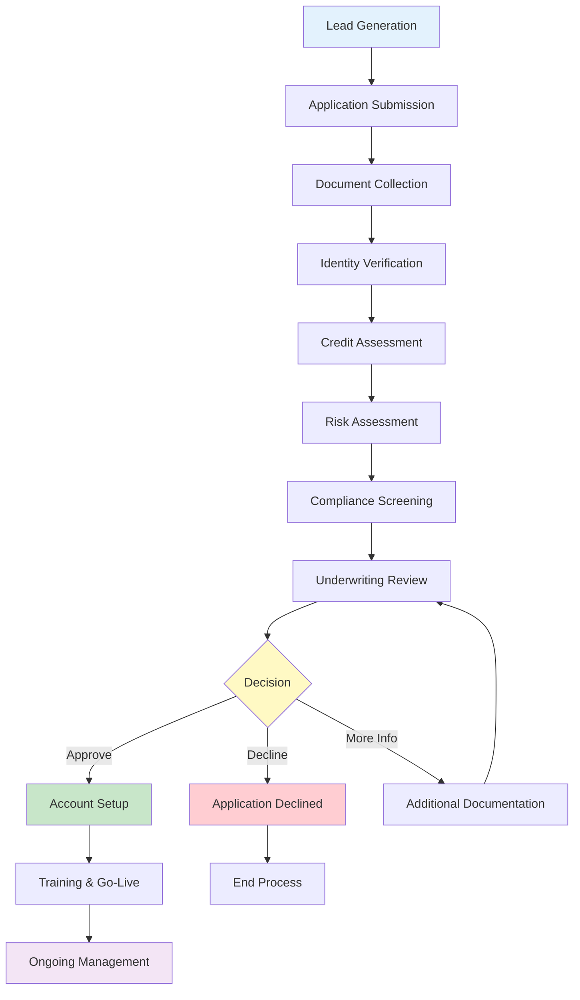

# Generic Merchant Onboarding Process
## Industry Standard Flow for Payment Processing

## Overview

This document outlines the **standard merchant onboarding process** used across the payment processing industry. This represents the typical flow that most banks, payment processors, and financial institutions follow in their current operations.

**Typical Timeline**: 15-20 business days
**Automation Level**: 20-30% (mostly manual processes)
**Success Rate**: 60-70% application completion
**Primary Challenges**: Manual processing, document collection delays, lengthy approval cycles

---

## Standard 12-Phase Merchant Onboarding Process

### **Phase 1: Lead Generation & Initial Contact**
**Duration**: 1-3 days
**Automation**: Low (20%)

**Activities**:
- Marketing campaigns and lead capture
- Initial merchant inquiry or application
- Basic qualification screening
- Sales team assignment
- Initial contact and relationship building

**Key Stakeholders**:
- Sales team
- Marketing department
- Lead qualification specialists

**Common Challenges**:
- Lead quality assessment
- Response time delays
- Manual lead routing

---

### **Phase 2: Application Submission**
**Duration**: 2-5 days
**Automation**: Medium (40%)

**Activities**:
- Merchant completes application form
- Basic business information collection
- Initial documentation requirements explanation
- Application fee payment (if applicable)
- Preliminary eligibility assessment

**Required Information**:
- Business name and structure
- Industry classification
- Processing volume estimates
- Contact information
- Basic financial information

**Common Challenges**:
- Incomplete applications
- Industry classification accuracy
- Volume estimation reliability

---

### **Phase 3: Document Collection**
**Duration**: 3-7 days
**Automation**: Low (15%)

**Required Documents**:

**Business Formation**:
- Articles of Incorporation
- Operating Agreement or Partnership Agreement
- DBA (Doing Business As) certificates
- Business registration certificates

**Tax & Financial**:
- Federal Tax ID (EIN) documentation
- Previous 2-3 years tax returns
- Recent bank statements (3-6 months)
- Financial statements (if available)
- Voided business check

**Identity Verification**:
- Government-issued photo ID for all owners
- Social Security cards
- Proof of address
- Beneficial ownership documentation

**Operational**:
- Business licenses and permits
- Professional certifications (if applicable)
- Insurance certificates
- Lease agreements or property ownership documents

**Common Challenges**:
- Document quality issues
- Missing or expired documents
- Multiple revision requests
- Merchant responsiveness delays

---

### **Phase 4: Identity & Business Verification**
**Duration**: 2-4 days
**Automation**: Medium (50%)

**KYC (Know Your Customer) Process**:
- Identity document verification
- Address verification
- Phone number validation
- Email verification
- Social Security number validation

**Business Verification**:
- Business registration verification with Secretary of State
- Tax ID verification with IRS
- Business address confirmation
- Operating status verification
- Beneficial ownership identification (25%+ ownership)

**Verification Methods**:
- Government database queries
- Third-party verification services
- Manual document review
- Phone verification calls

**Common Challenges**:
- Document authenticity verification
- Beneficial ownership complexity
- Address discrepancies
- Government database access delays

---

### **Phase 5: Credit & Financial Assessment**
**Duration**: 2-3 days
**Automation**: High (70%)

**Credit Bureau Checks**:
- Personal credit reports for all owners
- Business credit reports (if available)
- FICO scores and credit history analysis
- Bankruptcy and lien searches
- Judgment and collection searches

**Financial Analysis**:
- Bank account verification
- Cash flow analysis from bank statements
- Debt-to-income ratio calculations
- Financial statement review
- Revenue trend analysis

**Assessment Criteria**:
- Credit score thresholds
- Debt service coverage ratios
- Cash flow stability
- Financial statement accuracy
- Banking relationship history

**Common Challenges**:
- Limited business credit history
- Personal vs business credit separation
- Financial statement availability
- Bank statement interpretation

---

### **Phase 6: Risk Assessment**
**Duration**: 2-4 days
**Automation**: Medium (40%)

**Industry Risk Evaluation**:
- Industry classification and risk rating
- Regulatory compliance requirements
- Chargeback risk assessment
- Fraud risk evaluation
- Market stability analysis

**Processing History Review**:
- Previous processing relationships
- Termination history and reasons
- Chargeback and dispute history
- Volume and transaction patterns
- Customer complaint history

**Risk Scoring Factors**:
- Industry type and risk level
- Business model and sales methods
- Geographic location and markets
- Product/service types
- Delivery methods and timeframes

**Common Challenges**:
- Industry classification accuracy
- Historical data availability
- Risk model calibration
- Subjective risk assessment

---

### **Phase 7: Compliance Screening**
**Duration**: 1-3 days
**Automation**: High (80%)

**AML (Anti-Money Laundering) Screening**:
- OFAC sanctions list checking
- Global sanctions database screening
- Politically Exposed Persons (PEP) identification
- Adverse media screening
- Criminal background checks

**Regulatory Compliance**:
- Bank Secrecy Act (BSA) requirements
- Customer Due Diligence (CDD) procedures
- Enhanced Due Diligence (EDD) for high-risk
- State and federal licensing verification
- Industry-specific compliance checks

**Screening Databases**:
- Office of Foreign Assets Control (OFAC)
- Financial Crimes Enforcement Network (FinCEN)
- Specially Designated Nationals (SDN) list
- Consolidated Screening List
- Global sanctions databases

**Common Challenges**:
- False positive matches
- Name similarity issues
- Database update delays
- Complex ownership structures

---

### **Phase 8: Underwriting Review**
**Duration**: 3-5 days
**Automation**: Low (20%)

**Manual Review Process**:
- Comprehensive application review
- Risk assessment validation
- Credit analysis confirmation
- Compliance verification
- Documentation completeness check

**Decision Factors**:
- Overall risk profile
- Financial stability
- Industry experience
- Processing volume projections
- Compliance history

**Underwriter Responsibilities**:
- Risk-based decision making
- Pricing structure determination
- Terms and conditions setting
- Limit and reserve requirements
- Special conditions identification

**Review Outcomes**:
- Approve with standard terms
- Approve with conditions/restrictions
- Request additional information
- Decline application
- Escalate to senior underwriter

**Common Challenges**:
- Subjective decision making
- Inconsistent underwriting standards
- Documentation interpretation
- Risk tolerance variations

---

### **Phase 9: Decision & Approval**
**Duration**: 1-2 days
**Automation**: Medium (60%)

**Decision Communication**:
- Approval/decline notification
- Terms and conditions presentation
- Pricing structure explanation
- Contract generation
- Merchant agreement preparation

**Approval Components**:
- Processing limits and restrictions
- Pricing rates and fees
- Settlement terms
- Reserve requirements
- Monitoring conditions

**Contract Process**:
- Merchant agreement review
- Terms negotiation (if applicable)
- Electronic or physical signing
- Contract execution and filing
- Legal review completion

**Common Challenges**:
- Contract complexity
- Terms negotiation delays
- Legal review requirements
- Merchant understanding issues

---

### **Phase 10: Account Setup & Configuration**
**Duration**: 2-4 days
**Automation**: Medium (50%)

**Technical Setup**:
- Merchant account creation
- Payment gateway configuration
- API key generation and distribution
- Terminal/POS system setup
- Integration testing preparation

**System Configuration**:
- Processing parameters setup
- Risk management rules configuration
- Fraud prevention settings
- Reporting access provisioning
- User account creation

**Integration Support**:
- Technical documentation provision
- Developer resources access
- Integration testing coordination
- Certification process management
- Go-live preparation

**Common Challenges**:
- Technical complexity
- Integration compatibility
- Testing coordination
- Resource availability

---

### **Phase 11: Training & Go-Live**
**Duration**: 1-3 days
**Automation**: Low (30%)

**Merchant Training**:
- Platform navigation training
- Transaction processing procedures
- Reporting and analytics overview
- Customer service processes
- Compliance requirements education

**Testing Process**:
- Test transaction execution
- Integration validation
- Error handling verification
- Performance testing
- Security validation

**Go-Live Support**:
- Live transaction monitoring
- Initial processing oversight
- Issue resolution support
- Performance optimization
- Merchant feedback collection

**Common Challenges**:
- Training effectiveness
- Technical issues during go-live
- Merchant adaptation time
- Support resource allocation

---

### **Phase 12: Ongoing Relationship Management**
**Duration**: Ongoing
**Automation**: Low (25%)

**Account Management**:
- Regular performance reviews
- Relationship maintenance
- Issue resolution and support
- Account optimization opportunities
- Contract renewal management

**Monitoring Activities**:
- Transaction volume tracking
- Chargeback and dispute monitoring
- Compliance adherence verification
- Risk profile updates
- Performance benchmarking

**Growth Opportunities**:
- Volume increase assessments
- Additional service offerings
- Pricing optimization
- Feature upgrades
- Cross-selling initiatives

**Common Challenges**:
- Relationship maintenance
- Proactive issue identification
- Growth opportunity recognition
- Customer satisfaction management

---

## Process Flow Diagram

---

## Industry Benchmarks & Performance Metrics

### **Typical Performance Standards**

| **Metric** | **Industry Average** | **Best Practice** | **Common Range** |
|------------|---------------------|-------------------|------------------|
| **Total Processing Time** | 15-20 days | 7-10 days | 10-25 days |
| **Application Completion Rate** | 60-70% | 80-85% | 50-75% |
| **Automation Level** | 20-30% | 50-60% | 15-40% |
| **First-Pass Approval Rate** | 45-55% | 70-75% | 35-65% |
| **Document Collection Time** | 5-8 days | 2-3 days | 3-12 days |
| **Underwriting Time** | 3-5 days | 1-2 days | 2-7 days |

### **Common Pain Points**

**Merchant Experience**:
- Lengthy processing times
- Multiple document requests
- Lack of status visibility
- Complex requirements
- Poor communication

**Operational Challenges**:
- Manual processing bottlenecks
- Inconsistent underwriting decisions
- Document quality issues
- Integration complexities
- Resource allocation inefficiencies

**Compliance Risks**:
- Manual error rates
- Incomplete documentation
- Regulatory requirement changes
- Audit trail gaps
- Monitoring limitations

---

## Technology Stack (Traditional)

### **Core Systems**:
- Legacy core banking platforms
- Manual document management systems
- Basic CRM and workflow tools
- Traditional underwriting platforms
- Standard reporting and analytics

### **Integration Challenges**:
- Limited API capabilities
- Batch processing dependencies
- Manual data entry requirements
- System compatibility issues
- Scalability limitations

### **Automation Opportunities**:
- Document processing and OCR
- Identity verification services
- Credit bureau integrations
- Compliance screening automation
- Workflow management systems

---

## Regulatory Framework

### **Key Regulations**:
- Bank Secrecy Act (BSA)
- Anti-Money Laundering (AML) requirements
- Know Your Customer (KYC) regulations
- Payment Card Industry (PCI) compliance
- State licensing requirements

### **Compliance Requirements**:
- Customer Due Diligence (CDD)
- Enhanced Due Diligence (EDD)
- Suspicious Activity Reporting (SAR)
- Currency Transaction Reporting (CTR)
- Record keeping and audit trails

---

## Conclusion

This generic merchant onboarding process represents the **current state** of most payment processing organizations. While functional, it presents significant opportunities for improvement through:

- **Automation**: Reducing manual processing steps
- **Integration**: Real-time data verification and validation
- **Standardization**: Consistent decision-making criteria
- **Technology**: Modern platforms and AI/ML capabilities
- **Experience**: Improved merchant and operational efficiency

Organizations looking to modernize this process should consider the transformation strategies outlined in companion documents that leverage AI/ML technologies to achieve significant improvements in processing time, automation rates, and overall efficiency.

---

**Document Version**: 1.0  
**Last Updated**: [Current Date]  
**Document Type**: Industry Standard Reference  
**Related Documents**: Enterprise Merchant Onboarding Transformation Strategy