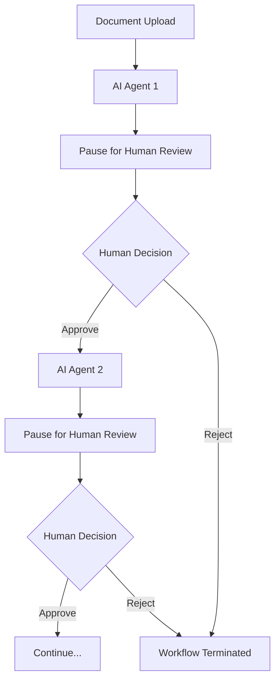

# Human Review Technical Architecture
## Implementation Details for Human-in-the-Loop System

## 🏗️ **System Architecture Overview**

The human-in-the-loop system is built on a **pause-and-resume workflow architecture** where every AI agent execution is followed by a mandatory human review checkpoint.



## 🔧 **Core Components**

### **1. Agent Wrapper System**
Every AI agent is wrapped with human review functionality:

```python
def create_agent_wrapper(agent_func, agent_name):
    """Wrapper adds mandatory human review to every agent"""
    async def wrapped_agent(state):
        # Execute AI agent
        result = await agent_func(state)
        
        # Set review state
        state.status = ApplicationStatus.PENDING_HUMAN_REVIEW
        state.review_agent = agent_name
        state.review_data = extract_agent_result(result, agent_name)
        
        # Add to review queue
        await add_to_review_queue(state.application_id, agent_name, result)
        
        # Emit review required event
        emit_review_required(state.application_id, agent_name, result)
        
        # PAUSE - Wait for human approval
        while await needs_human_review(state.application_id):
            await asyncio.sleep(2)  # Check every 2 seconds
            
            # Check for rejection
            if await is_rejected(state.application_id):
                raise WorkflowStoppedException("Human rejected application")
        
        return result
```

### **2. Review Queue Management**
Database-backed queue system for managing human review tasks:

```sql
CREATE TABLE review_queue (
    id INTEGER PRIMARY KEY AUTOINCREMENT,
    application_id VARCHAR(255) NOT NULL,
    agent_name VARCHAR(100) NOT NULL,
    agent_result JSON NOT NULL,
    status VARCHAR(50) DEFAULT 'pending',
    assigned_reviewer VARCHAR(100),
    reviewer_notes TEXT,
    decision VARCHAR(50),
    created_at TIMESTAMP DEFAULT CURRENT_TIMESTAMP,
    assigned_at TIMESTAMP,
    completed_at TIMESTAMP,
    
    INDEX idx_app_id (application_id),
    INDEX idx_status (status),
    INDEX idx_reviewer (assigned_reviewer)
);
```

### **3. Human Review API**
RESTful API endpoints for human review operations:

```python
# Get pending review for application
@app.route('/api/applications/<app_id>/review', methods=['GET'])
def get_application_review(app_id):
    return {
        'application_id': app_id,
        'needs_review': True,
        'review_agent': 'document_processing',
        'review_data': {...},
        'business_name': 'Example Corp'
    }

# Submit human review decision
@app.route('/api/applications/<app_id>/review-decision', methods=['POST'])
def submit_review_decision(app_id):
    decision = request.json['decision']  # 'approved' or 'rejected'
    notes = request.json['notes']
    
    # Update database
    update_review_status(app_id, decision, notes)
    
    # Resume or terminate workflow
    if decision == 'approved':
        resume_workflow(app_id)
    else:
        terminate_workflow(app_id)
    
    return {'success': True}
```

### **4. Real-Time UI Updates**
WebSocket-based real-time communication:

```javascript
// WebSocket event handlers
socket.on('review_required', (data) => {
    showReviewPanel(data.agent_name, data.review_data);
    updatePipelineStage(data.agent_name, 'review');
});

socket.on('workflow_resume', (data) => {
    hideReviewPanel();
    updatePipelineStage(data.agent_name, 'completed');
});

socket.on('agent_progress', (data) => {
    updateProgress(data.progress_percentage);
    updatePipelineStage(data.agent_name, data.status);
});
```

## 🎯 **Jenkins-Style Pipeline Visualization**

### **Pipeline Stage States**
- 🔵 **Pending**: Agent not yet started (gray circle)
- 🟡 **Running**: Agent currently executing (yellow pulsing)
- 🟠 **Review Required**: Waiting for human review (orange pulsing)
- 🟢 **Completed**: Agent and review completed (green checkmark)
- 🔴 **Failed/Rejected**: Agent failed or human rejected (red X)

### **Dynamic Pipeline Generation**
```javascript
function initializePipeline(workflowPattern) {
    const stages = {
        'express_workflow': ['document_processing', 'risk_assessment', 'decision_making', 'account_provisioning'],
        'standard_workflow': ['document_processing', 'data_validation', 'risk_assessment', 'compliance_verification', 'decision_making', 'account_provisioning', 'communication'],
        'comprehensive_workflow': ['document_processing', 'market_qualification', 'lead_qualification', 'data_validation', 'risk_assessment', 'compliance_verification', 'decision_making', 'exception_routing', 'communication', 'account_provisioning', 'monitoring', 'optimization', 'onboarding_support']
    };
    
    stages[workflowPattern].forEach((stage, index) => {
        createPipelineStage(stage, index + 1);
    });
}
```

## 📊 **Human Review Interface**

### **Natural Language Agent Summaries**
Agent results are formatted into human-readable summaries:

```javascript
function formatAgentResult(agentName, data) {
    if (agentName === 'document_processing') {
        return `
            <h4>📄 Document Processing Results</h4>
            <p class="text-green-600">✅ Processing Status: Successfully completed</p>
            <p>Documents Processed: ${data.documents_processed} documents</p>
            <p>Confidence Level: ${Math.round(data.overall_confidence * 100)}% (High)</p>
            <p>Fraud Risk: ${data.fraud_risk.toUpperCase()}</p>
            <p>Tools Used: ${data.tools_used.join(', ')}</p>
        `;
    }
    // ... other agent-specific formatting
}
```

### **Review Panel Components**
- **Agent Name Badge**: Shows which agent needs review
- **Natural Language Summary**: Human-readable results
- **Decision Buttons**: Approve/Reject with immediate action
- **Review Notes**: Text area for human feedback
- **Raw Data Access**: Collapsible technical details

## 🔄 **Workflow State Management**

### **Application Status Enum**
```python
class ApplicationStatus(Enum):
    SUBMITTED = "submitted"
    PROCESSING = "processing"
    PENDING_HUMAN_REVIEW = "pending_human_review"  # NEW
    HUMAN_APPROVED = "human_approved"              # NEW
    HUMAN_REJECTED = "human_rejected"              # NEW
    APPROVED = "approved"
    DECLINED = "declined"
    EXCEPTION = "exception"
```

### **State Transitions**
```
SUBMITTED → PROCESSING → PENDING_HUMAN_REVIEW → HUMAN_APPROVED → PROCESSING → ...
                                             → HUMAN_REJECTED → DECLINED
```

## 📈 **Performance Monitoring**

### **Review Metrics Tracking**
```python
class ReviewMetrics:
    def __init__(self):
        self.total_reviews = 0
        self.avg_review_time = 0
        self.approval_rate = 0
        self.rejection_rate = 0
        self.reviewer_performance = {}
    
    def track_review_decision(self, reviewer, decision, review_time):
        self.total_reviews += 1
        self.update_approval_rates(decision)
        self.update_reviewer_performance(reviewer, decision, review_time)
```

### **Real-Time Dashboard Metrics**
- **Pending Reviews**: Count of applications awaiting human review
- **Average Review Time**: Time from agent completion to human decision
- **Approval Rate**: Percentage of agents approved by humans
- **Reviewer Performance**: Individual reviewer statistics
- **Workflow Completion Rate**: End-to-end success metrics

## 🔒 **Security & Access Control**

### **Role-Based Review Assignment**
```python
class ReviewerRoles:
    DOCUMENT_SPECIALIST = "document_specialist"
    RISK_ANALYST = "risk_analyst"
    COMPLIANCE_OFFICER = "compliance_officer"
    SENIOR_UNDERWRITER = "senior_underwriter"

def assign_reviewer(agent_name):
    role_mapping = {
        'document_processing': ReviewerRoles.DOCUMENT_SPECIALIST,
        'risk_assessment': ReviewerRoles.RISK_ANALYST,
        'compliance_verification': ReviewerRoles.COMPLIANCE_OFFICER,
        'decision_making': ReviewerRoles.SENIOR_UNDERWRITER
    }
    return role_mapping.get(agent_name, ReviewerRoles.SENIOR_UNDERWRITER)
```

### **Audit Trail Requirements**
- **Complete Review History**: All human decisions logged
- **Reviewer Identification**: Who made each decision
- **Decision Timestamps**: When decisions were made
- **Review Notes**: Why decisions were made
- **Agent Result Preservation**: What data was reviewed

## 🚀 **Scalability Considerations**

### **Review Queue Optimization**
- **Database Indexing**: Optimized queries for pending reviews
- **Caching**: Redis cache for frequently accessed review data
- **Load Balancing**: Multiple review API instances
- **Queue Partitioning**: Separate queues by reviewer role

### **Real-Time Performance**
- **WebSocket Connection Pooling**: Efficient real-time updates
- **Event Batching**: Reduce WebSocket message frequency
- **Client-Side Caching**: Minimize API calls for UI updates
- **Progressive Loading**: Load agent details on demand

## 📋 **Deployment Architecture**

### **Production Components**
```yaml
services:
  web-app:
    image: merchant-onboarding-ui
    ports: ["5000:5000"]
    environment:
      - DATABASE_URL=postgresql://...
      - REDIS_URL=redis://...
  
  review-api:
    image: merchant-onboarding-api
    ports: ["8000:8000"]
    environment:
      - DATABASE_URL=postgresql://...
  
  workflow-engine:
    image: merchant-onboarding-workflow
    environment:
      - DATABASE_URL=postgresql://...
      - REDIS_URL=redis://...
  
  database:
    image: postgres:13
    environment:
      - POSTGRES_DB=merchant_onboarding
  
  cache:
    image: redis:6
```

### **Infrastructure Requirements**
- **Database**: PostgreSQL with high availability
- **Cache**: Redis for session and review data
- **Load Balancer**: NGINX for API and WebSocket traffic
- **Monitoring**: Prometheus + Grafana for metrics
- **Logging**: ELK stack for audit trail

## 🎯 **Integration Points**

### **External System Integration**
- **HR Systems**: Reviewer authentication and role management
- **Notification Systems**: Email/SMS alerts for pending reviews
- **Audit Systems**: Export review data for compliance reporting
- **Workflow Management**: Integration with existing business processes

### **API Compatibility**
- **RESTful APIs**: Standard HTTP endpoints for review operations
- **WebSocket APIs**: Real-time updates for UI components
- **Webhook Support**: Notify external systems of review decisions
- **GraphQL Support**: Flexible data querying for complex UIs

## 🏆 **Benefits Achieved**

### **Compliance Benefits**
- **100% Human Oversight**: Every AI decision reviewed by humans
- **Complete Audit Trail**: Full regulatory compliance documentation
- **Role-Based Access**: Appropriate expertise for each review type
- **Decision Accountability**: Clear responsibility for all decisions

### **Operational Benefits**
- **AI Acceleration**: Agents prepare comprehensive analysis for humans
- **Consistent Process**: Standardized review workflow across all applications
- **Real-Time Visibility**: Live tracking of all review activities
- **Scalable Architecture**: Queue-based system handles high volumes

### **User Experience Benefits**
- **Intuitive Interface**: Jenkins-style pipeline familiar to technical users
- **Natural Language**: Complex AI results presented in plain English
- **One-Click Decisions**: Simple approve/reject workflow
- **Complete Transparency**: Full access to AI reasoning and data

This technical architecture provides a robust, scalable, and compliant foundation for human oversight of AI-powered merchant onboarding processes.