# Merchant Onboarding Process Diagrams

## Overview Flowchart

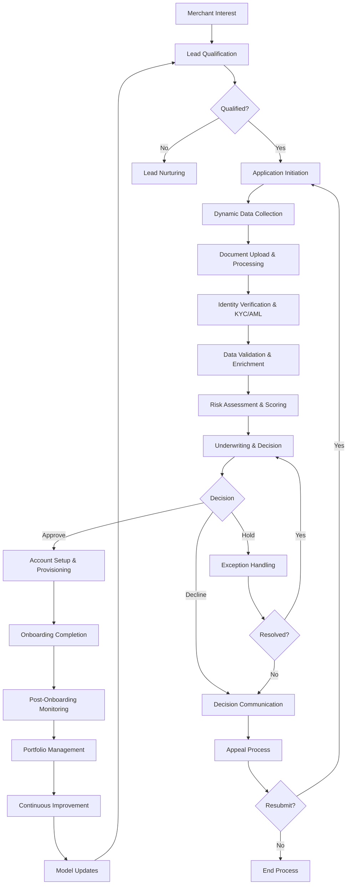

## Detailed Phase Flow Diagram

```mermaid
flowchart LR
    subgraph "Phase 1: Pre-Application"
        A1[Lead Generation] --> A2[Lead Scoring]
        A2 --> A3[Qualification]
        A3 --> A4[Initial Engagement]
    end
    
    subgraph "Phase 2: Application"
        B1[Portal Access] --> B2[Adaptive Questionnaire]
        B2 --> B3[Data Collection]
        B3 --> B4[Progress Tracking]
    end
    
    subgraph "Phase 3: Documents"
        C1[Document Upload] --> C2[OCR Processing]
        C2 --> C3[Classification]
        C3 --> C4[Data Extraction]
    end
    
    subgraph "Phase 4: Verification"
        D1[Identity Verification] --> D2[KYC Checks]
        D2 --> D3[AML Screening]
        D3 --> D4[Compliance Validation]
    end
    
    subgraph "Phase 5: Validation"
        E1[Document Authentication] --> E2[Data Enrichment]
        E2 --> E3[Cross-Reference]
        E3 --> E4[GenAI Analysis]
    end
    
    subgraph "Phase 6: Risk Assessment"
        F1[Risk Modeling] --> F2[ML Analytics]
        F2 --> F3[Risk Scoring]
        F3 --> F4[Risk Classification]
    end
    
    subgraph "Phase 7: Underwriting"
        G1[Application Routing] --> G2[Underwriter Review]
        G2 --> G3[Decision Matrix]
        G3 --> G4[Final Decision]
    end
    
    A4 --> B1
    B4 --> C1
    C4 --> D1
    D4 --> E1
    E4 --> F1
    F4 --> G1
```

## Swimlane Diagram - Roles and Responsibilities

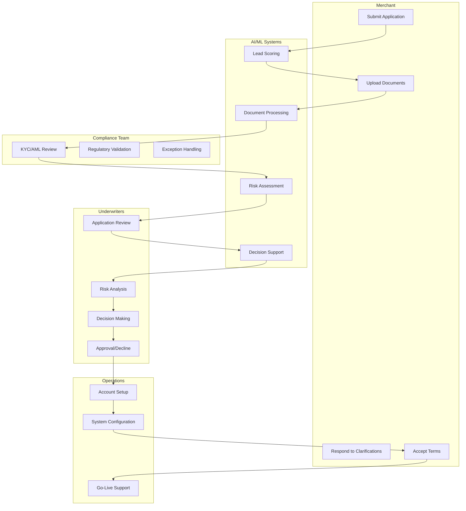

## Risk Assessment Decision Tree

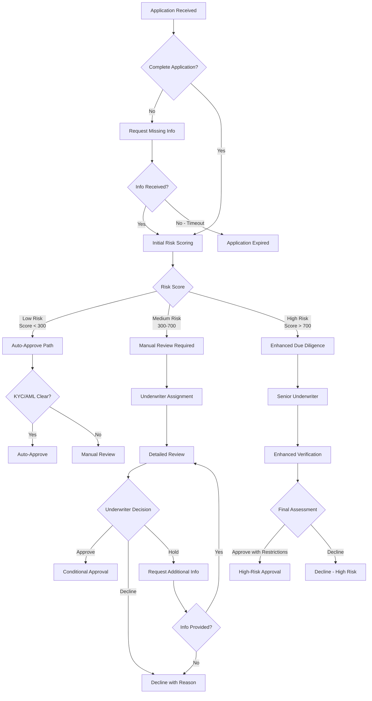

## Technology Architecture Diagram

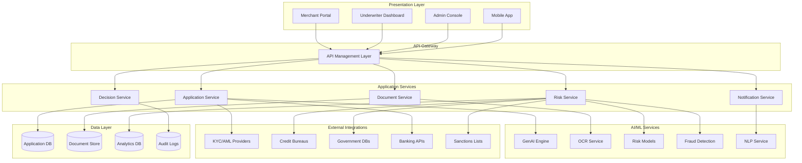

## Data Flow Diagram

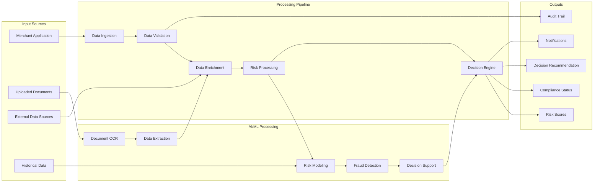

## Compliance and Audit Flow

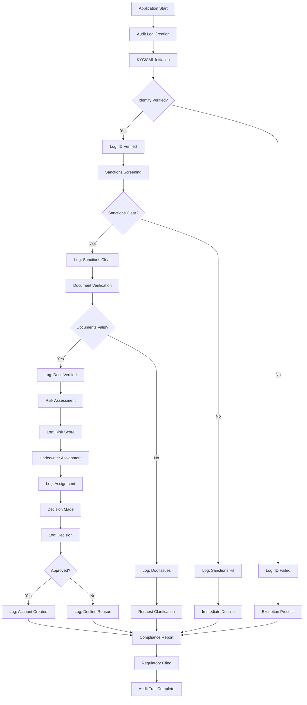

## Exception Handling Workflow

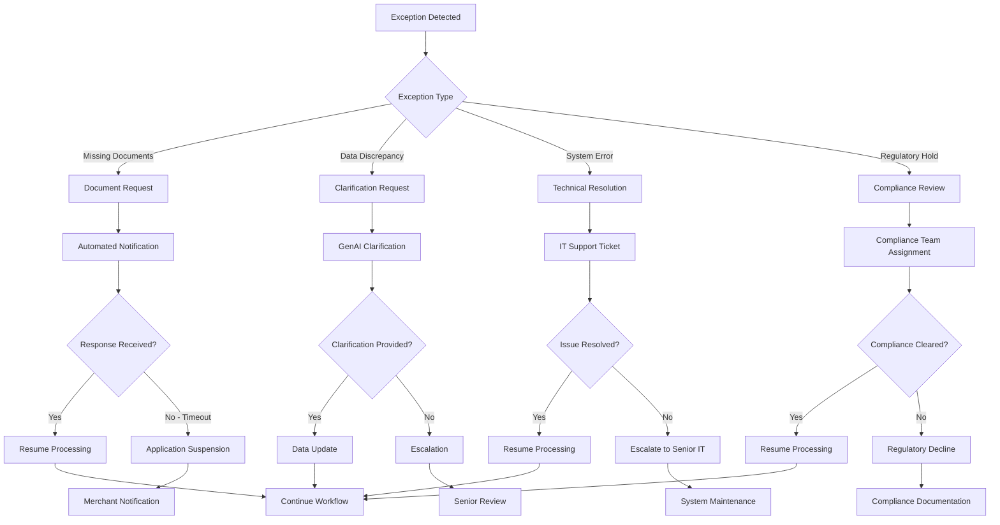

## Performance Monitoring Dashboard Layout

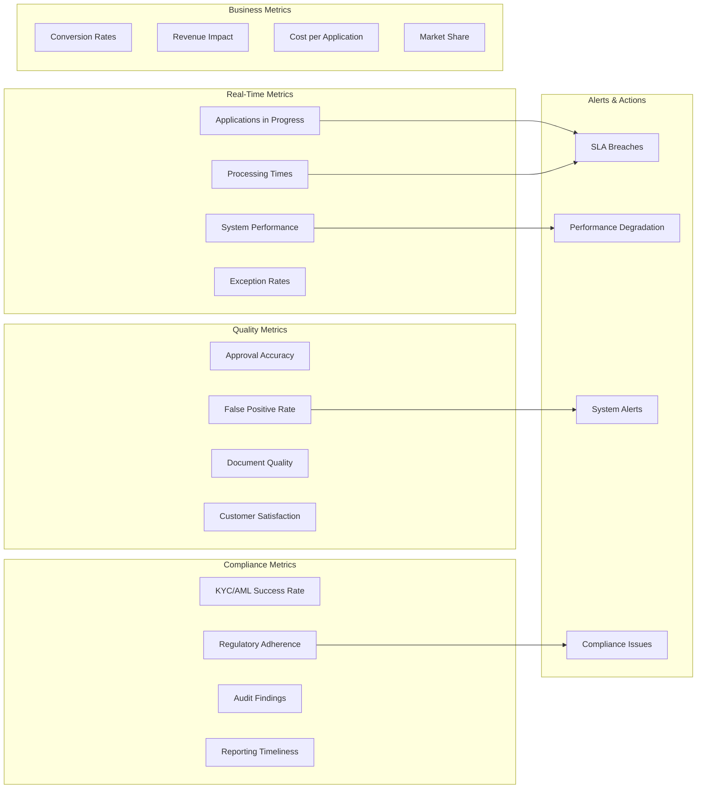

## Integration Architecture

```mermaid
flowchart TB
    subgraph "Core Platform"
        CP[Merchant Onboarding Platform]
    end
    
    subgraph "Identity Verification"
        IV1[Jumio]
        IV2[Onfido]
        IV3[Trulioo]
    end
    
    subgraph "KYC/AML Providers"
        KYC1[LexisNexis]
        KYC2[Thomson Reuters]
        KYC3[Refinitiv]
    end
    
    subgraph "Credit & Financial"
        CF1[Experian]
        CF2[Dun & Bradstreet]
        CF3[Equifax]
    end
    
    subgraph "Government & Regulatory"
        GR1[IRS Database]
        GR2[Secretary of State]
        GR3[OFAC Lists]
    end
    
    subgraph "Banking & Payments"
        BP1[Plaid]
        BP2[Yodlee]
        BP3[ACH Networks]
    end
    
    subgraph "Document Processing"
        DP1[AWS Textract]
        DP2[Google Vision API]
        DP3[Azure Cognitive Services]
    end
    
    CP --> IV1
    CP --> IV2
    CP --> IV3
    CP --> KYC1
    CP --> KYC2
    CP --> KYC3
    CP --> CF1
    CP --> CF2
    CP --> CF3
    CP --> GR1
    CP --> GR2
    CP --> GR3
    CP --> BP1
    CP --> BP2
    CP --> BP3
    CP --> DP1
    CP --> DP2
    CP --> DP3
```

## Timeline and Milestones

```mermaid
gantt
    title Merchant Onboarding Process Timeline
    dateFormat X
    axisFormat %s
    
    section Application Phase
    Lead Qualification     :0, 1
    Application Submission :1, 2
    Document Upload       :2, 4
    
    section Verification Phase
    Identity Verification :4, 6
    KYC/AML Checks      :6, 8
    Document Processing  :4, 8
    
    section Assessment Phase
    Data Validation     :8, 10
    Risk Assessment     :10, 12
    Underwriting Review :12, 15
    
    section Decision Phase
    Decision Making     :15, 16
    Communication      :16, 17
    
    section Setup Phase
    Account Provisioning :17, 19
    Integration Setup   :19, 21
    Go-Live Support    :21, 22
    
    section Monitoring
    Initial Monitoring  :22, 52
    Portfolio Management :52, 365
```