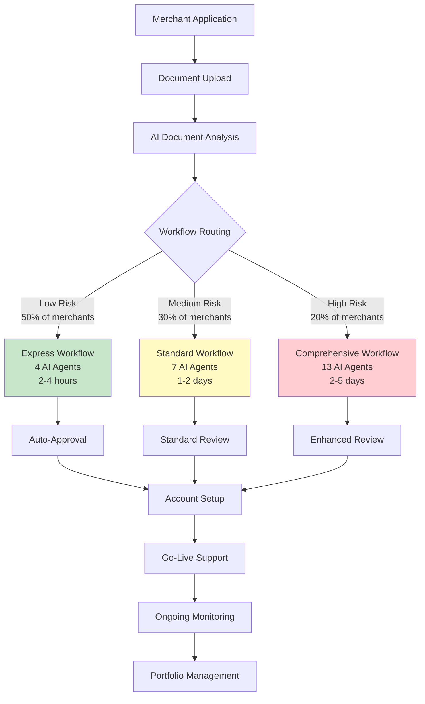
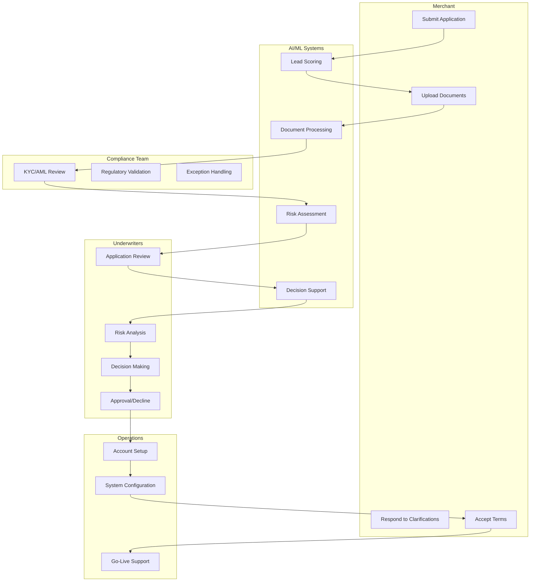
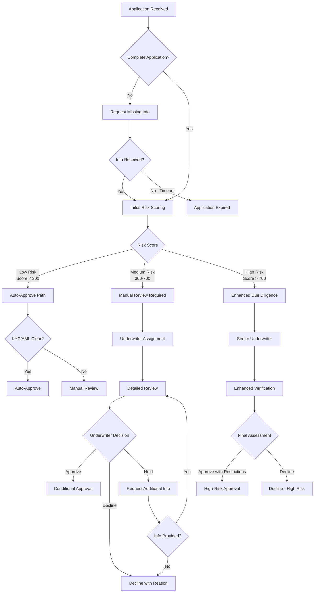
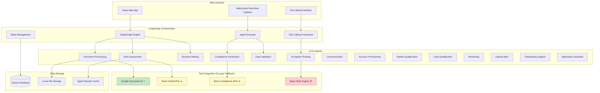
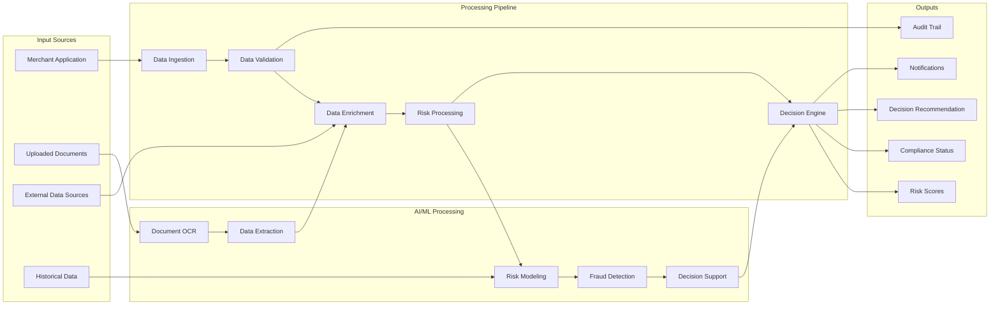
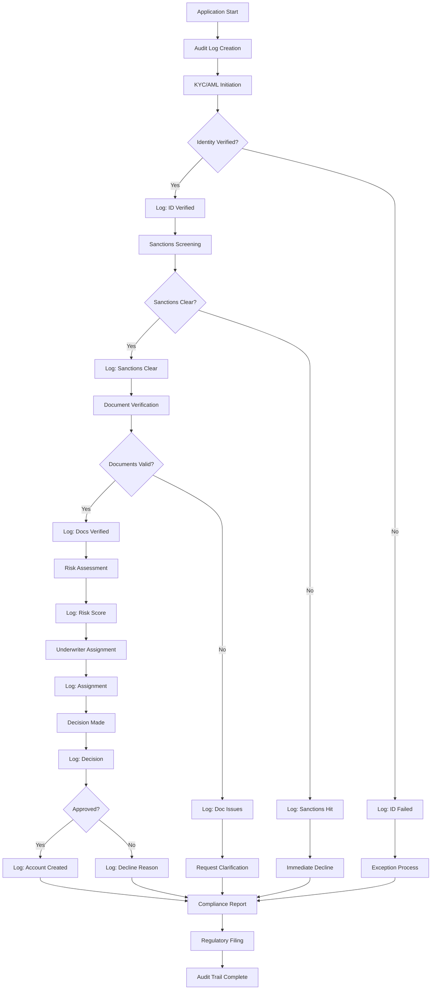
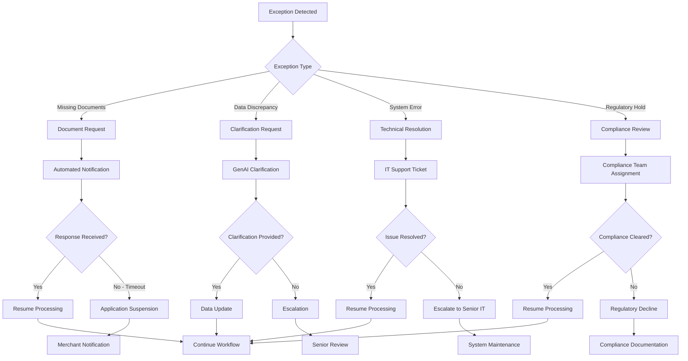
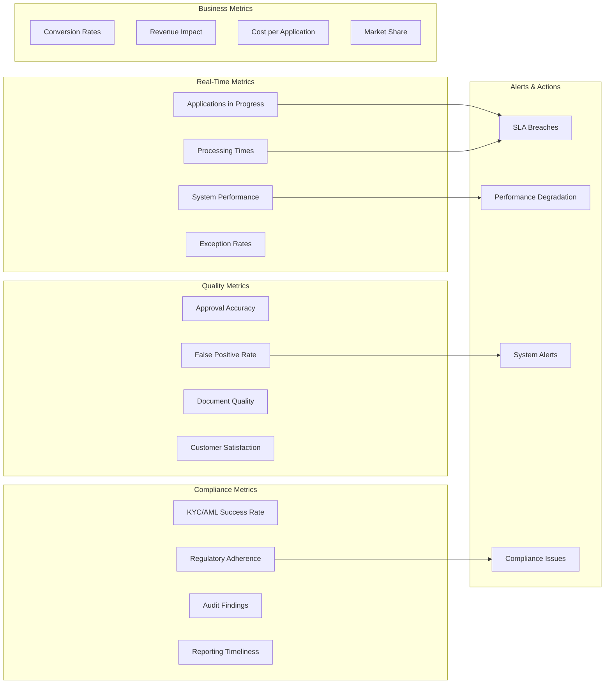

# Merchant Onboarding Process Diagrams
## Updated to Match AI Agent Implementation

## AI-Powered Multi-Workflow Overview

```mermaid
flowchart TD
    A[Merchant Application] --> B[Document Upload]
    B --> C[AI Document Analysis]
    C --> D{Workflow Routing}
    
    D -->|Low Risk<br/>50% of merchants| E[Express Workflow<br/>4 AI Agents<br/>2-4 hours]
    D -->|Medium Risk<br/>30% of merchants| F[Standard Workflow<br/>7 AI Agents<br/>1-2 days]
    D -->|High Risk<br/>20% of merchants| G[Comprehensive Workflow<br/>13 AI Agents<br/>2-5 days]
    
    E --> H[Auto-Approval]
    F --> I[Standard Review]
    G --> J[Enhanced Review]
    
    H --> K[Account Setup]
    I --> K
    J --> K
    
    K --> L[Go-Live Support]
    L --> M[Ongoing Monitoring]
    M --> N[Portfolio Management]
    
    style E fill:#c8e6c9
    style F fill:#fff9c4
    style G fill:#ffcdd2
```

## AI Agent Execution Flow (Actual Implementation)

```mermaid
flowchart LR
    subgraph "Document-First Processing"
        A1[Document Processing Agent] --> A2[Market Qualification Agent]
        A2 --> A3[Lead Qualification Agent]
        A3 --> A4[Data Validation Agent]
    end
    
    subgraph "Risk & Compliance Assessment"
        B1[Risk Assessment Agent] --> B2[Compliance Verification Agent]
        B2 --> B3[Decision Making Agent]
        B3 --> B4[Exception Routing Agent]
    end
    
    subgraph "Communication & Setup"
        C1[Communication Agent] --> C2[Account Provisioning Agent]
        C2 --> C3[Monitoring Agent]
        C3 --> C4[Optimization Agent]
    end
    
    subgraph "Onboarding Support"
        D1[Onboarding Support Agent]
    end
    
    A4 --> B1
    B4 --> C1
    C4 --> D1
    
    style A1 fill:#e3f2fd
    style B1 fill:#f3e5f5
    style C1 fill:#e8f5e8
    style D1 fill:#fff3e0
```

## Swimlane Diagram - Roles and Responsibilities

```mermaid
flowchart TD
    subgraph "Merchant"
        M1[Submit Application]
        M2[Upload Documents]
        M3[Respond to Clarifications]
        M4[Accept Terms]
    end
    
    subgraph "AI/ML Systems"
        AI1[Lead Scoring]
        AI2[Document Processing]
        AI3[Risk Assessment]
        AI4[Decision Support]
    end
    
    subgraph "Compliance Team"
        C1[KYC/AML Review]
        C2[Regulatory Validation]
        C3[Exception Handling]
    end
    
    subgraph "Underwriters"
        U1[Application Review]
        U2[Risk Analysis]
        U3[Decision Making]
        U4[Approval/Decline]
    end
    
    subgraph "Operations"
        O1[Account Setup]
        O2[System Configuration]
        O3[Go-Live Support]
    end
    
    M1 --> AI1
    AI1 --> M2
    M2 --> AI2
    AI2 --> C1
    C1 --> AI3
    AI3 --> U1
    U1 --> AI4
    AI4 --> U2
    U2 --> U3
    U3 --> U4
    U4 --> O1
    O1 --> O2
    O2 --> M4
    M4 --> O3
```

## Risk Assessment Decision Tree

```mermaid
flowchart TD
    A[Application Received] --> B{Complete Application?}
    B -->|No| C[Request Missing Info]
    B -->|Yes| D[Initial Risk Scoring]
    
    D --> E{Risk Score}
    E -->|Low Risk<br/>Score < 300| F[Auto-Approve Path]
    E -->|Medium Risk<br/>300-700| G[Manual Review Required]
    E -->|High Risk<br/>Score > 700| H[Enhanced Due Diligence]
    
    F --> I{KYC/AML Clear?}
    I -->|Yes| J[Auto-Approve]
    I -->|No| K[Manual Review]
    
    G --> L[Underwriter Assignment]
    L --> M[Detailed Review]
    M --> N{Underwriter Decision}
    N -->|Approve| O[Conditional Approval]
    N -->|Decline| P[Decline with Reason]
    N -->|Hold| Q[Request Additional Info]
    
    H --> R[Senior Underwriter]
    R --> S[Enhanced Verification]
    S --> T{Final Assessment}
    T -->|Approve with Restrictions| U[High-Risk Approval]
    T -->|Decline| V[Decline - High Risk]
    
    C --> W{Info Received?}
    W -->|Yes| D
    W -->|No - Timeout| X[Application Expired]
    
    Q --> Y{Info Provided?}
    Y -->|Yes| M
    Y -->|No| P
```

## Actual Technology Architecture (LangGraph Implementation)

```mermaid
flowchart TB
    subgraph "Web Interface"
        UI1[Flask Web App]
        UI2[WebSocket Real-time Updates]
        UI3[File Upload Interface]
    end
    
    subgraph "LangGraph Orchestration"
        LG1[StateGraph Engine]
        LG2[Agent Executor]
        LG3[Tool Calling Framework]
        LG4[State Management]
    end
    
    subgraph "14 AI Agents"
        AG1[Document Processing]
        AG2[Risk Assessment]
        AG3[Decision Making]
        AG4[Compliance Verification]
        AG5[Data Validation]
        AG6[Exception Routing]
        AG7[Communication]
        AG8[Account Provisioning]
        AG9[Market Qualification]
        AG10[Lead Qualification]
        AG11[Monitoring]
        AG12[Optimization]
        AG13[Onboarding Support]
        AG14[Application Assistant]
    end
    
    subgraph "Tool Integration (3-Layer Fallback)"
        T1[Google Document AI ✅]
        T2[Mock Credit APIs ⚠️]
        T3[Mock Compliance APIs ⚠️]
        T4[Basic Rule Engine 📋]
    end
    
    subgraph "Data Storage"
        DB1[(SQLite Database)]
        DB2[Local File Storage]
        DB3[Agent Results Cache]
    end
    
    UI1 --> LG1
    UI2 --> LG2
    UI3 --> LG3
    
    LG1 --> AG1
    LG1 --> AG2
    LG1 --> AG3
    LG2 --> AG4
    LG2 --> AG5
    LG3 --> AG6
    
    AG1 --> T1
    AG2 --> T2
    AG4 --> T3
    AG6 --> T4
    
    LG4 --> DB1
    AG1 --> DB2
    AG2 --> DB3
    
    style T1 fill:#c8e6c9
    style T2 fill:#fff9c4
    style T3 fill:#fff9c4
    style T4 fill:#ffcdd2
```

## Data Flow Diagram

```mermaid
flowchart LR
    subgraph "Input Sources"
        I1[Merchant Application]
        I2[Uploaded Documents]
        I3[External Data Sources]
        I4[Historical Data]
    end
    
    subgraph "Processing Pipeline"
        P1[Data Ingestion]
        P2[Data Validation]
        P3[Data Enrichment]
        P4[Risk Processing]
        P5[Decision Engine]
    end
    
    subgraph "AI/ML Processing"
        AI1[Document OCR]
        AI2[Data Extraction]
        AI3[Risk Modeling]
        AI4[Fraud Detection]
        AI5[Decision Support]
    end
    
    subgraph "Outputs"
        O1[Risk Scores]
        O2[Compliance Status]
        O3[Decision Recommendation]
        O4[Audit Trail]
        O5[Notifications]
    end
    
    I1 --> P1
    I2 --> AI1
    I3 --> P3
    I4 --> AI3
    
    P1 --> P2
    AI1 --> AI2
    P2 --> P3
    AI2 --> P3
    P3 --> P4
    P4 --> AI3
    AI3 --> AI4
    P4 --> P5
    AI4 --> AI5
    AI5 --> P5
    
    P5 --> O1
    P5 --> O2
    P5 --> O3
    P2 --> O4
    P5 --> O5
```

## Compliance and Audit Flow

```mermaid
flowchart TD
    A[Application Start] --> B[Audit Log Creation]
    B --> C[KYC/AML Initiation]
    
    C --> D{Identity Verified?}
    D -->|Yes| E[Log: ID Verified]
    D -->|No| F[Log: ID Failed]
    F --> G[Exception Process]
    
    E --> H[Sanctions Screening]
    H --> I{Sanctions Clear?}
    I -->|Yes| J[Log: Sanctions Clear]
    I -->|No| K[Log: Sanctions Hit]
    K --> L[Immediate Decline]
    
    J --> M[Document Verification]
    M --> N{Documents Valid?}
    N -->|Yes| O[Log: Docs Verified]
    N -->|No| P[Log: Doc Issues]
    P --> Q[Request Clarification]
    
    O --> R[Risk Assessment]
    R --> S[Log: Risk Score]
    S --> T[Underwriter Assignment]
    T --> U[Log: Assignment]
    
    U --> V[Decision Made]
    V --> W[Log: Decision]
    W --> X{Approved?}
    X -->|Yes| Y[Log: Account Created]
    X -->|No| Z[Log: Decline Reason]
    
    Y --> AA[Compliance Report]
    Z --> AA
    L --> AA
    G --> AA
    Q --> AA
    
    AA --> BB[Regulatory Filing]
    BB --> CC[Audit Trail Complete]
```

## Exception Handling Workflow

```mermaid
flowchart TD
    A[Exception Detected] --> B{Exception Type}
    
    B -->|Missing Documents| C[Document Request]
    B -->|Data Discrepancy| D[Clarification Request]
    B -->|System Error| E[Technical Resolution]
    B -->|Regulatory Hold| F[Compliance Review]
    
    C --> G[Automated Notification]
    D --> H[GenAI Clarification]
    E --> I[IT Support Ticket]
    F --> J[Compliance Team Assignment]
    
    G --> K{Response Received?}
    H --> L{Clarification Provided?}
    I --> M{Issue Resolved?}
    J --> N{Compliance Cleared?}
    
    K -->|Yes| O[Resume Processing]
    K -->|No - Timeout| P[Application Suspension]
    
    L -->|Yes| Q[Data Update]
    L -->|No| R[Escalation]
    
    M -->|Yes| S[Resume Processing]
    M -->|No| T[Escalate to Senior IT]
    
    N -->|Yes| U[Resume Processing]
    N -->|No| V[Regulatory Decline]
    
    O --> W[Continue Workflow]
    Q --> W
    S --> W
    U --> W
    
    P --> X[Merchant Notification]
    R --> Y[Senior Review]
    T --> Z[System Maintenance]
    V --> AA[Compliance Documentation]
```

## Performance Monitoring Dashboard Layout

```mermaid
flowchart LR
    subgraph "Real-Time Metrics"
        RT1[Applications in Progress]
        RT2[Processing Times]
        RT3[System Performance]
        RT4[Exception Rates]
    end
    
    subgraph "Quality Metrics"
        Q1[Approval Accuracy]
        Q2[False Positive Rate]
        Q3[Document Quality]
        Q4[Customer Satisfaction]
    end
    
    subgraph "Compliance Metrics"
        C1[KYC/AML Success Rate]
        C2[Regulatory Adherence]
        C3[Audit Findings]
        C4[Reporting Timeliness]
    end
    
    subgraph "Business Metrics"
        B1[Conversion Rates]
        B2[Revenue Impact]
        B3[Cost per Application]
        B4[Market Share]
    end
    
    subgraph "Alerts & Actions"
        A1[SLA Breaches]
        A2[System Alerts]
        A3[Compliance Issues]
        A4[Performance Degradation]
    end
    
    RT1 --> A1
    RT2 --> A1
    Q2 --> A2
    C2 --> A3
    RT3 --> A4
```

## Integration Architecture

```mermaid
flowchart TB
    subgraph "Core Platform"
        CP[Merchant Onboarding Platform]
    end
    
    subgraph "Identity Verification"
        IV1[Jumio]
        IV2[Onfido]
        IV3[Trulioo]
    end
    
    subgraph "KYC/AML Providers"
        KYC1[LexisNexis]
        KYC2[Thomson Reuters]
        KYC3[Refinitiv]
    end
    
    subgraph "Credit & Financial"
        CF1[Experian]
        CF2[Dun & Bradstreet]
        CF3[Equifax]
    end
    
    subgraph "Government & Regulatory"
        GR1[IRS Database]
        GR2[Secretary of State]
        GR3[OFAC Lists]
    end
    
    subgraph "Banking & Payments"
        BP1[Plaid]
        BP2[Yodlee]
        BP3[ACH Networks]
    end
    
    subgraph "Document Processing"
        DP1[AWS Textract]
        DP2[Google Vision API]
        DP3[Azure Cognitive Services]
    end
    
    CP --> IV1
    CP --> IV2
    CP --> IV3
    CP --> KYC1
    CP --> KYC2
    CP --> KYC3
    CP --> CF1
    CP --> CF2
    CP --> CF3
    CP --> GR1
    CP --> GR2
    CP --> GR3
    CP --> BP1
    CP --> BP2
    CP --> BP3
    CP --> DP1
    CP --> DP2
    CP --> DP3
```

## AI Agent Processing Timeline (Actual Performance)

```mermaid
gantt
    title AI Agent Execution Timeline by Workflow
    dateFormat X
    axisFormat %H:%M
    
    section Express Workflow (2-4 hours)
    Document Processing    :0, 1
    Risk Assessment       :1, 2
    Decision Making       :2, 3
    Account Provisioning  :3, 4
    
    section Standard Workflow (1-2 days)
    Document Processing    :0, 2
    Data Validation       :2, 4
    Risk Assessment       :4, 6
    Compliance Verification :6, 8
    Decision Making       :8, 10
    Account Provisioning  :10, 12
    Communication        :12, 24
    
    section Comprehensive Workflow (2-5 days)
    Document Processing    :0, 4
    Market Qualification   :4, 6
    Lead Qualification    :6, 8
    Data Validation       :8, 12
    Risk Assessment       :12, 16
    Compliance Verification :16, 20
    Decision Making       :20, 24
    Exception Routing     :24, 28
    Communication        :28, 32
    Account Provisioning  :32, 36
    Monitoring           :36, 48
    Optimization         :48, 60
    Onboarding Support   :60, 120
```