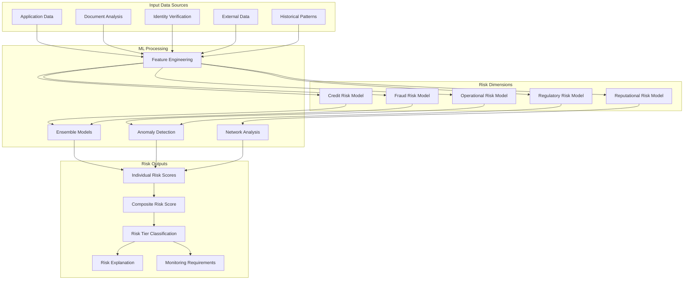
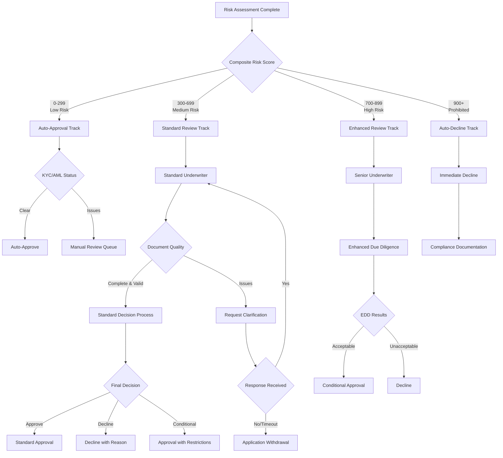
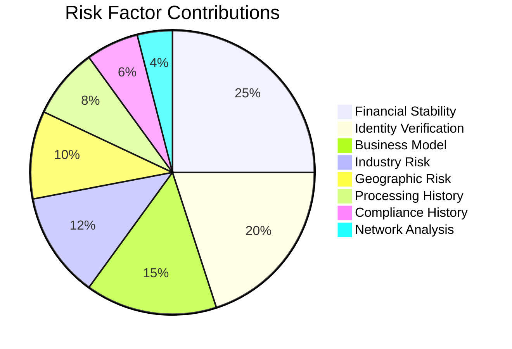
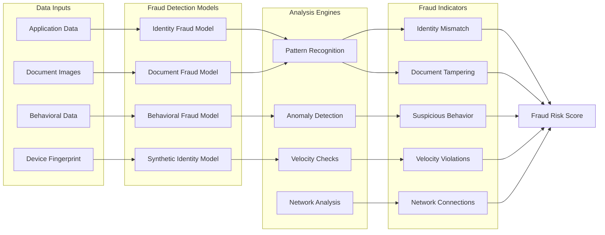
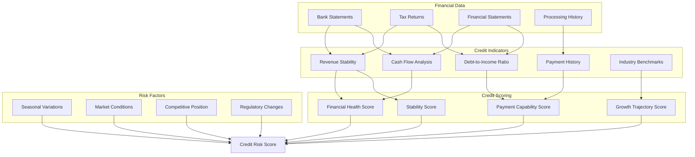
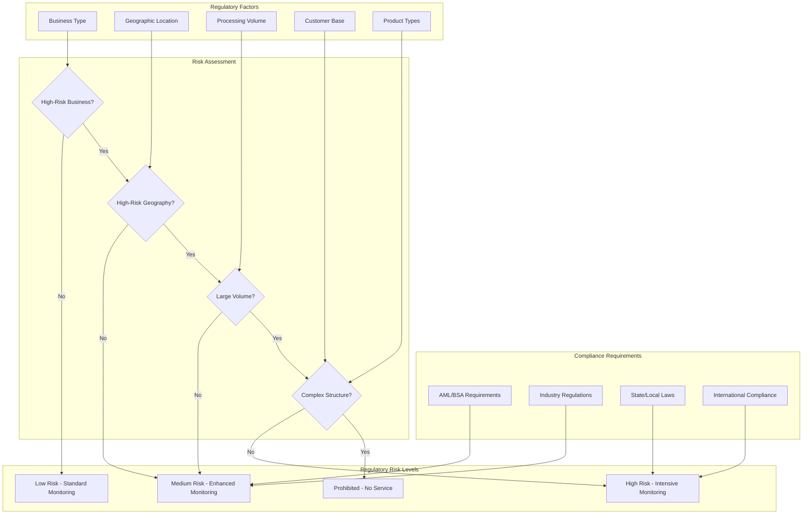
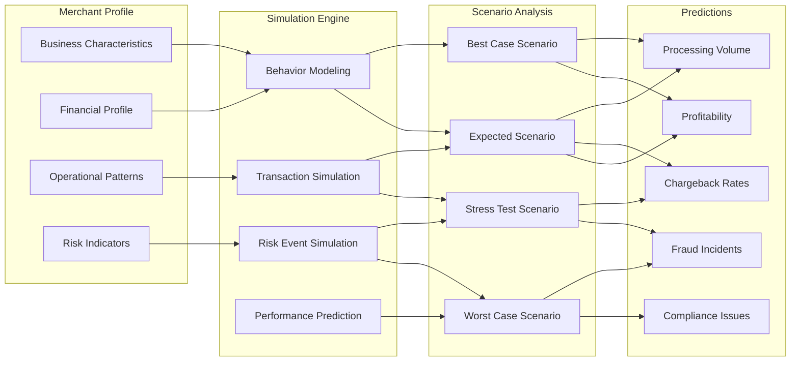
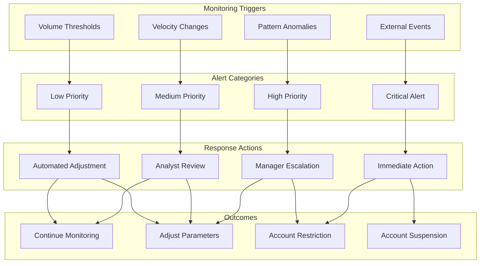

# Risk Assessment and Decision Matrix Diagrams

## Risk Scoring Model Architecture

## Decision Matrix Framework

## Risk Factor Weighting Model

## Fraud Detection Pipeline

## Credit Risk Assessment Model

## Regulatory Risk Matrix

## Digital Twin Simulation Model

## Risk Monitoring and Alerting System

