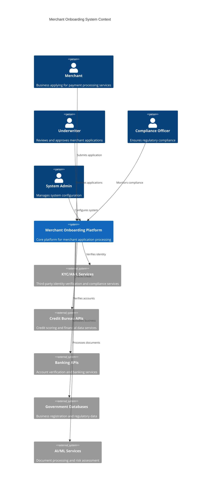
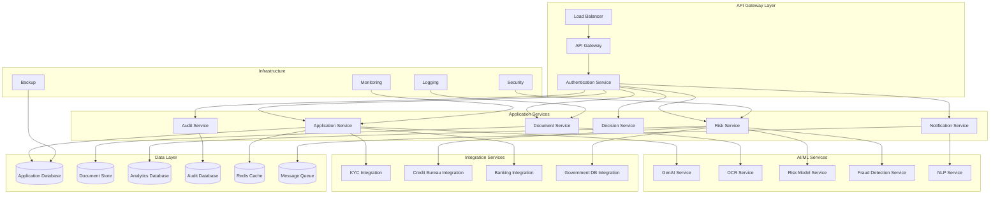
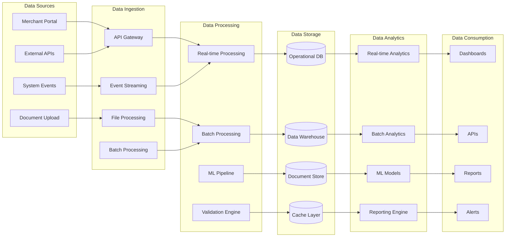
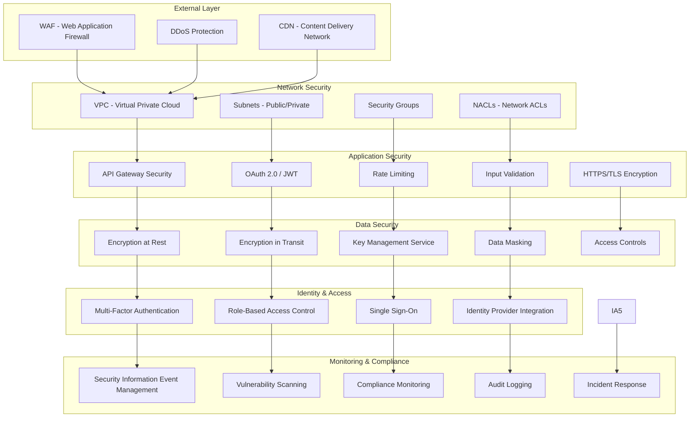
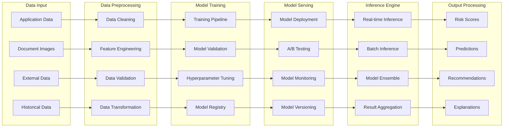
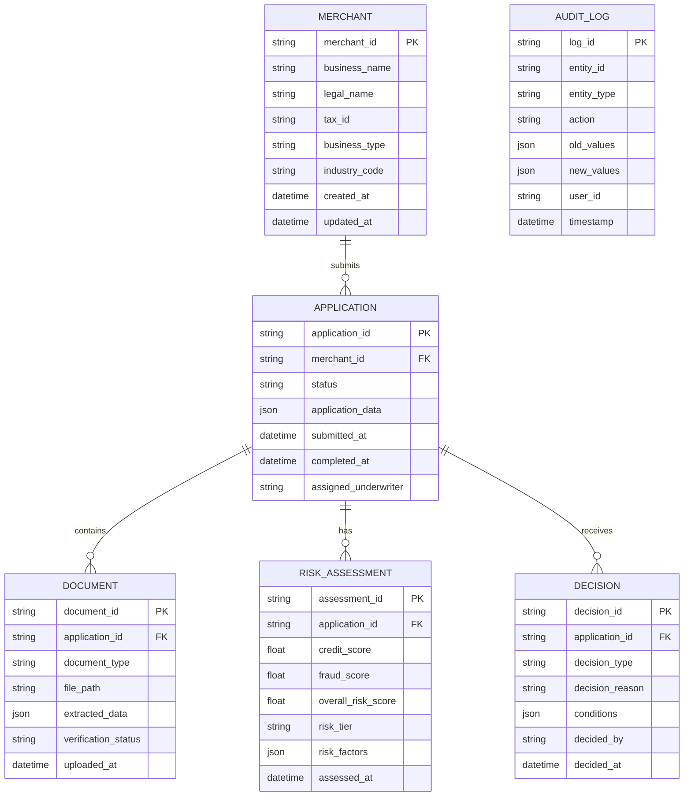
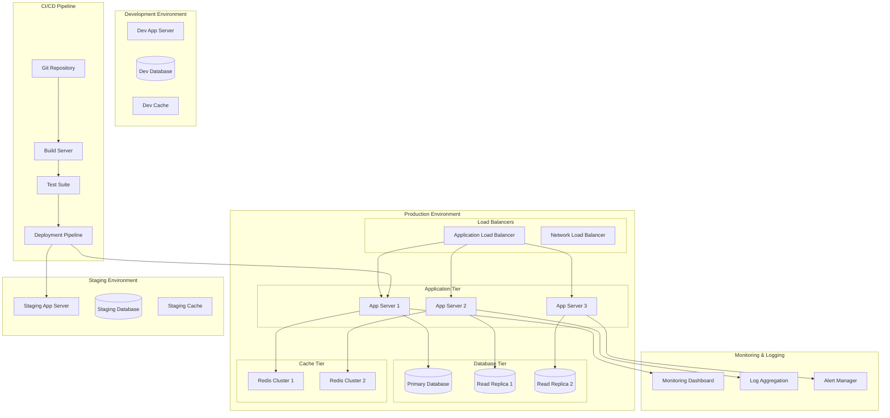
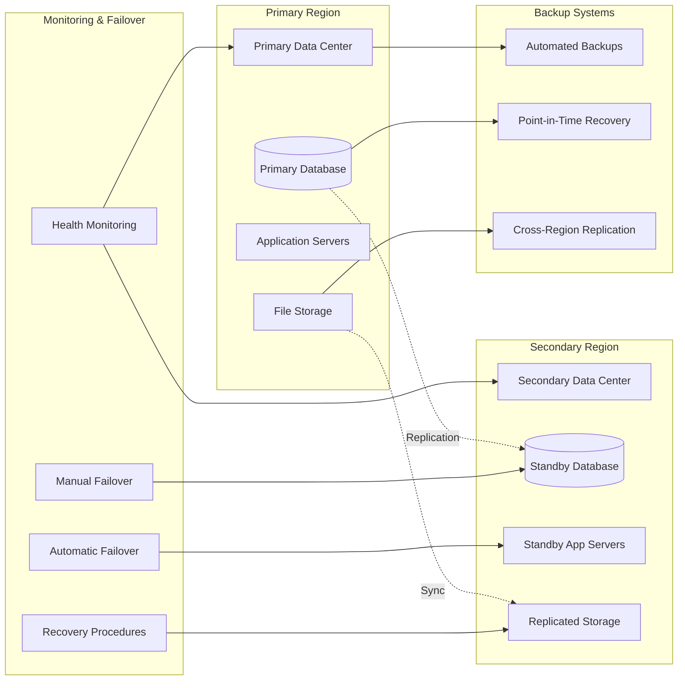

# System Architecture and Technical Diagrams

## High-Level System Architecture

## Microservices Architecture

## Data Flow Architecture

## Security Architecture

## AI/ML Pipeline Architecture

## Database Architecture

## Integration Architecture

```mermaid
flowchart TB
    subgraph "Core Platform"
        CP[Merchant Onboarding Platform]
    end
    
    subgraph "Identity Verification"
        IV1[Jumio API]
        IV2[Onfido API]
        IV3[Trulioo API]
    end
    
    subgraph "KYC/AML Services"
        KYC1[LexisNexis API]
        KYC2[Thomson Reuters API]
        KYC3[Refinitiv API]
    end
    
    subgraph "Credit & Financial"
        CF1[Experian API]
        CF2[Dun & Bradstreet API]
        CF3[Equifax API]
    end
    
    subgraph "Government & Regulatory"
        GR1[IRS Database]
        GR2[Secretary of State APIs]
        GR3[OFAC Sanctions Lists]
    end
    
    subgraph "Banking & Payments"
        BP1[Plaid API]
        BP2[Yodlee API]
        BP3[ACH Network APIs]
    end
    
    subgraph "AI/ML Services"
        AI1[AWS Textract]
        AI2[Google Vision API]
        AI3[Azure Cognitive Services]
        AI4[OpenAI GPT API]
    end
    
    subgraph "Integration Layer"
        IL1[API Gateway]
        IL2[Message Queue]
        IL3[Event Bus]
        IL4[Circuit Breaker]
        IL5[Rate Limiter]
    end
    
    CP --> IL1
    IL1 --> IV1
    IL1 --> IV2
    IL1 --> IV3
    IL1 --> KYC1
    IL1 --> KYC2
    IL1 --> KYC3
    IL1 --> CF1
    IL1 --> CF2
    IL1 --> CF3
    IL1 --> GR1
    IL1 --> GR2
    IL1 --> GR3
    IL1 --> BP1
    IL1 --> BP2
    IL1 --> BP3
    IL1 --> AI1
    IL1 --> AI2
    IL1 --> AI3
    IL1 --> AI4
    
    IL2 --> IL1
    IL3 --> IL1
    IL4 --> IL1
    IL5 --> IL1
```

## Deployment Architecture

## Disaster Recovery Architecture

