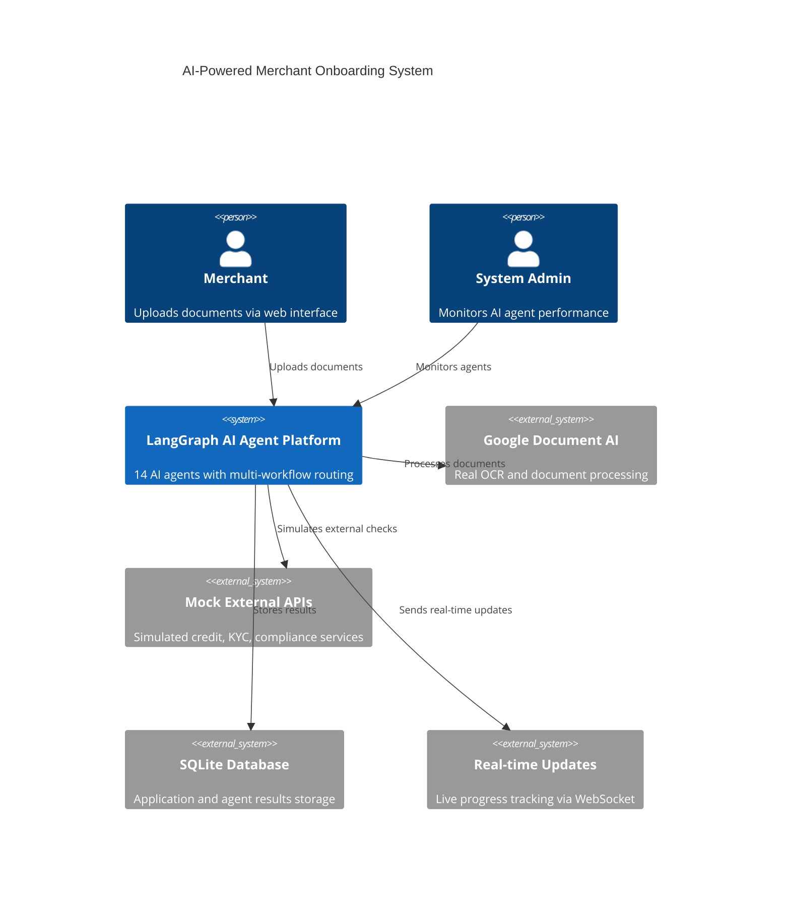
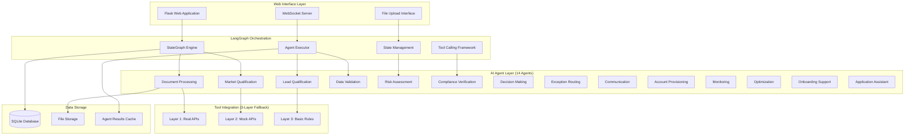
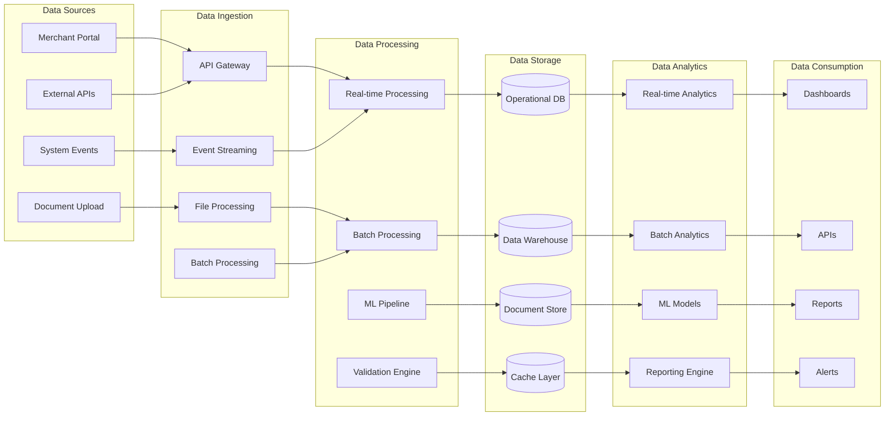
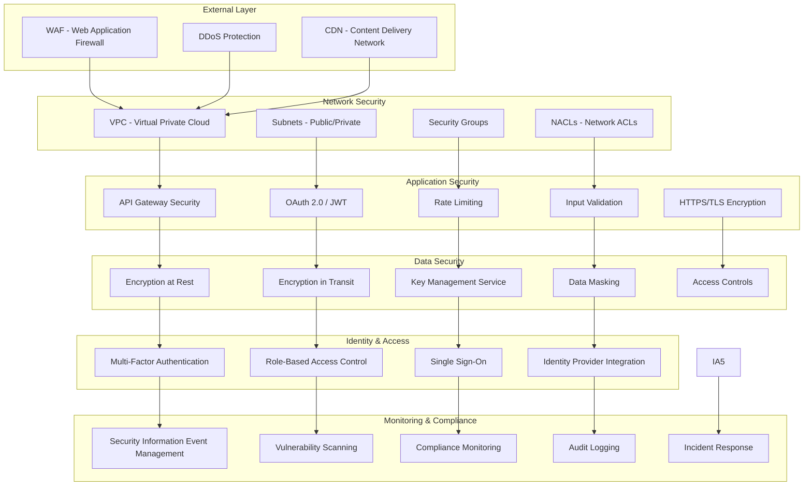
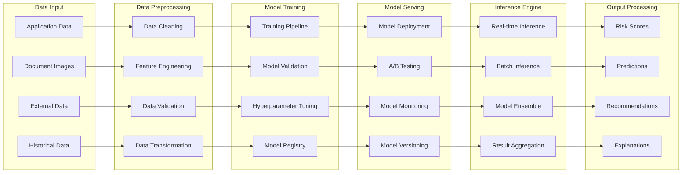
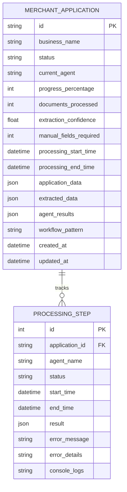
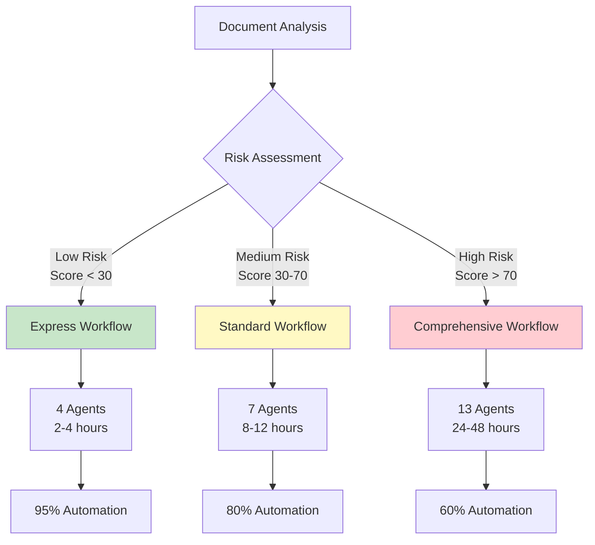
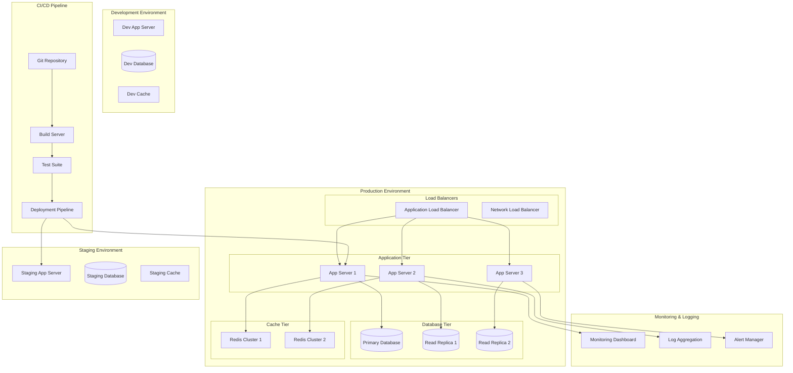
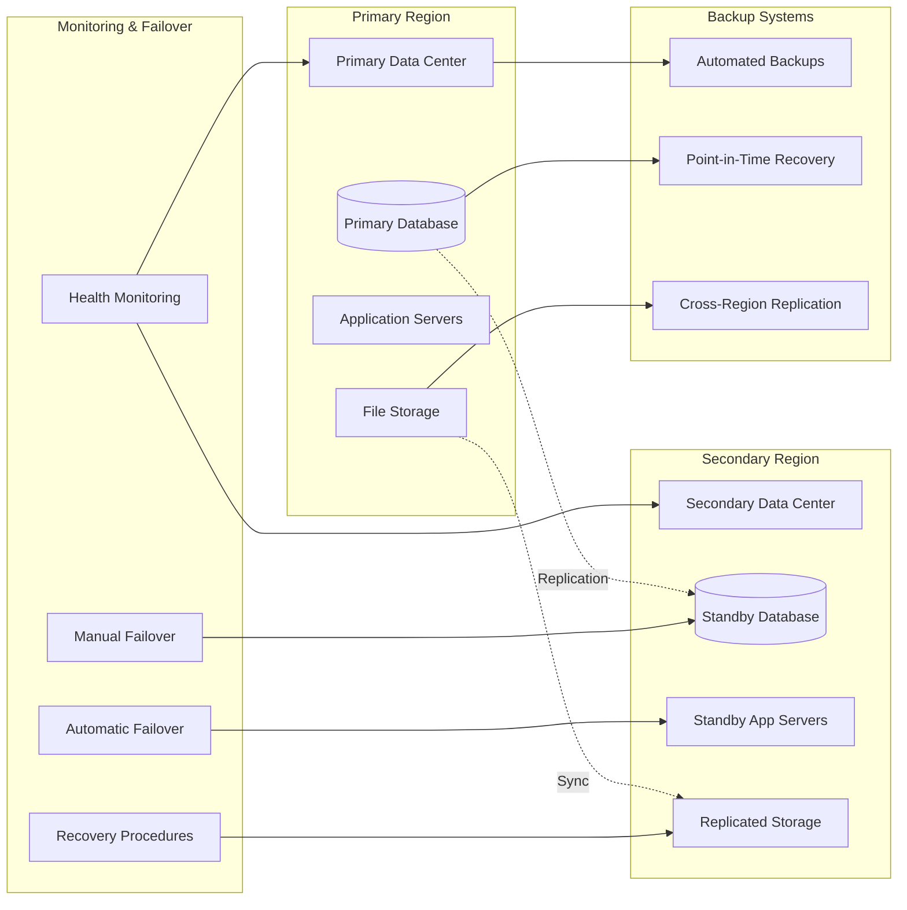

# System Architecture and Technical Diagrams
## Updated for AI Agent Implementation

## High-Level System Architecture (Actual Implementation)

```mermaid
C4Context
    title AI-Powered Merchant Onboarding System

    Person(merchant, "Merchant", "Uploads documents via web interface")
    Person(admin, "System Admin", "Monitors AI agent performance")

    System(onboarding, "LangGraph AI Agent Platform", "14 AI agents with multi-workflow routing")

    System_Ext(google_ai, "Google Document AI", "Real OCR and document processing")
    System_Ext(mock_apis, "Mock External APIs", "Simulated credit, KYC, compliance services")
    System_Ext(database, "SQLite Database", "Application and agent results storage")
    System_Ext(websocket, "Real-time Updates", "Live progress tracking via WebSocket")

    Rel(merchant, onboarding, "Uploads documents")
    Rel(admin, onboarding, "Monitors agents")

    Rel(onboarding, google_ai, "Processes documents")
    Rel(onboarding, mock_apis, "Simulates external checks")
    Rel(onboarding, database, "Stores results")
    Rel(onboarding, websocket, "Sends real-time updates")
```

## LangGraph Agent Architecture (Current Implementation)

```mermaid
flowchart TB
    subgraph "Web Interface Layer"
        WEB[Flask Web Application]
        WS[WebSocket Server]
        UI[File Upload Interface]
    end
    
    subgraph "LangGraph Orchestration"
        SG[StateGraph Engine]
        AE[Agent Executor]
        SM[State Management]
        TC[Tool Calling Framework]
    end
    
    subgraph "AI Agent Layer (14 Agents)"
        AG1[Document Processing]
        AG2[Market Qualification]
        AG3[Lead Qualification]
        AG4[Data Validation]
        AG5[Risk Assessment]
        AG6[Compliance Verification]
        AG7[Decision Making]
        AG8[Exception Routing]
        AG9[Communication]
        AG10[Account Provisioning]
        AG11[Monitoring]
        AG12[Optimization]
        AG13[Onboarding Support]
        AG14[Application Assistant]
    end
    
    subgraph "Tool Integration (3-Layer Fallback)"
        L1[Layer 1: Real APIs]
        L2[Layer 2: Mock APIs]
        L3[Layer 3: Basic Rules]
    end
    
    subgraph "Data Storage"
        DB[(SQLite Database)]
        FS[File Storage]
        CACHE[Agent Results Cache]
    end
    
    WEB --> SG
    WS --> AE
    UI --> SM
    
    SG --> AG1
    SG --> AG2
    AE --> AG3
    AE --> AG4
    SM --> AG5
    TC --> AG6
    
    AG1 --> L1
    AG2 --> L2
    AG3 --> L3
    
    SG --> DB
    AG1 --> FS
    AE --> CACHE
```

## Data Flow Architecture

```mermaid
flowchart LR
    subgraph "Data Sources"
        DS1[Merchant Portal]
        DS2[Document Upload]
        DS3[External APIs]
        DS4[System Events]
    end
    
    subgraph "Data Ingestion"
        DI1[API Gateway]
        DI2[File Processing]
        DI3[Event Streaming]
        DI4[Batch Processing]
    end
    
    subgraph "Data Processing"
        DP1[Real-time Processing]
        DP2[Batch Processing]
        DP3[ML Pipeline]
        DP4[Validation Engine]
    end
    
    subgraph "Data Storage"
        DST1[(Operational DB)]
        DST2[(Data Warehouse)]
        DST3[(Document Store)]
        DST4[(Cache Layer)]
    end
    
    subgraph "Data Analytics"
        DA1[Real-time Analytics]
        DA2[Batch Analytics]
        DA3[ML Models]
        DA4[Reporting Engine]
    end
    
    subgraph "Data Consumption"
        DC1[Dashboards]
        DC2[APIs]
        DC3[Reports]
        DC4[Alerts]
    end
    
    DS1 --> DI1
    DS2 --> DI2
    DS3 --> DI1
    DS4 --> DI3
    
    DI1 --> DP1
    DI2 --> DP2
    DI3 --> DP1
    DI4 --> DP2
    
    DP1 --> DST1
    DP2 --> DST2
    DP3 --> DST3
    DP4 --> DST4
    
    DST1 --> DA1
    DST2 --> DA2
    DST3 --> DA3
    DST4 --> DA4
    
    DA1 --> DC1
    DA2 --> DC2
    DA3 --> DC3
    DA4 --> DC4
```

## Security Architecture

```mermaid
flowchart TB
    subgraph "External Layer"
        EL1[WAF - Web Application Firewall]
        EL2[DDoS Protection]
        EL3[CDN - Content Delivery Network]
    end
    
    subgraph "Network Security"
        NS1[VPC - Virtual Private Cloud]
        NS2[Subnets - Public/Private]
        NS3[Security Groups]
        NS4[NACLs - Network ACLs]
    end
    
    subgraph "Application Security"
        AS1[API Gateway Security]
        AS2[OAuth 2.0 / JWT]
        AS3[Rate Limiting]
        AS4[Input Validation]
        AS5[HTTPS/TLS Encryption]
    end
    
    subgraph "Data Security"
        DS1[Encryption at Rest]
        DS2[Encryption in Transit]
        DS3[Key Management Service]
        DS4[Data Masking]
        DS5[Access Controls]
    end
    
    subgraph "Identity & Access"
        IA1[Multi-Factor Authentication]
        IA2[Role-Based Access Control]
        IA3[Single Sign-On]
        IA4[Identity Provider Integration]
    end
    
    subgraph "Monitoring & Compliance"
        MC1[Security Information Event Management]
        MC2[Vulnerability Scanning]
        MC3[Compliance Monitoring]
        MC4[Audit Logging]
        MC5[Incident Response]
    end
    
    EL1 --> NS1
    EL2 --> NS1
    EL3 --> NS1
    
    NS1 --> AS1
    NS2 --> AS2
    NS3 --> AS3
    NS4 --> AS4
    
    AS1 --> DS1
    AS2 --> DS2
    AS3 --> DS3
    AS4 --> DS4
    AS5 --> DS5
    
    DS1 --> IA1
    DS2 --> IA2
    DS3 --> IA3
    DS4 --> IA4
    
    IA1 --> MC1
    IA2 --> MC2
    IA3 --> MC3
    IA4 --> MC4
    IA5 --> MC5
```

## AI/ML Pipeline Architecture

```mermaid
flowchart LR
    subgraph "Data Input"
        DI1[Application Data]
        DI2[Document Images]
        DI3[External Data]
        DI4[Historical Data]
    end
    
    subgraph "Data Preprocessing"
        DP1[Data Cleaning]
        DP2[Feature Engineering]
        DP3[Data Validation]
        DP4[Data Transformation]
    end
    
    subgraph "Model Training"
        MT1[Training Pipeline]
        MT2[Model Validation]
        MT3[Hyperparameter Tuning]
        MT4[Model Registry]
    end
    
    subgraph "Model Serving"
        MS1[Model Deployment]
        MS2[A/B Testing]
        MS3[Model Monitoring]
        MS4[Model Versioning]
    end
    
    subgraph "Inference Engine"
        IE1[Real-time Inference]
        IE2[Batch Inference]
        IE3[Model Ensemble]
        IE4[Result Aggregation]
    end
    
    subgraph "Output Processing"
        OP1[Risk Scores]
        OP2[Predictions]
        OP3[Recommendations]
        OP4[Explanations]
    end
    
    DI1 --> DP1
    DI2 --> DP2
    DI3 --> DP3
    DI4 --> DP4
    
    DP1 --> MT1
    DP2 --> MT2
    DP3 --> MT3
    DP4 --> MT4
    
    MT1 --> MS1
    MT2 --> MS2
    MT3 --> MS3
    MT4 --> MS4
    
    MS1 --> IE1
    MS2 --> IE2
    MS3 --> IE3
    MS4 --> IE4
    
    IE1 --> OP1
    IE2 --> OP2
    IE3 --> OP3
    IE4 --> OP4
```

## Database Schema (Actual SQLAlchemy Implementation)

```mermaid
erDiagram
    MERCHANT_APPLICATION ||--o{ PROCESSING_STEP : tracks
    
    MERCHANT_APPLICATION {
        string id PK
        string business_name
        string status
        string current_agent
        int progress_percentage
        int documents_processed
        float extraction_confidence
        int manual_fields_required
        datetime processing_start_time
        datetime processing_end_time
        json application_data
        json extracted_data
        json agent_results
        string workflow_pattern
        datetime created_at
        datetime updated_at
    }
    
    PROCESSING_STEP {
        int id PK
        string application_id FK
        string agent_name
        string status
        datetime start_time
        datetime end_time
        json result
        string error_message
        string error_details
        string console_logs
    }
```

## Workflow Routing Logic (Actual Implementation)

```mermaid
flowchart TD
    A[Document Analysis] --> B{Risk Assessment}
    
    B -->|Low Risk<br/>Score < 30| C[Express Workflow]
    B -->|Medium Risk<br/>Score 30-70| D[Standard Workflow]
    B -->|High Risk<br/>Score > 70| E[Comprehensive Workflow]
    
    C --> F[4 Agents<br/>2-4 hours]
    D --> G[7 Agents<br/>8-12 hours]
    E --> H[13 Agents<br/>24-48 hours]
    
    F --> I[95% Automation]
    G --> J[80% Automation]
    H --> K[60% Automation]
    
    style C fill:#c8e6c9
    style D fill:#fff9c4
    style E fill:#ffcdd2
```

## Integration Architecture

```mermaid
flowchart TB
    subgraph "Core Platform"
        CP[Merchant Onboarding Platform]
    end
    
    subgraph "Identity Verification"
        IV1[Jumio API]
        IV2[Onfido API]
        IV3[Trulioo API]
    end
    
    subgraph "KYC/AML Services"
        KYC1[LexisNexis API]
        KYC2[Thomson Reuters API]
        KYC3[Refinitiv API]
    end
    
    subgraph "Credit & Financial"
        CF1[Experian API]
        CF2[Dun & Bradstreet API]
        CF3[Equifax API]
    end
    
    subgraph "Government & Regulatory"
        GR1[IRS Database]
        GR2[Secretary of State APIs]
        GR3[OFAC Sanctions Lists]
    end
    
    subgraph "Banking & Payments"
        BP1[Plaid API]
        BP2[Yodlee API]
        BP3[ACH Network APIs]
    end
    
    subgraph "AI/ML Services"
        AI1[AWS Textract]
        AI2[Google Vision API]
        AI3[Azure Cognitive Services]
        AI4[OpenAI GPT API]
    end
    
    subgraph "Integration Layer"
        IL1[API Gateway]
        IL2[Message Queue]
        IL3[Event Bus]
        IL4[Circuit Breaker]
        IL5[Rate Limiter]
    end
    
    CP --> IL1
    IL1 --> IV1
    IL1 --> IV2
    IL1 --> IV3
    IL1 --> KYC1
    IL1 --> KYC2
    IL1 --> KYC3
    IL1 --> CF1
    IL1 --> CF2
    IL1 --> CF3
    IL1 --> GR1
    IL1 --> GR2
    IL1 --> GR3
    IL1 --> BP1
    IL1 --> BP2
    IL1 --> BP3
    IL1 --> AI1
    IL1 --> AI2
    IL1 --> AI3
    IL1 --> AI4
    
    IL2 --> IL1
    IL3 --> IL1
    IL4 --> IL1
    IL5 --> IL1
```

## Deployment Architecture

```mermaid
flowchart TB
    subgraph "Production Environment"
        subgraph "Load Balancers"
            LB1[Application Load Balancer]
            LB2[Network Load Balancer]
        end
        
        subgraph "Application Tier"
            APP1[App Server 1]
            APP2[App Server 2]
            APP3[App Server 3]
        end
        
        subgraph "Database Tier"
            DB1[(Primary Database)]
            DB2[(Read Replica 1)]
            DB3[(Read Replica 2)]
        end
        
        subgraph "Cache Tier"
            CACHE1[Redis Cluster 1]
            CACHE2[Redis Cluster 2]
        end
    end
    
    subgraph "Staging Environment"
        STAGE1[Staging App Server]
        STAGE_DB[(Staging Database)]
        STAGE_CACHE[Staging Cache]
    end
    
    subgraph "Development Environment"
        DEV1[Dev App Server]
        DEV_DB[(Dev Database)]
        DEV_CACHE[Dev Cache]
    end
    
    subgraph "CI/CD Pipeline"
        GIT[Git Repository]
        BUILD[Build Server]
        TEST[Test Suite]
        DEPLOY[Deployment Pipeline]
    end
    
    subgraph "Monitoring & Logging"
        MON[Monitoring Dashboard]
        LOG[Log Aggregation]
        ALERT[Alert Manager]
    end
    
    LB1 --> APP1
    LB1 --> APP2
    LB1 --> APP3
    
    APP1 --> DB1
    APP2 --> DB2
    APP3 --> DB3
    
    APP1 --> CACHE1
    APP2 --> CACHE2
    
    GIT --> BUILD
    BUILD --> TEST
    TEST --> DEPLOY
    DEPLOY --> STAGE1
    DEPLOY --> APP1
    
    APP1 --> MON
    APP2 --> LOG
    APP3 --> ALERT
```

## Disaster Recovery Architecture

```mermaid
flowchart LR
    subgraph "Primary Region"
        PR1[Primary Data Center]
        PR_DB[(Primary Database)]
        PR_APP[Application Servers]
        PR_STORAGE[File Storage]
    end
    
    subgraph "Secondary Region"
        SR1[Secondary Data Center]
        SR_DB[(Standby Database)]
        SR_APP[Standby App Servers]
        SR_STORAGE[Replicated Storage]
    end
    
    subgraph "Backup Systems"
        BS1[Automated Backups]
        BS2[Point-in-Time Recovery]
        BS3[Cross-Region Replication]
    end
    
    subgraph "Monitoring & Failover"
        MF1[Health Monitoring]
        MF2[Automatic Failover]
        MF3[Manual Failover]
        MF4[Recovery Procedures]
    end
    
    PR_DB -.->|Replication| SR_DB
    PR_STORAGE -.->|Sync| SR_STORAGE
    
    PR1 --> BS1
    PR_DB --> BS2
    PR_STORAGE --> BS3
    
    MF1 --> PR1
    MF1 --> SR1
    MF2 --> SR_APP
    MF3 --> SR_DB
    MF4 --> SR_STORAGE
```